# Architecture Report

> Generated automatically on 2026-07-18 12:56:41 UTC

## Executive Summary

- **Grade:** PASS
- **Architecture Score:** 99.5/100
- **Quality Gates:** PASSED
- **Modules in graph:** 796
- **Dependency edges:** 2616
- **Cycles:** 0

Architecture score 99.5/100 — PASS. Modules=796, edges=2616, cycles=0.

## Validation Summary

| Domain | Status | Coverage | Violations |
|--------|--------|----------|------------|
| boundaries | PASS | 100.0% | 0 critical / 4 total |
| plugins | PASS | 100.0% | 0 critical / 0 total |
| workflows | PASS | 100.0% | 0 critical / 1 total |
| api | PASS | 100.0% | 0 critical / 0 total |
| sdk | PASS | 100.0% | 0 critical / 0 total |
| dependencies | PASS | 97.52% | 0 critical / 85 total |
| legacy | PASS | 100.0% | 0 critical / 0 total |

## Dependency Graph

```mermaid
flowchart TD
  subgraph api[api]
    platform_identity_identity_router_py[platform_identity/identity_router.py]
    platform_integrations_integration_router_py[platform_integrations/integration_router.py]
    platform_integrations_webhook_router_py[platform_integrations/webhook_router.py]
    platform_jobs_jobs_router_py[platform_jobs/jobs_router.py]
    platform_management_management_router_py[platform_management/management_router.py]
    platform_observability_telemetry_router_py[platform_observability/telemetry_router.py]
    platform_plugins_plugins_router_py[platform_plugins/plugins_router.py]
    platform_realtime_websocket_router_py[platform_realtime/websocket_router.py]
    api_more[...+1 modules]
  end
  subgraph database[database]
    database_async_bridge_py[database/async_bridge.py]
    database_base_py[database/base.py]
    database_connection_py[database/connection.py]
    database_engine_py[database/engine.py]
    database_migration_models_py[database/migration_models.py]
    database_models_ai_advertising_agent_py[database/models/ai_advertising_agent.py]
    database_models_ai_agents_py[database/models/ai_agents.py]
    database_models_ai_conversation_skills_py[database/models/ai_conversation_skills.py]
    database_more[...+119 modules]
  end
  subgraph legacy[legacy]
    platform_events_legacy_py[platform_events_legacy.py]
    services_pg_ai_advertising_agent_engine_py[services/pg_ai_advertising_agent_engine.py]
    services_pg_ai_advertising_agent_v1_py[services/pg_ai_advertising_agent_v1.py]
    services_pg_ai_conversation_skills_engine_py[services/pg_ai_conversation_skills_engine.py]
    services_pg_ai_conversation_skills_v1_py[services/pg_ai_conversation_skills_v1.py]
    services_pg_ai_manager_engine_py[services/pg_ai_manager_engine.py]
    services_pg_ai_procurement_agent_engine_py[services/pg_ai_procurement_agent_engine.py]
    services_pg_ai_procurement_agent_v1_py[services/pg_ai_procurement_agent_v1.py]
    legacy_more[...+94 modules]
  end
  subgraph plugins[plugins]
    plugins__scaffold_py[plugins/_scaffold.py]
    plugins_agro_plugin_py[plugins/agro/plugin.py]
    plugins_auto_plugin_py[plugins/auto/plugin.py]
    plugins_construction_plugin_py[plugins/construction/plugin.py]
    plugins_example_plugin_py[plugins/example/plugin.py]
    plugins_insurance_plugin_py[plugins/insurance/plugin.py]
    plugins_legal_plugin_py[plugins/legal/plugin.py]
    plugins_medical_plugin_py[plugins/medical/plugin.py]
    plugins_more[...+1 modules]
  end
  subgraph repositories[repositories]
    repositories_ai_advertising_agent_repository_py[repositories/ai_advertising_agent_repository.py]
    repositories_ai_conversation_skills_repository_py[repositories/ai_conversation_skills_repository.py]
    repositories_ai_procurement_agent_repository_py[repositories/ai_procurement_agent_repository.py]
    repositories_ai_sales_agent_repository_py[repositories/ai_sales_agent_repository.py]
    repositories_ai_sales_assistant_repository_py[repositories/ai_sales_assistant_repository.py]
    repositories_ai_skill_repository_py[repositories/ai_skill_repository.py]
    repositories_analytics_automation_repository_py[repositories/analytics_automation_repository.py]
    repositories_analytics_engine_repository_py[repositories/analytics_engine_repository.py]
    repositories_more[...+101 modules]
  end
  subgraph services[services]
    events_adapters_crm_adapter_py[events/adapters/crm_adapter.py]
    events_adapters_legacy_adapter_py[events/adapters/legacy_adapter.py]
    events_base_event_py[events/base_event.py]
    events_configuration_events_py[events/configuration_events.py]
    events_event_bus_py[events/event_bus.py]
    events_generic_events_py[events/generic_events.py]
    events_handlers_audit_handler_py[events/handlers/audit_handler.py]
    events_handlers_configuration_handler_py[events/handlers/configuration_handler.py]
    services_more[...+242 modules]
  end
  subgraph shared[shared]
    database___init___py[database/__init__.py]
    database_models___init___py[database/models/__init__.py]
    database_seeds___init___py[database/seeds/__init__.py]
    events___init___py[events/__init__.py]
    events_adapters___init___py[events/adapters/__init__.py]
    events_handlers___init___py[events/handlers/__init__.py]
    platform_api___init___py[platform_api/__init__.py]
    platform_api_contracts_py[platform_api/contracts.py]
    shared_more[...+43 modules]
  end
  subgraph unknown[unknown]
    services_agro_deal_lifecycle_py[services/agro_deal_lifecycle.py]
    services_agro_erp_py[services/agro_erp.py]
    services_agro_erp_calendar_py[services/agro_erp_calendar.py]
    services_agro_erp_workflow_py[services/agro_erp_workflow.py]
    services_agro_request_workflow_py[services/agro_request_workflow.py]
    services_ai_agents_py[services/ai_agents.py]
    services_anti_loss_layer_test_py[services/anti_loss_layer_test.py]
    services_attachments_py[services/attachments.py]
    unknown_more[...+119 modules]
  end
  subgraph workflow[workflow]
    platform_workflows_adapters_legacy_rules_py[platform_workflows/adapters/legacy_rules.py]
    platform_workflows_adapters_python_definitions_py[platform_workflows/adapters/python_definitions.py]
    platform_workflows_context_py[platform_workflows/context.py]
    platform_workflows_exceptions_py[platform_workflows/exceptions.py]
    platform_workflows_models_py[platform_workflows/models.py]
    platform_workflows_services_py[platform_workflows/services.py]
    platform_workflows_workflow_engine_py[platform_workflows/workflow_engine.py]
    platform_workflows_workflow_executor_py[platform_workflows/workflow_executor.py]
    workflow_more[...+4 modules]
  end
```

## Layer Violations

- **[reverse_layer_dependency]** `database/engine.py` — database imports services via platform_configuration.configuration_center
- **[reverse_layer_dependency]** `platform_operations/timeline_service.py` — services imports shared via platform_management.management_service
- **[reverse_layer_dependency]** `platform_operations/status_service.py` — services imports shared via platform_management.system_info
- **[reverse_layer_dependency]** `platform_operations/status_service.py` — services imports shared via platform_management.health
- **[reverse_layer_dependency]** `platform_operations/activity_service.py` — services imports shared via platform_management.management_service
- **[reverse_layer_dependency]** `platform_operations/activity_service.py` — services imports shared via platform_management.statistics
- **[reverse_layer_dependency]** `platform_integrations/webhook_manager.py` — services imports shared via platform_legacy
- **[reverse_layer_dependency]** `platform_identity/policy_engine.py` — services imports shared via platform_legacy
- **[reverse_layer_dependency]** `platform_identity/permission_service.py` — services imports shared via platform_legacy
- **[reverse_layer_dependency]** `platform_identity/identity_service.py` — services imports shared via platform_management.exceptions
- **[reverse_layer_dependency]** `platform_identity/identity_service.py` — services imports shared via platform_management.permissions
- **[reverse_layer_dependency]** `platform_identity/role_service.py` — services imports shared via platform_legacy
- **[reverse_layer_dependency]** `platform_identity/audit_hooks.py` — services imports shared via platform_legacy
- **[reverse_layer_dependency]** `platform_sdk/bootstrap.py` — services imports shared via platform_sdk.verticals
- **[reverse_layer_dependency]** `platform_sdk/notification_provider.py` — services imports shared via platform_legacy
- **[reverse_layer_dependency]** `platform_sdk/validation_provider.py` — services imports shared via platform_legacy
- **[reverse_layer_dependency]** `repositories/assignment_score_repository.py` — repositories imports services via src.platform.layers.base_repository
- **[reverse_layer_dependency]** `repositories/base_repository.py` — repositories imports services via src.platform.layers.base_repository
- **[reverse_layer_dependency]** `repositories/request_repository.py` — repositories imports services via src.platform.layers.base_repository
- **[reverse_layer_dependency]** `repositories/manager_pool_repository.py` — repositories imports services via src.platform.layers.base_repository
- **[reverse_layer_dependency]** `repositories/owner_repository.py` — repositories imports services via platform_configuration.config_provider
- **[reverse_layer_dependency]** `repositories/owner_repository.py` — repositories imports services via src.platform.layers.base_repository
- **[reverse_layer_dependency]** `repositories/workflow_execution_repository.py` — repositories imports services via src.platform.layers.base_repository
- **[reverse_layer_dependency]** `repositories/platform_metrics_repository.py` — repositories imports services via src.platform.layers.base_repository
- **[reverse_layer_dependency]** `repositories/manager_repository.py` — repositories imports services via src.platform.layers.base_repository
- **[reverse_layer_dependency]** `repositories/kpi_repository.py` — repositories imports services via src.platform.layers.base_repository
- **[reverse_layer_dependency]** `repositories/event_repository.py` — repositories imports shared via events
- **[reverse_layer_dependency]** `repositories/escalation_repository.py` — repositories imports services via src.platform.layers.base_repository
- **[reverse_layer_dependency]** `repositories/user_repository.py` — repositories imports services via src.platform.layers.base_repository
- **[reverse_layer_dependency]** `repositories/sla_repository.py` — repositories imports services via platform_configuration.config_provider

## Certification Categories

| Category | Score | Weight | Status |
|----------|-------|--------|--------|
| Security | 100.0 | 0.12 | PASS |
| Architecture | 100.0 | 0.15 | PASS |
| Boundaries | 100.0 | 0.15 | PASS |
| Dependencies | 100 | 0.1 | PASS |
| API | 100.0 | 0.1 | PASS |
| Workflow | 100.0 | 0.08 | PASS |
| Plugin SDK | 100.0 | 0.08 | PASS |
| Configuration | 100.0 | 0.07 | PASS |
| Legacy | 100.0 | 0.08 | PASS |
| Observability | 95.0 | 0.04 | PASS |
| Testing | 90.0 | 0.03 | PASS |

