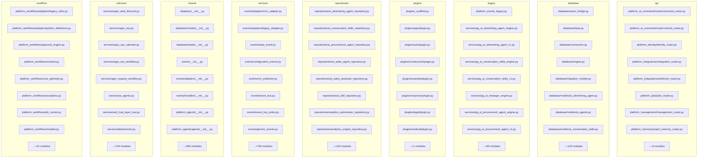

# Architecture Report

> Generated automatically on 2026-08-10 08:03:19 UTC

## Executive Summary

- **Grade:** FAIL
- **Architecture Score:** 80.25/100
- **Quality Gates:** FAILED
- **Modules in graph:** 1910
- **Dependency edges:** 4920
- **Cycles:** 0

Architecture score 80.25/100 — FAIL. Modules=1910, edges=4920, cycles=0.

## Quality Gate Failures

- Architecture score 80.25 < 90
- 29 critical boundary/import violations
- 0 dependency cycles and 4 strict layer violations detected

## Validation Summary

| Domain | Status | Coverage | Violations |
|--------|--------|----------|------------|
| boundaries | FAIL | 66.67% | 29 critical / 33 total |
| plugins | PASS | 100.0% | 0 critical / 0 total |
| workflows | PASS | 100.0% | 0 critical / 1 total |
| api | PASS | 100.0% | 0 critical / 0 total |
| sdk | PASS | 100.0% | 0 critical / 0 total |
| dependencies | FAIL | 88.37% | 4 critical / 592 total |
| legacy | PASS | 100.0% | 0 critical / 0 total |

## Dependency Graph

```mermaid
flowchart TD
  subgraph api[api]
    platform_ai_command_router_command_router_py[platform_ai_command/router/command_router.py]
    platform_ai_command_router_vertical_router_py[platform_ai_command/router/vertical_router.py]
    platform_identity_identity_router_py[platform_identity/identity_router.py]
    platform_integrations_integration_router_py[platform_integrations/integration_router.py]
    platform_integrations_webhook_router_py[platform_integrations/webhook_router.py]
    platform_jobs_jobs_router_py[platform_jobs/jobs_router.py]
    platform_management_management_router_py[platform_management/management_router.py]
    platform_memory_project_memory_router_py[platform_memory/project_memory_router.py]
    api_more[...+6 modules]
  end
  subgraph database[database]
    database_async_bridge_py[database/async_bridge.py]
    database_base_py[database/base.py]
    database_connection_py[database/connection.py]
    database_engine_py[database/engine.py]
    database_migration_models_py[database/migration_models.py]
    database_models_ai_advertising_agent_py[database/models/ai_advertising_agent.py]
    database_models_ai_agents_py[database/models/ai_agents.py]
    database_models_ai_conversation_skills_py[database/models/ai_conversation_skills.py]
    database_more[...+133 modules]
  end
  subgraph legacy[legacy]
    platform_events_legacy_py[platform_events_legacy.py]
    services_pg_ai_advertising_agent_engine_py[services/pg_ai_advertising_agent_engine.py]
    services_pg_ai_advertising_agent_v1_py[services/pg_ai_advertising_agent_v1.py]
    services_pg_ai_conversation_skills_engine_py[services/pg_ai_conversation_skills_engine.py]
    services_pg_ai_conversation_skills_v1_py[services/pg_ai_conversation_skills_v1.py]
    services_pg_ai_manager_engine_py[services/pg_ai_manager_engine.py]
    services_pg_ai_procurement_agent_engine_py[services/pg_ai_procurement_agent_engine.py]
    services_pg_ai_procurement_agent_v1_py[services/pg_ai_procurement_agent_v1.py]
    legacy_more[...+95 modules]
  end
  subgraph plugins[plugins]
    plugins__scaffold_py[plugins/_scaffold.py]
    plugins_agro_plugin_py[plugins/agro/plugin.py]
    plugins_auto_plugin_py[plugins/auto/plugin.py]
    plugins_construction_plugin_py[plugins/construction/plugin.py]
    plugins_example_plugin_py[plugins/example/plugin.py]
    plugins_insurance_plugin_py[plugins/insurance/plugin.py]
    plugins_legal_plugin_py[plugins/legal/plugin.py]
    plugins_medical_plugin_py[plugins/medical/plugin.py]
    plugins_more[...+1 modules]
  end
  subgraph repositories[repositories]
    repositories_ai_advertising_agent_repository_py[repositories/ai_advertising_agent_repository.py]
    repositories_ai_conversation_skills_repository_py[repositories/ai_conversation_skills_repository.py]
    repositories_ai_procurement_agent_repository_py[repositories/ai_procurement_agent_repository.py]
    repositories_ai_sales_agent_repository_py[repositories/ai_sales_agent_repository.py]
    repositories_ai_sales_assistant_repository_py[repositories/ai_sales_assistant_repository.py]
    repositories_ai_skill_repository_py[repositories/ai_skill_repository.py]
    repositories_analytics_automation_repository_py[repositories/analytics_automation_repository.py]
    repositories_analytics_engine_repository_py[repositories/analytics_engine_repository.py]
    repositories_more[...+103 modules]
  end
  subgraph services[services]
    events_adapters_crm_adapter_py[events/adapters/crm_adapter.py]
    events_adapters_legacy_adapter_py[events/adapters/legacy_adapter.py]
    events_base_event_py[events/base_event.py]
    events_configuration_events_py[events/configuration_events.py]
    events_crm_publisher_py[events/crm_publisher.py]
    events_event_bus_py[events/event_bus.py]
    events_event_bus_policy_py[events/event_bus_policy.py]
    events_generic_events_py[events/generic_events.py]
    services_more[...+762 modules]
  end
  subgraph shared[shared]
    database___init___py[database/__init__.py]
    database_models___init___py[database/models/__init__.py]
    database_seeds___init___py[database/seeds/__init__.py]
    events___init___py[events/__init__.py]
    events_adapters___init___py[events/adapters/__init__.py]
    events_handlers___init___py[events/handlers/__init__.py]
    platform_agents___init___py[platform_agents/__init__.py]
    platform_agents_agents___init___py[platform_agents/agents/__init__.py]
    shared_more[...+563 modules]
  end
  subgraph unknown[unknown]
    services_agro_deal_lifecycle_py[services/agro_deal_lifecycle.py]
    services_agro_erp_py[services/agro_erp.py]
    services_agro_erp_calendar_py[services/agro_erp_calendar.py]
    services_agro_erp_workflow_py[services/agro_erp_workflow.py]
    services_agro_request_workflow_py[services/agro_request_workflow.py]
    services_ai_agents_py[services/ai_agents.py]
    services_anti_loss_layer_test_py[services/anti_loss_layer_test.py]
    services_attachments_py[services/attachments.py]
    unknown_more[...+154 modules]
  end
  subgraph workflow[workflow]
    platform_workflows_adapters_legacy_rules_py[platform_workflows/adapters/legacy_rules.py]
    platform_workflows_adapters_python_definitions_py[platform_workflows/adapters/python_definitions.py]
    platform_workflows_approval_engine_py[platform_workflows/approval_engine.py]
    platform_workflows_context_py[platform_workflows/context.py]
    platform_workflows_cost_optimizer_py[platform_workflows/cost_optimizer.py]
    platform_workflows_exceptions_py[platform_workflows/exceptions.py]
    platform_workflows_job_runner_py[platform_workflows/job_runner.py]
    platform_workflows_models_py[platform_workflows/models.py]
    workflow_more[...+21 modules]
  end
```

## Layer Violations

- **[reverse_layer_dependency]** `platform_workflows/job_runner.py` — workflow imports shared via platform_hercules
- **[reverse_layer_dependency]** `platform_enterprise_event_bus/router.py` — services imports shared via platform_management.permissions
- **[reverse_layer_dependency]** `platform_enterprise_event_bus/router.py` — services imports shared via platform_api.versioning
- **[reverse_layer_dependency]** `database/engine.py` — database imports services via platform_configuration.configuration_center
- **[reverse_layer_dependency]** `platform_operations/timeline_service.py` — services imports shared via platform_management.management_service
- **[reverse_layer_dependency]** `platform_operations/status_service.py` — services imports shared via platform_management.system_info
- **[reverse_layer_dependency]** `platform_operations/status_service.py` — services imports shared via platform_management.health
- **[reverse_layer_dependency]** `platform_operations/activity_service.py` — services imports shared via platform_management.statistics
- **[reverse_layer_dependency]** `platform_operations/activity_service.py` — services imports shared via platform_management.management_service
- **[reverse_layer_dependency]** `platform_vertical_ai/registry.py` — services imports shared via platform_vertical_ai.configs
- **[reverse_layer_dependency]** `platform_ai_marketing_os/facade.py` — services imports shared via platform_ai_marketing_os.integrations
- **[reverse_layer_dependency]** `platform_ai_marketing_os/facade.py` — services imports shared via platform_ai_marketing_os.opportunities
- **[reverse_layer_dependency]** `platform_ai_marketing_os/facade.py` — services imports shared via platform_ai_marketing_os.creative
- **[reverse_layer_dependency]** `platform_ai_marketing_os/facade.py` — services imports shared via platform_ai_marketing_os.approval
- **[reverse_layer_dependency]** `platform_ai_marketing_os/facade.py` — services imports shared via platform_ai_marketing_os.campaigns
- **[reverse_layer_dependency]** `platform_ai_marketing_os/facade.py` — services imports shared via platform_ai_marketing_os.content
- **[reverse_layer_dependency]** `platform_ai_marketing_os/facade.py` — services imports shared via platform_ai_marketing_os.brand
- **[reverse_layer_dependency]** `platform_ai_marketing_os/facade.py` — services imports shared via platform_ai_marketing_os.performance
- **[reverse_layer_dependency]** `platform_ai_marketing_os/facade.py` — services imports shared via platform_ai_marketing_os.calendar
- **[reverse_layer_dependency]** `platform_quality/facade.py` — services imports shared via platform_quality.regression
- **[reverse_layer_dependency]** `platform_quality/facade.py` — services imports shared via platform_quality.security
- **[reverse_layer_dependency]** `platform_quality/facade.py` — services imports shared via platform_quality.ai
- **[reverse_layer_dependency]** `platform_quality/facade.py` — services imports shared via platform_quality.e2e
- **[reverse_layer_dependency]** `platform_quality/facade.py` — services imports shared via platform_quality.reporting
- **[reverse_layer_dependency]** `platform_quality/facade.py` — services imports shared via platform_quality.unit
- **[reverse_layer_dependency]** `platform_quality/facade.py` — services imports shared via platform_quality.contract
- **[reverse_layer_dependency]** `platform_quality/facade.py` — services imports shared via platform_quality.coverage
- **[reverse_layer_dependency]** `platform_quality/facade.py` — services imports shared via platform_quality.performance
- **[reverse_layer_dependency]** `platform_quality/facade.py` — services imports shared via platform_quality.fixtures
- **[reverse_layer_dependency]** `platform_quality/facade.py` — services imports shared via platform_quality.integration

## Boundaries Violations

- **[env_access_outside_center]** `api/crm_api.py:77` — \bos\.getenv\s*\(
- **[env_access_outside_center]** `api/crm_api.py:83` — \bos\.getenv\s*\(
- **[env_access_outside_center]** `applications/enterprise_hub/security/providers/google.py:39` — \bos\.environ\.get\s*\(
- **[env_access_outside_center]** `applications/enterprise_hub/security/providers/google.py:86` — \bos\.environ\.get\s*\(
- **[env_access_outside_center]** `platform_ai/providers/adapters.py:20` — \bos\.environ\.get\s*\(
- **[env_access_outside_center]** `platform_ai/providers/vault.py:76` — \bos\.environ\.get\s*\(
- **[env_access_outside_center]** `platform_ai/providers/vault.py:97` — \bos\.environ\.get\s*\(
- **[env_access_outside_center]** `platform_ai/skills_sdk_models.py:44` — \bos\.getenv\s*\(
- **[env_access_outside_center]** `platform_hercules/config/settings.py:11` — \bos\.environ\.get\s*\(
- **[env_access_outside_center]** `platform_hercules/config/settings.py:12` — \bos\.environ\.get\s*\(
- **[env_access_outside_center]** `platform_hercules/config/settings.py:13` — \bos\.environ\.get\s*\(
- **[env_access_outside_center]** `platform_hercules/core/resources.py:37` — \bos\.environ\.get\s*\(
- **[env_access_outside_center]** `platform_hercules/cpu/pool.py:34` — \bos\.environ\.get\s*\(
- **[env_access_outside_center]** `platform_hercules/executor/executor.py:94` — \bos\.environ\.get\s*\(
- **[env_access_outside_center]** `platform_hercules/gpu/pool.py:14` — \bos\.environ\.get\s*\(
- **[env_access_outside_center]** `platform_performance/measured_workload.py:460` — \bos\.getenv\s*\(
- **[env_access_outside_center]** `platform_security/external_ai_guard.py:31` — \bos\.environ\.get\s*\(
- **[env_access_outside_center]** `platform_security/external_ai_guard.py:32` — \bos\.environ\.get\s*\(
- **[env_access_outside_center]** `platform_security/secret_policy.py:104` — \bos\.getenv\s*\(
- **[env_access_outside_center]** `platform_security/secret_policy.py:123` — \bos\.getenv\s*\(
- **[env_access_outside_center]** `platform_security/secret_policy.py:99` — \bos\.getenv\s*\(
- **[env_access_outside_center]** `platform_state/event_store.py:23` — \bos\.environ\.get\s*\(
- **[env_access_outside_center]** `platform_state/event_store.py:259` — \bos\.environ\.get\s*\(
- **[env_access_outside_center]** `platform_state/event_store.py:262` — \bos\.environ\.get\s*\(
- **[env_access_outside_center]** `platform_state/event_store_postgres.py:18` — \bos\.environ\.get\s*\(
- ... and 4 more

## Dependencies Violations

- **[reverse_layer_dependency]** `platform_validation/enterprise_integration_suite.py` — services imports api via platform_jobs.jobs_router
- **[reverse_layer_dependency]** `platform_validation/enterprise_integration_suite.py` — services imports api via platform_realtime.websocket_router
- **[reverse_layer_dependency]** `platform_ai_command/core/command_center.py` — services imports api via platform_ai_command.router.vertical_router
- **[reverse_layer_dependency]** `platform_ai_command/core/command_center.py` — services imports api via platform_ai_command.router.command_router

## Certification Categories

| Category | Score | Weight | Status |
|----------|-------|--------|--------|
| Security | 100.0 | 0.12 | PASS |
| Architecture | 100.0 | 0.15 | PASS |
| Boundaries | 0 | 0.15 | WARN |
| Dependencies | 68 | 0.1 | WARN |
| API | 100.0 | 0.1 | PASS |
| Workflow | 100.0 | 0.08 | PASS |
| Plugin SDK | 100.0 | 0.08 | PASS |
| Configuration | 85.0 | 0.07 | WARN |
| Legacy | 100.0 | 0.08 | PASS |
| Observability | 95.0 | 0.04 | PASS |
| Testing | 90.0 | 0.03 | PASS |

