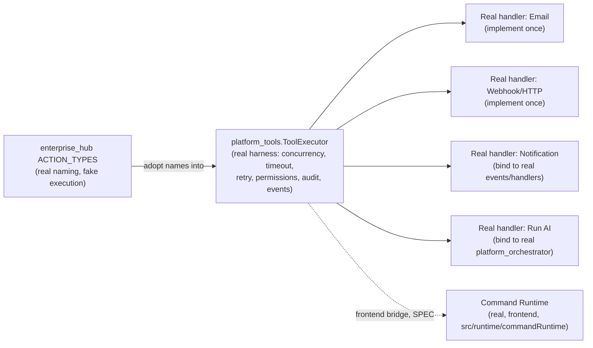

# Enterprise Automation — Action Library

**Sprint:** CG-7 — Architecture Research + Product Research. Documentation only, `src/` not modified.

**Do not duplicate:** `AUTOMATION_ENGINE.md`/`WORKFLOW_RUNTIME.md`/`TRIGGER_SYSTEM.md` cover the
engine, execution, and what starts a run — this document covers only what a single workflow step
*does*, per the brief's twelve requested reusable actions.

## 1. What exists today (verified) — two real registries, both incomplete for different reasons

Two independent, real action/tool registries exist — neither is `platform_workflow`'s own, and neither
is wired to it:

| | `platform_tools/` (Python, real) | `applications/enterprise_hub/workflow/actions/` (Python, real) |
|---|---|---|
| Abstraction | `Tool` dataclass: id, category (`internal \| rest_api \| database \| telegram \| filesystem \| email \| http \| search \| calendar \| crm \| plugin`), async handler, required permissions, timeout | `ActionRegistry` + `ACTION_TYPES`: `email \| telegram \| push \| create_task \| change_status \| assign \| ai_agent \| sql \| api \| python \| custom \| webhook \| crm \| approval` |
| Execution | Real `ToolExecutor.execute()` — semaphore-bound concurrency, real timeout, real retry/backoff, real permission check, real audit log, real metrics, real event publishing (`ToolStartedEvent`/`ToolCompletedEvent`/`ToolFailedEvent`) | `run_action()` — writes a completed-status record to an in-memory `EnterpriseHubStore` |
| Are the actions real? | **No** — every builtin tool is an explicit stub: `http_get`/`rest_api_call` return `"body_preview": "(stub — no network call)"`, `crm_lookup` returns `source: "crm_stub"`, `telegram_notify` returns `stub: True` | **No** — `run_action()` never calls out anywhere; it only records that an action "happened" |
| What's genuinely real | The **execution harness** — concurrency, timeout, retry, permissions, audit, metrics, events — all real and well-built | The **taxonomy** — the `ACTION_TYPES` list maps almost one-to-one onto the brief's requested action library |

**The honest framing for this whole document**: the platform has a real, well-engineered *action
execution harness* (`platform_tools`) and a real, well-shaped *action taxonomy*
(`enterprise_hub`'s `ACTION_TYPES`) — but no implementation anywhere actually performs a real
side-effecting action (no real email send, no real webhook POST, no real CRM write). This is
consistent with `TD-45`'s already-tracked finding for AI Studio specifically ("no studio can actually
generate anything") — this document's contribution is confirming the same pattern holds for the
*general* action library, not just AI Studio.

## 2. Per-action mapping (brief's twelve, against both real registries)

| Requested action | `platform_tools` category | `enterprise_hub` `ACTION_TYPES` | Real execution? | SPEC |
|---|---|---|---|---|
| Create Entity | `database` (stub) | none named exactly this — closest is `sql` | No | Bind to the real `repositories/` layer (111 real files, `ARCHITECTURE_MAP.md` §2.2) per-entity, not a generic "any entity" writer |
| Update Entity | `database` (stub) | `change_status` (closest partial match) | No | Same as Create — real `repositories/` binding |
| Delete Entity | `database` (stub) | none | No | Same as Create — real `repositories/` binding; recommend a soft-delete convention if one already exists in `repositories/` (not verified in this pass) |
| Send Notification | `internal` (plausible fit, not confirmed) | none named exactly, but `push`/`email`/`telegram` cover parts of it | No | Bind to the real, canonical `events.PlatformEventBus` → real `events/handlers/notification` handler (already exists per `ARCHITECTURE_MAP.md`'s handler list) — this is the action closest to having a real backend already, just needs the workflow-step wiring |
| Run AI | none named exactly — closest is invoking `platform_orchestrator`/`platform_agents` directly, outside the tool abstraction | `ai_agent` (real name, fake execution) | No (execution real elsewhere, not through this action) | Bind to real `platform_orchestrator.execute_async()` (`AUTOMATION_ENGINE.md`/`WORKFLOW_RUNTIME.md` — real, has timeout+retry) rather than building a parallel AI-invocation path inside the action registry |
| Generate Content | none | none | No — ties directly to `TD-45`, no real generation backend exists anywhere | Blocked entirely on `TD-45`'s backend work, not an action-library gap |
| Publish | `internal`/`http` (stub) | `webhook` (real shape, fake execution) | No | Ties to the real AI Production Center `prod_publish` building/queue (`CITY_INTEGRATIONS.md` §1) once `TD-45` is resolved |
| Approval | none in `platform_tools` | `approval` (real name, fake execution — writes a status record only) | Partially — the *decision-recording* shape is real (a status record), but nothing enforces the workflow actually pausing/waiting on it | Bind to `platform_workflow`'s real human-task pause mechanism (`WORKFLOW_RUNTIME.md` §1 — a human-assigned step already sets the workflow to `WAITING` for real) instead of `enterprise_hub`'s separate, disconnected approval action |
| Email | `email` (stub) | `email` (fake execution) | No | Same category name exists in both registries independently — a real implementation should live in exactly one place; `platform_tools`'s harness (real retry/audit/permissions) is the better home given §1 |
| Webhook | `rest_api`/`http` (stub) | `webhook` (fake execution) | No | Same duplication as Email — consolidate into `platform_tools`, reusing its real timeout/retry |
| HTTP | `http`/`rest_api` (stub) | `api` (fake execution) | No | Same as Webhook — this and Webhook are close enough in shape that a single real HTTP-call tool likely covers both |
| Internal Command | Not a `platform_tools` category, but a **real, separate mechanism exists on the frontend**: Command Runtime (`src/runtime/commandRuntime`, Sprint 28.6, per `ARCHITECTURE_MAP.md` §3.1) — "Palette/Shell/Desktop execute through one registry with history, permissions, and `command.*` Event Bus events" | none | The Command Runtime itself is real (frontend, TS) | This is a *different* real mechanism from the Python `platform_tools`/`enterprise_hub` registries — an "Internal Command" workflow action should invoke the real Command Runtime's registry via its `command.*` events, not be re-implemented as a Python tool category |
| Desktop Action | Same real Command Runtime as Internal Command (Desktop already routes through it, per `ARCHITECTURE_MAP.md`) | none | Real, on the frontend side only | Same as Internal Command — a backend-triggered "Desktop Action" would need to cross into the frontend's real Command Runtime via whatever bridge already connects backend events to frontend `enterpriseEventBus` consumers (`CITY_INTEGRATIONS.md` §2, `CITY_DESKTOP.md` §2's iframe-isolation caveat applies to any such bridge) |

## 3. Consolidation recommendation

Given §1's finding (two real, disconnected registries, one with a real harness and no real actions, one
with a real taxonomy and no real actions), the additive path is: **keep `platform_tools`'s execution
harness, adopt `enterprise_hub`'s `ACTION_TYPES` naming as the category list, implement one real
handler at a time.** This is strictly cheaper than building a third registry, and — per this
engagement's established pattern — the correct response to "two incomplete real things" is to combine
their strengths, not add a third attempt.

## 4. Non-goals

- No third action registry — §3's consolidation is explicitly two-into-one, not a new design.
- Generate Content is explicitly out of this document's scope to fix — it is `TD-45`'s backend gap.
- No attempt to design the backend↔frontend Command Runtime bridge in detail — flagged as needing
  `CITY_DESKTOP.md` §2's iframe-isolation constraint applied, not designed here.

## Related documents

`AUTOMATION_ENGINE.md` §2 (the node model an action fills), `WORKFLOW_RUNTIME.md` (the engine that
invokes an action), `TRIGGER_SYSTEM.md` §3 (the same silent-exception-swallowing failure pattern this
document's stubs share), `CITY_INTEGRATIONS.md` §1 (`TD-45`, the Generate Content/Publish blocker),
`TECH_DEBT.md` `TD-45`.
