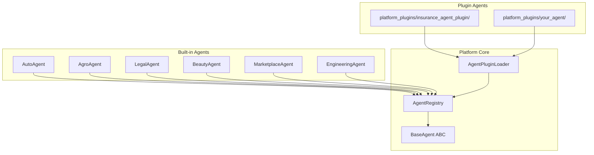

# Platform Agent Registry

> Sprint 3.1 — plugin-based AI agent system

## Overview

The Platform Agent Registry transforms BIDEX into a **plugin-based AI system**. New agents are added by dropping a folder into `platform_plugins/` — **no Platform Core modification required**.



---

## Package Structure

```
platform_agents/
├── __init__.py           # Public API
├── base_agent.py         # BaseAgent interface
├── models.py             # AgentMetadata, AgentCapability
├── registry.py           # AgentRegistry
├── plugin_loader.py      # Auto-discovery from platform_plugins/
├── validation.py         # Metadata & capability validation
├── exceptions.py
└── agents/
    └── builtin.py        # Built-in demonstration agents
```

---

## Agent Metadata

Every agent must expose:

| Field | Type | Required |
|-------|------|----------|
| id | str | yes |
| name | str | yes |
| description | str | yes |
| version | str (semver) | yes |
| author | str | yes |
| capabilities | list[str] | yes (min 1) |
| priority | int | no (default 0) |
| enabled | bool | no (default true) |

---

## BaseAgent Interface

```python
from platform_agents import BaseAgent, AgentExecutionResult

class MyAgent(BaseAgent):
    agent_id = "my_agent"
    name = "My Agent"
    description = "Does something useful"
    author = "Your Name"
    version = "1.0.0"
    capabilities = ["my_capability"]
    priority = 50

    async def execute(self, capability: str, payload: dict | None = None) -> AgentExecutionResult:
        self.validate_capability(capability)
        return AgentExecutionResult(
            agent_id=self.agent_id,
            capability=capability,
            success=True,
            output={"result": "ok"},
        )
```

**Lifecycle methods:** `initialize()`, `execute()`, `validate_capability()`, `shutdown()`, `health_check()`

---

## AgentRegistry API

```python
from platform_agents import agent_registry, register_builtin_agents

register_builtin_agents(agent_registry)

agent_registry.register(MyAgent())           # register
agent_registry.get("my_agent")               # retrieve instance
agent_registry.find_by_capability("buy_car") # capability search
agent_registry.list_agents()                 # list all
agent_registry.enable("my_agent")            # enable
agent_registry.disable("my_agent")           # disable
agent_registry.unregister("my_agent")        # remove
```

**Validation:** duplicate IDs rejected, metadata validated, capabilities validated.

---

## Plugin Creation Guide

### Step 1 — Create plugin folder

```
platform_plugins/
└── my_custom_agent/
    ├── plugin.json
    └── agent.py
```

### Step 2 — Write plugin.json

```json
{
  "id": "my_custom_agent",
  "name": "My Custom Agent",
  "description": "Handles custom tasks",
  "version": "1.0.0",
  "author": "Your Name",
  "capabilities": ["custom_task", "custom_analysis"],
  "priority": 60,
  "enabled": true,
  "entry_point": "agent:MyCustomAgent"
}
```

### Step 3 — Implement agent.py

```python
from platform_agents.base_agent import BaseAgent
from platform_agents.models import AgentExecutionResult

class MyCustomAgent(BaseAgent):
    agent_id = "my_custom_agent"
    name = "My Custom Agent"
    description = "Handles custom tasks"
    author = "Your Name"
    version = "1.0.0"
    capabilities = ["custom_task", "custom_analysis"]
    priority = 60

    async def execute(self, capability, payload=None):
        self.validate_capability(capability)
        return AgentExecutionResult(
            agent_id=self.agent_id,
            capability=capability,
            success=True,
            output={"handled": capability},
        )
```

### Step 4 — Auto-register

```python
from platform_agents import agent_registry, agent_plugin_loader, register_builtin_agents

register_builtin_agents(agent_registry)
agent_plugin_loader.load_and_register(agent_registry)
# my_custom_agent is now available — no core changes needed
```

---

## Built-in Agents

| Agent | ID | Sample Capabilities |
|-------|-----|---------------------|
| Auto Agent | `auto_agent` | buy_car, vin_lookup |
| Agro Agent | `agro_agent` | grain_trade, crop_analysis |
| Legal Agent | `legal_agent` | legal_contract, compliance_check |
| Beauty Agent | `beauty_agent` | book_appointment, service_catalog |
| Marketplace Agent | `marketplace_agent` | create_listing, order_management |
| Engineering Agent | `engineering_agent` | blueprint_review, construction_plan |

---

## Validation Rules

| Rule | Behavior |
|------|----------|
| Agent ID | `^[a-z][a-z0-9_-]*$` |
| Capability | `^[a-z][a-z0-9_]*$`, min 1 per agent |
| Version | Semver (e.g. `1.0.0`) |
| Duplicate ID | Rejected at register time |
| plugin.json ↔ agent.py | IDs must match |

---

## Relationship to Other Layers

| Layer | Package | Role |
|-------|---------|------|
| Agent Registry | `platform_agents/` | Agent discovery & metadata (Sprint 3.1) |
| Orchestrator | `platform_orchestrator/` | Task routing & execution (Sprint 2.3) |
| Domain Plugins | `plugins/` + `manifest.yaml` | HTTP routes & workflows (Sprint 1–2) |
| Plugin SDK | `platform_plugin_sdk/` | Domain plugin authoring API |

Sprint 3.1 agent plugins (`platform_plugins/*/plugin.json`) are **separate** from Sprint 1–2 domain plugins (`plugins/*/manifest.yaml`). Both coexist without modifying Platform Core.

---

## Developer Checklist

1. Create `platform_plugins/<name>/plugin.json` + `agent.py`
2. Inherit from `BaseAgent`
3. Match `agent_id` in class and `plugin.json`
4. Expose at least one valid capability
5. Call `agent_plugin_loader.load_and_register(agent_registry)` at startup
6. No changes to Platform Core required
