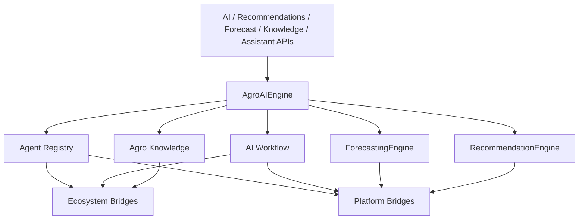

# Agro AI Agents & Smart Recommendations — Sprint 8.4

Agricultural AI layer for **Agro Marketplace 1.3.0-alpha** (`agro_ai = 1.0`).

| Field | Value |
|-------|-------|
| Application version | `1.3.0-alpha` |
| Agro AI | `1.0` |
| Platform | AI Platform Core v3.0 (Memory, Workflow, Reasoning — bridge only) |
| Ecosystem | AI Ecosystem v1.5 (Workforce, Executive AI, Knowledge Graph, Assistant — bridge only) |

## Architecture



## AI Agents guide

| Agent | Type | Focus |
|-------|------|-------|
| Farmer Assistant | `farmer_assistant` | Crops, harvests, listings |
| Buyer Assistant | `buyer_assistant` | Sourcing, RFQs |
| Supplier Assistant | `supplier_assistant` | Demand matching |
| Exporter Assistant | `exporter_assistant` | Compliance, markets |
| Marketplace Moderator | `marketplace_moderator` | Matching integrity |
| Pricing Advisor | `pricing_advisor` | Price estimation |
| Crop Advisor | `crop_advisor` | Taxonomy, seasonality |
| Warehouse Advisor | `warehouse_advisor` | Capacity / lots |
| Logistics Advisor | `logistics_advisor` | Delivery readiness |
| Executive Agro AI | `executive_agro_ai` | Reporting |

Invoke: `POST /api/agro/v1/ai/agents/{agent_type}/invoke`

## Forecasting guide

| Kind | Endpoint |
|------|----------|
| Price | `/forecast/price` |
| Demand | `/forecast/demand` |
| Supply | `/forecast/supply` |
| Harvest | `/forecast/harvest` |
| Season plan | `/forecast/season` |
| Risk | `/forecast/risk` |

## Knowledge guide

Seeded base covers crop taxonomy, seasonality, regional notes, market trends, quality standards, and export regulation hooks. Search also queries Ecosystem Knowledge Graph when available.

- `GET /knowledge/search?q=`
- `GET /knowledge/taxonomy`
- `GET /knowledge/seasonality`
- `GET /knowledge/export-regulations`

## Recommendations

Products, buyers, suppliers, contracts, inventory/warehouse optimization, trade opportunities under `/api/agro/v1/recommendations/*`.

## Workflow automation

- AI-assisted negotiations
- Automatic lead qualification
- Automatic offer matching
- Opportunity detection
- Executive reporting + task generation

## Events

`RecommendationGenerated`, `ForecastCompleted`, `LeadQualified`, `PriceEstimated`, `DemandPredicted`, `TradeOpportunityDetected`, `ExecutiveReportGenerated`

## Developer guide

```python
from applications.agro_marketplace import agro_marketplace

agents = agro_marketplace.agro_ai.agents.list_agents()
reply = await agro_marketplace.agro_ai.assistant.ask(
    "What moisture target for maize storage?",
    role="crop",
)
forecast = await agro_marketplace.agro_ai.forecasting.forecast_price("maize", region="Rift")
recs = await agro_marketplace.agro_ai.recommendations.recommend_products(buyer_id="b1")
report = await agro_marketplace.agro_ai.workflow.executive_report()
```

```bash
pytest tests/test_agro_ai.py tests/test_agro_crm.py tests/test_agro_catalog.py tests/test_agro_marketplace.py -q
```

## Constraints

- Do not modify AI Platform Core or AI Ecosystem
- Reuse Workforce, Executive AI, Knowledge Graph, Memory, Workflow via bridges only
