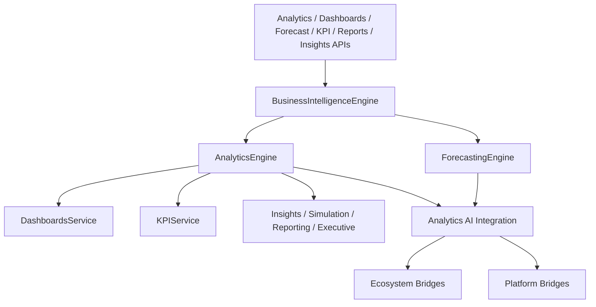

# Agro Analytics, Forecasting & Business Intelligence — Sprint 8.6

Enterprise BI for **Agro Marketplace 1.5.0-alpha** (`analytics_engine = 1.0`).

| Field | Value |
|-------|-------|
| Application version | `1.5.0-alpha` |
| Analytics Engine | `1.0` |
| Platform | AI Platform Core v3.0 (Workflow, Memory — bridge only) |
| Ecosystem | AI Ecosystem v1.5 (Executive AI, Workforce, Knowledge Graph, Governance — bridge only) |

**Hard constraint:** AI Platform Core and AI Ecosystem are not modified.

## Architecture



## Analytics guide

Domain reports via `GET /api/agro/v1/analytics/domains/{domain}`:

sales · inventory · harvest · crop · demand · supply · pricing · export · customer · regional

Facade: `agro_marketplace.analytics_engine.domain("sales")`

## Forecasting guide

Classic + BI suite:

| Kind | Endpoint |
|------|----------|
| Demand / Supply / Price / Harvest | `/forecast/*` |
| Storage / Export / Revenue / Market trend | `/forecast/storage\|export\|revenue\|market_trend` |
| Full suite | `/bi/forecast/suite` |

## BI guide

Role dashboards: executive, farmer, buyer, supplier, exporter, warehouse, logistics, marketplace.

| Area | Prefix |
|------|--------|
| Analytics | `/api/agro/v1/analytics/*` |
| Dashboards | `/api/agro/v1/dashboards/*` |
| KPI | `/api/agro/v1/kpi/*` |
| Reports | `/api/agro/v1/reports/*` |
| Insights | `/api/agro/v1/insights/*` |
| Simulation | `/api/agro/v1/simulation/*` |

KPIs: Revenue, Gross Margin, Order Volume, Marketplace Growth, Export Volume, Inventory Turnover, Warehouse Utilization, Farmer Activity, Buyer Conversion, AI Performance.

## AI Integration

Executive reports · automatic insights · anomaly detection · risk prediction · opportunity detection · optimization recommendations · scenario simulation — via Executive AI, Workforce, Knowledge Graph, Event Bus (bridges only).

## Events

`DashboardUpdated` · `ForecastGenerated` · `InsightGenerated` · `AnomalyDetected` · `ExecutiveReportCreated` · `KPICalculated` · `SimulationCompleted`

## Developer guide

```python
from applications.agro_marketplace import agro_marketplace

kpis = await agro_marketplace.analytics_engine.kpi.calculate_all()
dash = await agro_marketplace.dashboards.executive()
suite = await agro_marketplace.business_intelligence.forecasting_suite("maize", region="Rift")
report = await agro_marketplace.analytics_engine.executive.build_executive_report()
sim = await agro_marketplace.business_intelligence.run_simulation(
    "price_shock",
    {"base_revenue": 50000, "price_change_pct": 5, "demand_change_pct": -2},
)
```

## Modules

`analytics/` · `dashboards/` · `forecasting/` · `business_intelligence/` · `reporting/` · `executive/` · `metrics/` · `kpi/` · `insights/` · `simulation/`
