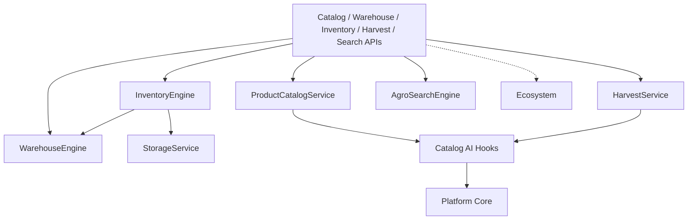

# Agro Catalog, Warehouse & Inventory — Sprint 8.2

Enterprise agricultural catalog, warehouse, inventory and harvest management for **Agro Marketplace 1.1.0-alpha**.

| Field | Value |
|-------|-------|
| Application version | `1.1.0-alpha` |
| Platform | AI Platform Core v3.0 (bridge only) |
| Ecosystem | AI Ecosystem v1.5 (bridge only) |

## Architecture



## Warehouse guide

1. Create warehouses via `POST /api/agro/v1/warehouse/warehouses`
2. Add storage locations per warehouse
3. Store batches into lots (`POST /api/agro/v1/warehouse/lots`) — emits `BatchStored`
4. Capacity is tracked on warehouse and location usage

Multi-warehouse transfers use Inventory Engine `POST /api/agro/v1/inventory/transfer`.

## Inventory guide

| Operation | Endpoint | Event |
|-----------|----------|-------|
| Incoming harvest | `POST /inventory/incoming` | `InventoryUpdated` |
| Outgoing shipment | `POST /inventory/outgoing` | `ShipmentPrepared` |
| Stock transfer | `POST /inventory/transfer` | `InventoryUpdated` |
| Availability | `GET /inventory/availability` | — |

Inventory items track quantity, reserved quantity, lot/batch linkage, and warehouse/location.

## Harvest guide

1. Create a season (`POST /harvest/seasons`)
2. Register harvest with moisture / protein / foreign material (`POST /harvest/records`) → `HarvestRegistered`
3. Create batches for storage (`POST /harvest/batches`)
4. Record lab results and issue/verify certificates → `QualityVerified`

AI quality assessment hooks suggest grades during registration.

## Product catalog

- CRUD, bulk import/update, archive/restore
- Duplicate detection (SKU + farmer/crop/region + AI hook)
- Categories, crops, varieties, packaging, attributes
- Auto-categorization and price estimation hooks

## Search

| Endpoint | Scope |
|----------|-------|
| `/search/products` | Catalog products |
| `/search/crops` | Crops |
| `/search/regions/{region}` | Products + harvests + warehouses |
| `/search/harvests` | Harvest records |
| `/search/warehouses` | Warehouses |
| `/search/suppliers` | Suppliers |
| `/search/semantic` | AI semantic + keyword fallback |

## Events

`HarvestRegistered`, `ProductCreated` (`CatalogProductCreatedEvent`), `InventoryUpdated`, `WarehouseCreated`, `QualityVerified`, `BatchStored`, `ShipmentPrepared`

## Developer guide

```python
from applications.agro_marketplace import agro_marketplace
from applications.agro_marketplace.product_catalog.models import (
    AgriculturalProduct,
    AgroWarehouse,
    HarvestRecord,
)

product = await agro_marketplace.product_catalog.create(
    AgriculturalProduct(name="Wheat", region="Rift Valley", quantity=40, price=210)
)
warehouse = await agro_marketplace.warehouse_engine.create_warehouse(
    AgroWarehouse(name="Silo A", region="Rift Valley", capacity_tons=500)
)
harvest = await agro_marketplace.harvest.register_harvest(
    HarvestRecord(crop_id="wheat", quantity=40, moisture_pct=12.5, region="Rift Valley")
)
await agro_marketplace.inventory.incoming_harvest(
    product_id=product.product_id,
    warehouse_id=warehouse.warehouse_id,
    quantity=40,
)
```

```bash
pytest tests/test_agro_catalog.py tests/test_agro_marketplace.py -q
```

## Constraints

- Do not modify AI Platform Core or AI Ecosystem
- Integrate only through `integrations/platform_bridge.py` and `ecosystem_bridge.py`
