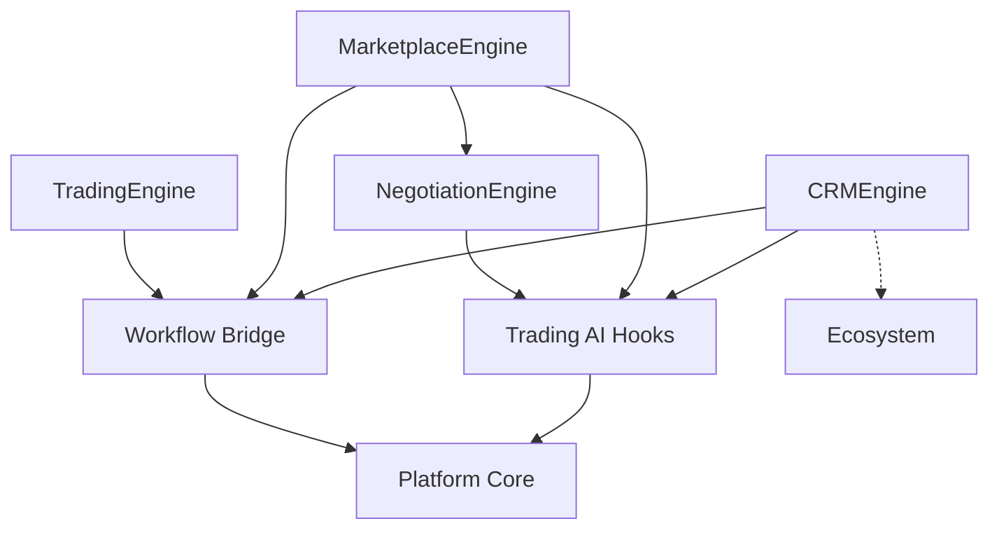

# Agro CRM, Marketplace & Trading — Sprint 8.3

CRM and agricultural trading subsystem for **Agro Marketplace 1.2.0-alpha**.

| Field | Value |
|-------|-------|
| Application version | `1.2.0-alpha` |
| Platform | AI Platform Core v3.0 (bridge only) |
| Ecosystem | AI Ecosystem v1.5 (bridge only) |

## Architecture



## CRM guide

Profiles: farmers, buyers, suppliers, exporters via `/api/agro/v1/crm/*`

| Capability | Endpoint |
|------------|----------|
| Register farmer/buyer/supplier/exporter | `POST /crm/{role}` |
| Leads + scoring | `POST /crm/leads` |
| Assign / qualify | `POST /crm/leads/{id}/assign\|qualify` |
| Contact timeline | `POST /crm/contacts`, `GET /crm/profiles/{id}/timeline` |
| Tasks | `GET\|POST /crm/tasks` |

## Marketplace guide

1. Create listing / purchase request / sales offer
2. Match offer ↔ request (`POST /marketplace/match`) → `OfferMatched`
3. Start negotiation → agree terms
4. Create & confirm marketplace order → prepare/sign contract
5. Complete deal → `TradeCompleted`

## Trading guide

| Feature | API |
|---------|-----|
| RFQ | `/trading/rfqs` |
| Counter / negotiate | `/negotiations/{id}/counter` |
| Price recommendation | `/trading/offers/{id}/price-recommendation` |
| Contract lifecycle | `/trading/contracts` |
| Trade history | `/trading/history` |
| Opportunities | `/marketplace/opportunities` |

## Events

`FarmerRegistered`, `BuyerRegistered`, `OfferPublished`, `OfferMatched`, `NegotiationStarted`, `ContractPrepared`, `OrderConfirmed`, `TradeCompleted`

## Developer guide

```python
from applications.agro_marketplace import agro_marketplace
from applications.agro_marketplace.marketplace.models import (
    BuyerProfile, FarmerProfile, PurchaseRequest, SalesOffer, MarketplaceOrder,
)

farmer = await agro_marketplace.crm_engine.register_farmer(
    FarmerProfile(name="Ada", email="ada@farm.test", region="Rift", crops=["maize"])
)
buyer = await agro_marketplace.crm_engine.register_buyer(
    BuyerProfile(name="Mill", email="mill@buy.test", preferred_crops=["maize"], budget_max=50000)
)
offer = await agro_marketplace.offers.publish(
    SalesOffer(seller_id=farmer.farmer_id, crop_id="maize", quantity=20, price=180, region="Rift")
)
req = agro_marketplace.marketplace.create_purchase_request(
    PurchaseRequest(buyer_id=buyer.buyer_id, crop_id="maize", quantity=15, max_price=200, region="Rift")
)
match = await agro_marketplace.marketplace.match_offer(offer.offer_id, req.request_id)
```

```bash
pytest tests/test_agro_crm.py tests/test_agro_catalog.py tests/test_agro_marketplace.py -q
```

## Constraints

- Do not modify AI Platform Core or AI Ecosystem
- Integrate only through application bridges
