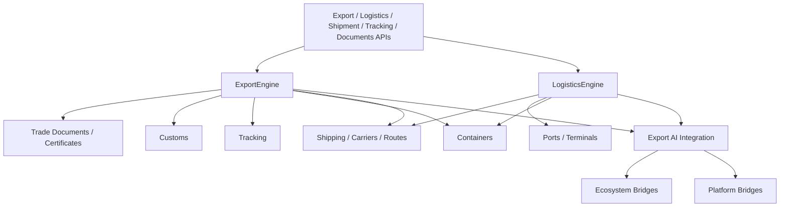

# Agro Export, Logistics & International Trade — Sprint 8.5

Cross-border agricultural trading for **Agro Marketplace 1.4.0-alpha** (`export_engine = 1.0`).

| Field | Value |
|-------|-------|
| Application version | `1.4.0-alpha` |
| Export Engine | `1.0` |
| Platform | AI Platform Core v3.0 (Workflow, Reasoning — bridge only) |
| Ecosystem | AI Ecosystem v1.5 (Workforce, Executive AI, Governance, Knowledge Graph — bridge only) |

**Hard constraint:** AI Platform Core and AI Ecosystem are not modified. Integration is via `integrations/platform_bridge.py` and `integrations/ecosystem_bridge.py` only.

## Architecture



## Export guide

Workflow: **plan → load → documents → risk → dispatch → port arrive → customs → deliver → complete**.

| Step | Engine method | Event |
|------|---------------|-------|
| Create / plan | `create_shipment` / `logistics.plan_shipment` | `ShipmentCreated` |
| Load container | `containers.load_container` | `ShipmentLoaded` |
| Prepare docs | `prepare_documents` | — |
| Verify docs | `verify_documents` | — |
| Risk | `assess_risk` | `RiskDetected` |
| Dispatch | `dispatch` | `ShipmentDispatched` |
| Arrive | `arrive_port` | `PortArrived` |
| Customs | `clear_customs` | `CustomsCleared` |
| Deliver | `confirm_delivery` | `DeliveryConfirmed` |
| Complete | `complete_export` | `ExportCompleted` |

Country requirements (seeded NL / AE / KE) drive document packs. Certificates: Certificate of Origin, Phytosanitary.

## Logistics guide

| Capability | Entry |
|------------|--------|
| Shipment planning | `POST /logistics/plan` |
| Warehouse dispatch | `POST /logistics/dispatch` |
| Delivery scheduling | `POST /logistics/deliveries` |
| Ports / terminals | `/logistics/ports`, `/logistics/terminals` |
| Carriers | `/logistics/carriers` (+ recommend) |
| Containers | `/logistics/containers`, `/load` |
| Insurance / finance | `/logistics/insurance`, `/logistics/finance/estimate` |

Seeded ports: Mombasa (KE), Rotterdam (NL), Singapore (SG), Jebel Ali (AE).

## Shipping guide

Carriers, route plans, freight orders under `shipping/`. Route planning sets estimated transit; AI ranks carriers by destination coverage and rating.

## International trade (Incoterms)

| Code | Name |
|------|------|
| EXW | Ex Works |
| FOB | Free On Board |
| CFR | Cost and Freight |
| CIF | Cost Insurance and Freight |
| DAP | Delivered At Place |
| DDP | Delivered Duty Paid |

`GET /api/agro/v1/export/incoterms` — trade compliance hooks via Ecosystem governance + knowledge lookup on risk assessment.

## AI Integration

Route optimization · carrier recommendation · export risk · delivery prediction · shipment / container optimization · customs document validation · trade opportunities.

Reuses Workforce, Workflow Engine, Executive AI, Governance, Event Bus, and Knowledge Graph through bridges only.

## API

| Area | Prefix |
|------|--------|
| Export | `/api/agro/v1/export/*` |
| Logistics | `/api/agro/v1/logistics/*` |
| Shipments | `/api/agro/v1/shipments/{id}/tracking\|documents` |
| Tracking | `/api/agro/v1/tracking/{shipment_id}` |
| Documents | `/api/agro/v1/trade-documents` |

Health: `GET /api/agro/v1/export/health`

## Events

`ShipmentCreated` · `ShipmentLoaded` · `ShipmentDispatched` · `PortArrived` · `CustomsCleared` · `ExportCompleted` · `DeliveryConfirmed` · `RiskDetected`

## Developer guide

```python
from applications.agro_marketplace import agro_marketplace
from applications.agro_marketplace.export.models import (
    Carrier,
    IncotermCode,
    InternationalExportShipment,
    Port,
)

ports = agro_marketplace.ports.list_ports(country="KE")
carrier = agro_marketplace.shipping.create_carrier(
    Carrier(name="AgroLine", countries=["NL", "AE"], rating=4.5)
)
plan = await agro_marketplace.logistics_engine.plan_shipment(
    InternationalExportShipment(
        origin_country="KE",
        destination_country="NL",
        origin_port_id=ports[0].port_id,
        destination_port_id=agro_marketplace.ports.list_ports(country="NL")[0].port_id,
        incoterm=IncotermCode.CIF,
        exporter_id="exp-1",
    )
)
shipment_id = plan["shipment"]["shipment_id"]
await agro_marketplace.export_engine.prepare_documents(shipment_id, cargo_value=50000)
await agro_marketplace.export_engine.dispatch(shipment_id)  # set carrier + origin port first
timeline = agro_marketplace.tracking.timeline(shipment_id)
```

## Modules

`export/` · `logistics/` · `shipping/` · `customs/` · `ports/` · `containers/` · `incoterms/` · `documents/` · `certificates/` · `tracking/` · `insurance/` · `finance/`
