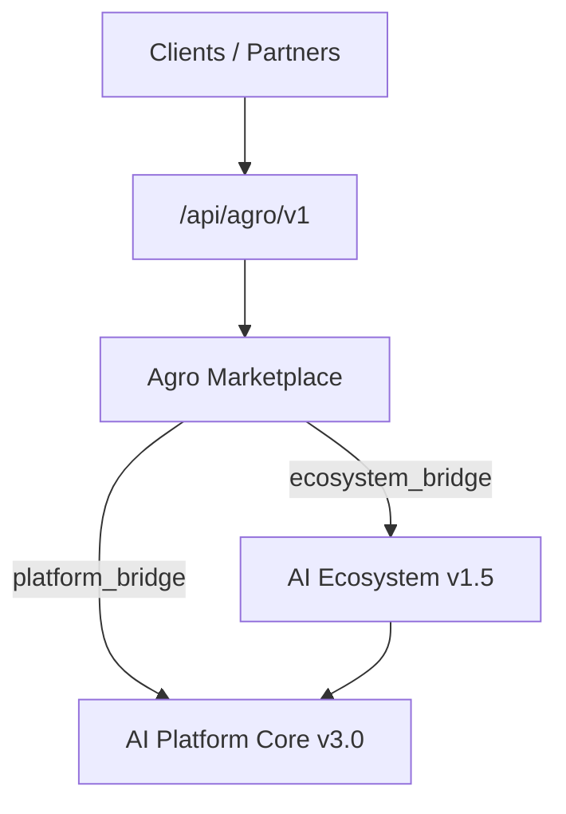

# Agro Marketplace — Foundation (Sprint 8.1)

Agricultural marketplace as the second enterprise application on **AI Platform Core v3.0** and **AI Ecosystem v1.5**.

| Field | Value |
|-------|-------|
| Application | Agro Marketplace |
| Version | `1.0.0-alpha` |
| Package | `applications/agro_marketplace/` |
| Platform | AI Platform Core v3.0 (bridge only — not modified) |
| Ecosystem | AI Ecosystem v1.5 (bridge only — not modified) |

## Architecture



Agro Marketplace reuses Ecosystem Identity, Unified AI Assistant, Memory, Workflow, Executive AI, AI Workforce, Recommendation Engine, Knowledge Graph, Event Bus, and Governance — without changing those packages.

## Domain model

| Entity | Module | Description |
|--------|--------|-------------|
| Farmer / Farm / Field | `farmers/` | Producer registry and land units |
| Supplier | `suppliers/` | Input and services suppliers |
| Buyer | `buyers/` | Processors, traders, retailers |
| Product / ProductCategory / Crop / Harvest | `products/`, `catalog/` | Sellable inventory and harvests |
| MarketplaceListing | `catalog/` | Public listings |
| Order / Offer / Contract | `orders/` | Commercial transactions |
| Warehouse / StorageLot | `warehouse/` | Storage capacity and lots |
| Delivery | `logistics/` | Domestic delivery |
| ExportShipment / QualityCertificate | `export/` | Cross-border shipments |

## Folder structure

```
applications/agro_marketplace/
  catalog/ crm/ farmers/ buyers/ suppliers/ products/
  orders/ pricing/ warehouse/ logistics/ analytics/
  documents/ payments/ notifications/ export/ dashboard/
  shared/ security/ integrations/ api/
  application.py  config.py  manifest.json
```

## Services

| Service | Responsibility |
|---------|----------------|
| CatalogService | Categories, listings, search |
| FarmerService | Farmers, farms, fields |
| SupplierService | Suppliers |
| BuyerService | Buyers |
| ProductService | Products, crops, harvests |
| OrderService | Orders, offers, contracts |
| WarehouseService | Warehouses, storage lots |
| PricingService | Quotes and recommendations |
| LogisticsService | Deliveries |
| ExportService | Export shipments, certificates |
| AnalyticsService | Metrics |
| NotificationService | In-app / webhook notifications |

## API overview

| Surface | Prefix |
|---------|--------|
| REST (versioned) | `/api/agro/v1` |
| Internal | `/internal/agro/v1` |
| Webhooks | `/webhooks/agro/v1` |

Authentication uses **Ecosystem Identity** (`Authorization: Bearer <token>`). Internal routes require a valid session. Public GET paths include `/health`, `/products`, `/catalog/search`, `/listings`, `/categories`.

### Key endpoints

- `GET /api/agro/v1/health`
- `POST /api/agro/v1/farmers` — register farmer (`FarmerRegistered`)
- `POST /api/agro/v1/products` — create product (`ProductCreated`)
- `POST /api/agro/v1/harvests` — add harvest (`HarvestAdded`)
- `POST /api/agro/v1/orders` — create order (`OrderCreated`)
- `POST /api/agro/v1/deliveries` — create delivery (`ShipmentCreated`)
- `POST /api/agro/v1/deliveries/{id}/complete` — (`DeliveryCompleted`)
- `POST /api/agro/v1/export/shipments/{id}/start` — (`ExportStarted`)
- `GET /api/agro/v1/dashboard`
- `POST /api/agro/v1/assistant` — Unified AI Assistant via ecosystem bridge

## Events

| Event | When |
|-------|------|
| FarmerRegistered | Farmer registration |
| ProductCreated | Product created |
| HarvestAdded | Harvest recorded |
| OrderCreated | Order placed |
| ShipmentCreated | Delivery or export shipment created |
| ContractSigned | Contract signed |
| ExportStarted | Export shipment started |
| DeliveryCompleted | Delivery completed |

## Security roles

`farmer`, `buyer`, `supplier`, `exporter`, `logistics`, `administrator`, `owner`, `ai_agent`

RBAC lives in `security/permissions.py` and composes with Ecosystem Identity + Governance.

## AI integration (reuse only)

| Capability | Via |
|------------|-----|
| Unified AI Assistant | `ecosystem_bridge.ask_assistant` |
| Memory Engine | `platform_bridge.store_farmer_context` |
| Workflow Engine | `platform_bridge.start_order_workflow` |
| Executive AI / Workforce / Knowledge Graph | Ecosystem engine bridges |
| Recommendation Engine | `PricingService` + platform reasoning |
| Event Bus | `events.publisher.publish` |

## Developer guide

```python
from applications.agro_marketplace import agro_marketplace
from applications.agro_marketplace.shared.models import Farmer, Product

farmer = await agro_marketplace.farmers.register_farmer(
    Farmer(name="Ada Farms", email="ada@example.com")
)
product = await agro_marketplace.products.create_product(
    Product(name="Wheat", farmer_id=farmer.farmer_id, price=220, quantity=50)
)
```

Register routes (already wired in `api/server.py`):

```python
from applications.agro_marketplace.api.register import register_agro_marketplace_routes
register_agro_marketplace_routes(app)
```

Run tests:

```bash
pytest tests/test_agro_marketplace.py -q
```

## Constraints

- **DO NOT** modify AI Platform Core (`platform_*`)
- **DO NOT** modify AI Ecosystem (`ecosystem/`)
- Integrate only through bridges under `integrations/`
