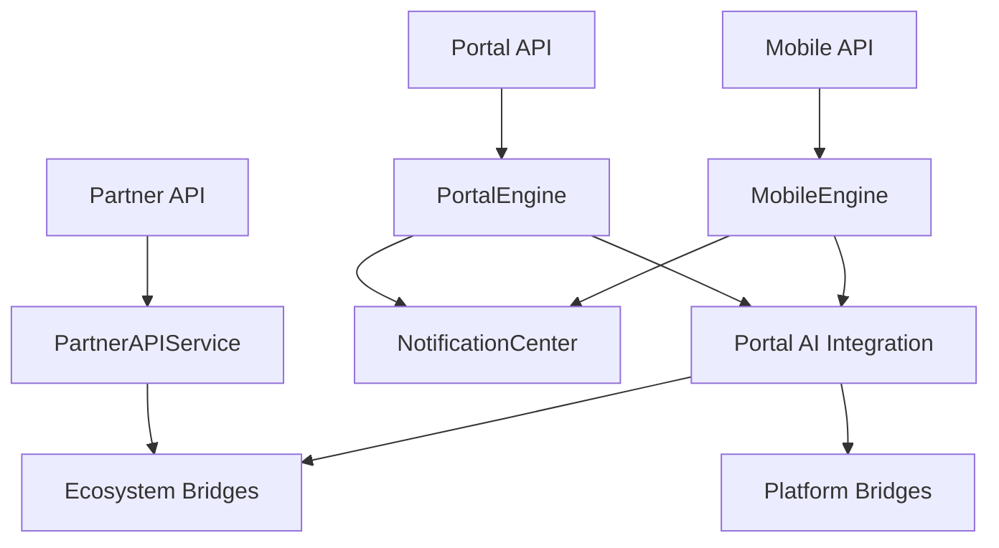

# Agro Farmer Portal, Mobile API & Partner Integrations — Sprint 8.7

Customer-facing platform for **Agro Marketplace 1.6.0-alpha** (`portal_engine = 1.0`).

| Field | Value |
|-------|-------|
| Application version | `1.6.0-alpha` |
| Portal Engine | `1.0` |
| Platform | AI Platform Core v3.0 (bridge only) |
| Ecosystem | AI Ecosystem v1.5 — Identity, Assistant, Workforce, Governance (bridge only) |

**Hard constraint:** AI Platform Core and AI Ecosystem are not modified.

## Architecture



## Portal guide

| Portal | Kind |
|--------|------|
| Farmer Portal | `farmer` |
| Buyer Portal | `buyer` |
| Supplier Portal | `supplier` |
| Exporter Portal | `exporter` |
| Administrator Portal | `administrator` |
| Executive Dashboard Portal | `executive` |

`GET|POST /api/agro/v1/portal/{kind}?user_id=`

Register: `POST /api/agro/v1/portal/users`  
Assistant: `POST /api/agro/v1/portal/assistant`

## Mobile guide

Base: `/api/agro/mobile/v1`

| Area | Endpoint |
|------|----------|
| Auth | `POST /auth` |
| Profile | `GET /profile/{user_id}` |
| Home | `GET /home/{user_id}` |
| Products / Orders | `GET /products`, `GET /orders` |
| Notifications | `GET /notifications/{user_id}` |
| Analytics | `GET /analytics` |
| AI Assistant | `POST /assistant` |
| Documents / Messaging | `GET /documents`, `GET /messaging/threads` |

## Partner guide

Base: `/api/agro/partner/v1`

Abstractions: bank · insurance · logistics · government · laboratory · ERP · marketplace partner API.

- `POST /connections` — connect partner
- `GET /connections` — list
- `POST /invoke` — call connector action

Webhook management: `/api/agro/v1/webhooks/subscriptions`, `/trigger`  
Inbound: `/webhooks/agro/v1/orders|shipments|partners`

## Notification Center

Channels: in-app · push · email · SMS · workflow · AI alerts

`POST /api/agro/v1/notifications` · `GET /notifications/{user_id}` · `POST /notifications/ai-alert`

## Events

`PortalUserRegistered` · `NotificationSent` · `PartnerConnected` · `WebhookTriggered` · `MobileSessionStarted` · `DocumentShared`

## Developer guide

```python
from applications.agro_marketplace import agro_marketplace
from applications.agro_marketplace.portal.models import PortalKind, PortalUser, PartnerConnection, PartnerType

user = await agro_marketplace.portal_engine.register_user(
    PortalUser(email="farmer@agro.test", role="farmer", display_name="Amina")
)
farmer = await agro_marketplace.portal_engine.build_portal(PortalKind.FARMER, user_id=user.user_id)
session = await agro_marketplace.mobile_engine.authenticate(email="farmer@agro.test", platform="android")
await agro_marketplace.partner_api.connect(
    PartnerConnection(partner_type=PartnerType.BANK, partner_name="AgriBank")
)
await agro_marketplace.notification_center.push(user.user_id, "Harvest", "Moisture check due")
```

## Modules

`portal/` · `mobile/` · `users/` · `notifications/` · `partner_api/` · `integrations/` · `webhooks/` · `calendar/` · `documents/` · `messaging/`
