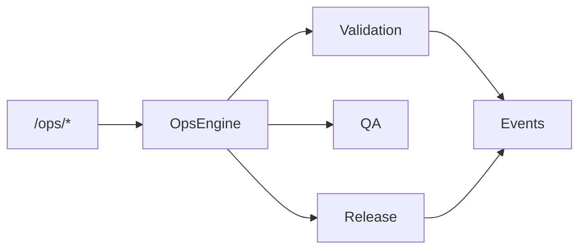

# Agro Marketplace Commercial Release — Sprint 8.8

**Version 2.0.0** · **Status: Production Ready** · **Release: Commercial**

| Field | Value |
|-------|-------|
| Application | Agro Marketplace |
| Version | `2.0.0` |
| Status | Production Ready |
| Release | Commercial |
| Platform | AI Platform Core v3.0 (bridge only) |
| Ecosystem | AI Ecosystem v1.5 (bridge only) |

## Release notes

### What’s included
- Foundation marketplace (catalog, CRM, trading, warehouse)
- Agricultural AI agents, recommendations, forecasting
- Export / logistics / international trade
- Analytics, BI dashboards, KPI & executive reporting
- Farmer / buyer / supplier / exporter / admin / executive portals
- Mobile API and partner integrations
- Notification center and webhook registry
- Production validation, readiness, certification ops suite

### Constraints honored
- AI Platform Core was **not** modified
- AI Ecosystem was **not** modified
- Integration only via `integrations/platform_bridge.py` and `integrations/ecosystem_bridge.py`

## Architecture (ops)

## Ops API

| Endpoint | Purpose |
|----------|---------|
| `GET /api/agro/v1/ops/health` | Production health |
| `GET /api/agro/v1/ops/version` | Version / status |
| `GET\|POST /api/agro/v1/ops/readiness` | Readiness score |
| `GET\|POST /api/agro/v1/ops/validation` | Full validation |
| `GET\|POST /api/agro/v1/ops/release` | Release list / commercial bundle |
| `GET /api/agro/v1/ops/reports` | QA reports |
| `POST /api/agro/v1/ops/certify` | Certification |
| `POST /api/agro/v1/ops/deploy/verify` | Deployment verification |

## Reports

Production · Quality · Security · Performance · Compatibility · Deployment

## Events

`ApplicationValidated` · `ProductionReady` · `ReleaseCreated` · `DeploymentVerified` · `CertificationCompleted`

## Guides

- [DEPLOYMENT.md](DEPLOYMENT.md)
- [OPERATIONS.md](OPERATIONS.md)
- [USER_GUIDE.md](USER_GUIDE.md)
- [ADMIN_GUIDE.md](ADMIN_GUIDE.md)

## Certification checklist

- [x] Full application validation
- [x] API / workflow / AI / partner / permission / event validation
- [x] Manifest & version verification (`2.0.0`)
- [x] Production readiness report
- [x] Commercial release record
