# Enterprise AI Operating System — Agent Lifecycle

**Sprint:** CG-8 — Architecture Research + Product Research. Documentation only, `src/` not modified.

**Do not duplicate:** `ARCHITECTURE_MAP.md` §5 already established the core finding this document is
built on — **three disconnected AI-agent stacks** exist (Python `platform_*` chain, TS
`src/orchestrator`, and `applications/platform_builder/ai_team`/`ai_builder`) — not repeated here. This
document maps the brief's nine lifecycle stages onto those three stacks plus `platform_ai_os`'s
separate real Agent Registry 2.0 (`ENTERPRISE_AI_OS.md`), precisely, stage by stage.

## 0. Which agent registry a lifecycle stage actually runs against

At least **three** real agent registries exist, each independently real, none unified:

| Registry | Stack | What it actually does |
|---|---|---|
| `platform_agents.registry` | Python, used by `platform_workflow`'s real engine (`WORKFLOW_RUNTIME.md` §1) for agent-step assignment | Real |
| `platform_orchestrator.agent_registry` | Python, used by `platform_orchestrator`'s single-task capability-routed executor (`AUTOMATION_ENGINE.md` §3) — a **different registry** from the one above, confirmed by CG-7's direct code reading | Real |
| `platform_ai_os`'s "Agent Registry 2.0" (`GET /agents`) | Python, part of the Sprint 27.1 Multi-Agent OS (`ENTERPRISE_AI_OS.md`) — name/role/status/load/capabilities/cost/speed/memory/models | Real, richer schema than either of the two above; not confirmed by this research to be the same underlying store |
| `aiAgentRuntime` | TS, frontend, `enterprise-runtime/` | **Client-side simulated** — `status: idle\|busy\|waiting\|error\|offline`, `queueDepth`, `memoryMb`, `workflow`, `health`; this is what City's AI visualization (`CITY_SIMULATION.md` §2) actually reads, per `CITY_AI_PLATFORM.md`'s central finding |

Every stage below names which of these four an implementation sprint would actually touch — a lifecycle
document that didn't distinguish these would silently imply a single coherent agent model that doesn't
exist.

## 1. Nine lifecycle stages

| Stage | Real mechanism | Gap |
|---|---|---|
| Creation | `platform_agents`/`platform_orchestrator` both have real agent-registration code paths (construction of an agent record); `platform_ai_os`'s richer schema (cost/speed/memory/models fields) suggests a more complete creation-time metadata model | Which of the three is authoritative for a *new* agent is unresolved — creating an agent in one registry does not create it in the other two |
| Registration | Same three real registries — each has its own registration call | No shared registration event; `TRIGGER_SYSTEM.md` §4's "AI action" event-source row is the closest real cross-cutting signal, but it's not agent-registration-specific |
| Permissions | **No agent-specific permission model found** — `CITY_INTEGRATIONS.md` §3's real `permissionManager`/`roleManager` are frontend, human-user-scoped; no equivalent "which permissions does this agent have" model was confirmed in any of the three backend registries | The clearest SPEC gap in this whole document — see §2 |
| Memory | `AI_MEMORY.md`'s four candidate memory surfaces, none unified; `platform_ai_os`'s Agent Registry 2.0 schema includes a `memory` field per-agent (real field, depth not independently verified) | Same "which surface is authoritative" gap as Creation |
| Reasoning | `platform_reasoning`/`platform_planning`/`platform_decision` (Python, real per `CLAUDE.md`'s AI stack description, not independently re-verified in this research pass) | Depth not confirmed this pass — flagged, not assumed absent |
| Execution | `platform_orchestrator.execute_async()` — **real, with real timeout (`asyncio.wait_for`) and real exponential-backoff retry** (`AUTOMATION_ENGINE.md` §3); `platform_ai_os`'s Task Orchestrator (`POST /tasks`, DAG, retry/rollback/timeout) is a separate real execution path, likely overlapping per `AI_OS.md` §0's flagged risk | The best-evidenced stage in this entire document — genuinely real, just duplicated |
| Communication | `platform_orchestrator`'s `AgentMessageBus` (real, request/response between agents, `AUTOMATION_ENGINE.md`/CG-7 research) **and** `platform_ai_os`'s separate Communication Bus (`/agent-bus`, real, request/response/event/broadcast/stream + priority queue) | Two real, independently-implemented agent communication buses — not the same code, per distinct real/discovered evidence in two different sprints' research |
| Termination | Not independently confirmed in this research pass for any of the three registries — `platform_orchestrator.cancel(task_id)` (real, cancels a running task) is the closest real analog, but task-cancellation is not the same as agent-deregistration/termination | Flagged as unverified, not assumed absent — a concrete next research step |
| Recovery | `applications/ai_os`'s real "AI Runtime" (`AI_OS.md`'s implementation reference — "sandboxed execution, security layer, context/state management, **checkpoints, and recovery**") is the one place "recovery" appears as a named real capability anywhere in this survey | Depth not independently re-verified — the strongest *named* precedent, unconfirmed *implementation* depth |

## 2. Permissions — the clearest SPEC gap (elaborated)

No agent-specific permission model (what actions/data an agent is allowed to touch) was confirmed
anywhere in this research pass, on either the `platform_agents`/`platform_orchestrator` side or
`platform_ai_os`'s richer schema. `platform_tools.Tool`'s real `required_permissions` field
(`ACTION_LIBRARY.md` §1, CG-7) is the closest real precedent — a *tool* has required permissions
checked at execution time by the real `ToolExecutor`. **SPEC recommendation**: extend that same
mechanism to agents directly (an agent's registry record carries a `required_permissions`/
`allowed_capabilities` field, checked the same way `ToolExecutor` already checks a tool's), rather than
inventing a second permission-check mechanism for agents specifically.

## 3. Lifecycle diagram (as it actually exists — fragmented, not unified)

```mermaid
stateDiagram-v2
    [*] --> Created: platform_agents / platform_orchestrator\nregistry (real, but which one?)
    Created --> Registered: same ambiguity
    Registered --> Executing: platform_orchestrator.execute_async()\n(real, timeout+retry)\nOR platform_ai_os /tasks\n(real, DAG, likely overlapping)
    Executing --> Communicating: AgentMessageBus (real)\nOR /agent-bus (real, separate)
    Communicating --> Executing
    Executing --> Failed: real TaskResult status
    Failed --> Executing: real retry/backoff
    Executing --> Completed: real
    Completed --> [*]
    Executing --> Terminated: unverified this pass
    Terminated --> Recovering: applications/ai_os "AI Runtime"\nrecovery capability (real, named;\ndepth unverified)
    Recovering --> Executing
```

## 4. Non-goals

- No unification of the three agent registries is designed here — flagged as a verification/ADR item
  (`AI_OS.md` §0), same posture as `AUTOMATION_ENGINE.md` §1's workflow-engine consolidation ask.
- No new agent permission model beyond extending the real `Tool.required_permissions` pattern (§2).
- No claim about Termination/Recovery's real implementation depth — both explicitly flagged as
  unverified rather than guessed at.

## Related documents

`ARCHITECTURE_MAP.md` §5 (three disconnected agent stacks), `ENTERPRISE_AI_OS.md` (Agent Registry 2.0,
Communication Bus, Task Orchestrator), `AUTOMATION_ENGINE.md`/`ACTION_LIBRARY.md` (CG-7,
`platform_orchestrator`/`platform_tools` detail), `CITY_AI_PLATFORM.md` (CG-6, the frontend
`aiAgentRuntime` simulation this document's registry table includes), `AI_OS.md` §0 (the
`platform_ai_os` vs. workflow-engine overlap risk this document's Execution row restates).
