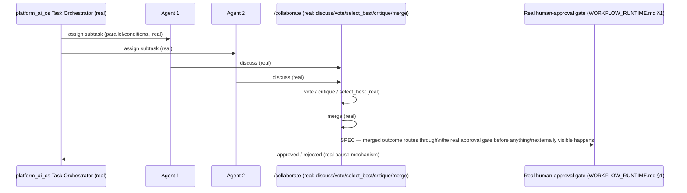

# Enterprise AI Operating System — Agent Collaboration

**Sprint:** CG-8 — Architecture Research + Product Research. Documentation only, `src/` not modified.

**Do not duplicate:** `COLLABORATION.md`/`MULTI_AGENT_COLLABORATION.md`/`AI_TEAM_COLLABORATION_32_6.md`
already document one real collaboration engine (`platform_collaboration`, Sprint 4.5 — structured
multi-agent coordination, negotiation, consensus: `CollaborationEngine`, `CollaborationPipeline`,
`NegotiationEngine`). `ENTERPRISE_AI_OS.md` §9 already documents a **second** real collaboration
mechanism (`platform_ai_os`'s `POST /collaborate` — discuss/vote/select_best/critique/merge) and
explicitly corrects an earlier characterization that treated `platform_collaboration` as the only
relevant precedent. This document does not re-describe either — it maps the brief's eight requested
collaboration concepts onto both real mechanisms, precisely, and adds the TS-side third mechanism
neither prior document named.

## 0. Three real collaboration mechanisms, not one

| Mechanism | Stack | Real capability |
|---|---|---|
| `platform_collaboration` | Python | `CollaborationEngine`/`CollaborationPipeline`/`NegotiationEngine` — structured coordination, negotiation, consensus (Sprint 4.5, real, per `COLLABORATION.md`) |
| `platform_ai_os`'s `/collaborate` | Python | discuss/vote/select_best/critique/merge — a real, named protocol for multiple agents reaching a joint outcome (`ENTERPRISE_AI_OS.md` §9) |
| `src/orchestrator/collaboration/CollaborationEngine.ts` | TS, ADOS kernel ecosystem | Its own `SharedContext`/`Timeline` classes (`ARCHITECTURE_MAP.md` §5 item 2) — real code, but the entire TS kernel ecosystem has zero runtime connection to the Python backend, so this is a **third, structurally isolated** collaboration engine, not merely a duplicate name |

**None of the three call each other.** This is the same shape of finding as `AUTOMATION_ENGINE.md` §0
(six-plus disconnected workflow engines) and `AI_AGENT_LIFECYCLE.md` §0 (three disconnected agent
registries) — collaboration is the fourth major AI-OS concept this engagement has now found
independently re-implemented two-to-three times across the codebase.

## 1. Per-concept mapping (brief's eight)

| Requested concept | Real mechanism | Status |
|---|---|---|
| Multi-agent execution | `platform_ai_os`'s Task Orchestrator (`POST /tasks`, real — parallel/sequential/conditional + retry/rollback/timeout, `ENTERPRISE_AI_OS.md` §9) | Real, richest of the candidates for this specific concept |
| Delegation | Not independently confirmed as a named concept in any of the three mechanisms this research pass reviewed | Flagged unverified, not assumed absent — `platform_collaboration`'s `NegotiationEngine` (real) is the closest plausible home if delegation means "agents negotiating who does what" |
| Coordination | `platform_collaboration`'s `CollaborationEngine`/`CollaborationPipeline` (real, this is its stated purpose) | Real |
| Shared memory | **No shared-memory mechanism confirmed specific to collaboration** — `AI_MEMORY.md`'s four candidate memory surfaces are agent-adjacent but not confirmed to be the substrate any of the three collaboration engines actually read/write during a joint task | Gap — see §2 |
| Message bus | Two real, separate buses: `platform_orchestrator`'s `AgentMessageBus` (request/response between agents) and `platform_ai_os`'s Communication Bus (`/agent-bus` — request/response/event/broadcast/stream + priority queue) — both cited already in `AI_AGENT_LIFECYCLE.md` §1's Communication row | Real, duplicated |
| Task ownership | `platform_ai_os`'s Agent Registry 2.0 schema includes agent-level fields (load, capabilities) that could express ownership, but no explicit "owner" field was confirmed | Not confirmed — same posture as `WORKFLOW_RUNTIME.md` §5's Owner gap for workflows, now the same gap shape found in the agent-collaboration domain too |
| Handoff | `platform_workflow`'s real dependency-ordered step execution is the closest real analog (`WORKFLOW_RUNTIME.md` §1) — one step's output becoming the next step's input is structurally a handoff, though not agent-to-agent negotiation-based | Real, but at the workflow-engine layer, not the agent-collaboration layer specifically |
| Approval | `platform_workflow`'s real human-task `WAITING` pause (`WORKFLOW_RUNTIME.md` §1) — the platform's one confirmed, structurally-enforced approval gate, already cross-referenced in `ACTION_LIBRARY.md` §2 and `CITY_INTEGRATIONS.md` §1 (AI Production Center's approval stage) | Real, and — per `ENTERPRISE_AI_OS.md` §13's automation philosophy — this gate should apply to *any* multi-agent collaboration outcome that acts externally, not be re-implemented per-mechanism |

## 2. Shared memory gap (elaborated)

None of the three collaboration mechanisms in §0 were confirmed by this research to read from or write
to a common memory substrate during a joint task — `platform_collaboration`'s negotiation state,
`platform_ai_os`'s discuss/vote/critique/merge protocol state, and `src/orchestrator`'s `SharedContext`
(TS, isolated) each appear to hold their own transient state, not a shared one. **SPEC recommendation**:
once `AI_MEMORY.md` §3's reconciliation work identifies one authoritative memory surface, a
collaboration session's working state (the discussion/vote/critique history) should persist there as a
`session`-scoped memory entry (reusing `platform_ai_os`'s own real `session` layer naming), rather than
each collaboration mechanism inventing its own transient state store.

## 3. Collaboration flow (SPEC — using the richest real mechanism as the reference shape)

The only SPEC element in this diagram is the arrow into `Approval` — every other step is a real,
named, already-implemented capability of `platform_ai_os`. This is deliberately the smallest possible
gap to close: the collaboration protocol already exists end-to-end; it is not yet confirmed to be
gated by the platform's one real approval mechanism before its output acts externally.

## 4. Non-goals

- No unification of the three collaboration engines (§0) — flagged for the same kind of ADR
  `AUTOMATION_ENGINE.md`/`AI_AGENT_LIFECYCLE.md` already called for in their respective domains.
- No new shared-memory mechanism — §2 recommends reusing `platform_ai_os`'s existing `session` layer,
  once `AI_MEMORY.md`'s reconciliation identifies it as authoritative.
- No new message bus — two real ones already exist; consolidation, not addition, is the correct frame.

## Related documents

`COLLABORATION.md`/`MULTI_AGENT_COLLABORATION.md`/`AI_TEAM_COLLABORATION_32_6.md` (the
`platform_collaboration` mechanism), `ENTERPRISE_AI_OS.md` §9 (the `/collaborate` and Task Orchestrator
mechanism), `ARCHITECTURE_MAP.md` §5 (the TS-side `CollaborationEngine.ts`), `AI_AGENT_LIFECYCLE.md`
(the message-bus/registry findings this document extends), `AI_MEMORY.md` (§2's shared-memory
dependency), `WORKFLOW_RUNTIME.md` §1/§5 (the real approval gate and the Owner-field gap shape).
