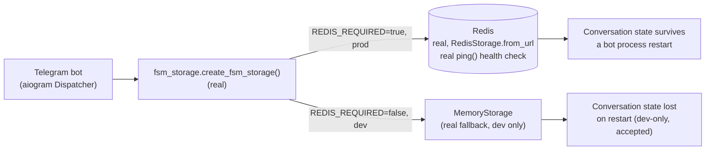

# Enterprise AI Operating System — Memory Architecture

**Sprint:** CG-8 — Architecture Research + Product Research. Documentation only, `src/` not modified.

**Do not duplicate:** `ENTERPRISE_AI_OS.md` §7/§8 and `ARCHITECTURE_MAP.md` §8 already established the
core duplication finding (`platform_memory/` vs. `platform_ai/memory/` — two full parallel stacks,
`TD-21`) and the real `platform_ai_os` Memory Manager's six layers (short/session/workspace/
organization/knowledge/semantic). This document maps the brief's five requested memory types onto
those real findings and adds new, specific research into what's actually backing the "knowledge" and
"vector storage" layers — which turns out to be the most important new finding in this document.

## Implementation reference — the original `AI_MEMORY.md` (preserved verbatim, real)

This file already existed before this sprint, describing a **fourth** real memory surface this
engagement had not yet named precisely:

> **Version:** `5.3.2-enterprise` · **API:** `GET/POST /api/enterprise-kg/v1/memory`
>
> ## Memory Types
>
> Long-Term · Conversation · Business · Project · Decision · Workflow · Memory Version Control

The `/api/enterprise-kg/v1` prefix (distinct from `platform_ai_os`'s `/api/ai-os/v1`) maps onto
`ARCHITECTURE_MAP.md` §8's already-noted `platform_enterprise_knowledge_graph/memory/__init__.py` —
meaning there are now **at least four** independent real-or-partially-real "memory" surfaces this
engagement has identified across its research: `platform_memory/`, `platform_ai/memory/`,
`platform_ai_os`'s six-layer Memory Manager, and `platform_enterprise_knowledge_graph/memory/`
(this document's implementation reference). This document's contribution is naming this precisely,
not resolving it — the resolution remains the ADR `ENTERPRISE_AI_OS.md` recommendation #3 already
calls for, now with one more candidate to include in that review. This stub's own **"Memory Version
Control"** memory type is worth flagging separately: it is the one place in this entire four-way
survey where a *versioning* concept for memory itself is named, distinct from `WORKFLOW_RUNTIME.md`
§5's separate (and also unbuilt) workflow-definition versioning — two different "versioning" gaps in
two different subsystems, not to be conflated.

## 0. The headline finding — the knowledge layer's embeddings are fake

`platform_ai/memory/memory_embeddings.py` defines `OpenAIEmbeddingProvider` and
`LocalEmbeddingProvider` — both real classes, both **actually call the same `_hash_embed()` function**:
a deterministic SHA-256 hash turned into a fixed-size vector. **Neither makes a real embedding API call
despite the class names implying otherwise.** This is a more specific and more consequential finding
than `TD-21`'s existing "two memory stacks" note — it means even the more complete of the two stacks
(`platform_ai/memory/`, which has a real `KnowledgeBase`/`DocumentStore`/`KnowledgeIndex`/
`KnowledgeSearch` chain) cannot actually do semantic similarity search today: two unrelated documents
that happen to hash similarly would appear "similar," and two paraphrased documents that hash
differently would not. Any workflow, agent, or City building this document's SPEC sections propose
binding to a "knowledge" or "semantic memory" layer must treat this as a hard blocker until real
embeddings exist — not a quality-tuning detail to fix later.

## 1. Per-type mapping (brief's five memory types + vector storage + cache)

| Requested type | Closest real layer(s) | Real status |
|---|---|---|
| Working memory | `platform_ai_os`'s `short`/`session` layers | Real layer names exist; internal depth not independently re-verified this pass |
| Persistent memory | `platform_ai_os`'s `organization` layer; the implementation-reference stub's "Long-Term" type | **No durable backing confirmed for any candidate** — `platform_ai/memory/document_store.py`'s `DocumentStore` is a plain in-process `dict`, no DB/file persistence (the same "correct abstraction, in-memory-only implementation" shape `WORKFLOW_RUNTIME.md` §1 found independently in the workflow engine) |
| Knowledge memory | `platform_ai_os`'s `knowledge` layer + `platform_ai/memory/knowledge_base.py`'s real chunk/index/search chain | Real code, real shape, **fake embeddings** (§0) |
| Conversation memory | Telegram bot's real FSM state (`fsm_storage.py`, real `RedisStorage`); also named in the implementation-reference stub | **The one genuinely durable, production-real memory mechanism found in this entire survey** — see §2 |
| Project memory | `platform_ai_os`'s `workspace` layer; the implementation-reference stub's "Project" type | Two candidates, neither independently re-verified for depth |
| Vector storage | **Absent entirely** — no `faiss`/`chromadb`/`pinecone`/`weaviate`/`qdrant` anywhere in `requirements.txt` or imports; `platform_memory/repositories/in_memory_semantic_repository.py`'s own comment names pgvector/Qdrant/Milvus/Weaviate as **aspirational, unimplemented** swap targets | The concrete, missing piece behind §0's fake-embedding finding — no real vector index exists to search even once real embeddings do |
| Cache | **Real and genuinely used** — Redis (`redis>=5.0.0`, `aioredis>=2.0.0`) backs FSM conversation state (production-critical, `REDIS_REQUIRED` fails hard if unavailable) and is separately used for best-effort health/metrics/config caching across several `platform_*` services | The one unambiguous "this works in production today" finding in this document |

## 2. Why conversation memory is the exception worth naming precisely

Every other memory type in §1 is either fully in-process (loses state on restart) or has an
unconfirmed durability story. Conversation memory is the one place this platform has already made
the correct production decision (fail hard rather than silently degrade to volatile state when Redis
is required) — this is the pattern the rest of this document's SPEC recommendations should copy, not
a special case to work around.

## 3. SPEC — closing the gaps, in dependency order

1. **Real embeddings first** — swap `_hash_embed()` for a real call. OpenRouter (`AI_PROVIDER_LAYER.md`)
   is the one real, wired LLM provider this platform has, but confirming it (or a dedicated embeddings
   provider) actually supports an embedding endpoint is a prerequisite check, not assumed here — chat
   completions and embeddings are different API surfaces.
2. **Real vector index second** — `pgvector` is the lowest-friction real option given the platform's
   existing, canonical Postgres-only policy (`POSTGRES_ONLY=true`, `scripts/check_no_sqlite.py`) — it
   adds a vector column type to the database the platform already runs, rather than standing up a new
   service, consistent with "prefer extension over replacement."
3. **Durable persistent/project memory third** — implement the real, already-abstracted repository
   pattern against the canonical `database/` package, not a new store, same shape as
   `WORKFLOW_RUNTIME.md` §3's recommendation for workflow persistence.
4. **Reconcile the four memory surfaces (`TD-21` + this document's implementation reference) fourth** —
   `platform_memory`, `platform_ai/memory`, `platform_ai_os`'s Memory Manager, and
   `platform_enterprise_knowledge_graph/memory/`. `ENTERPRISE_AI_OS.md` recommendation #3 already calls
   for this as a dedicated ADR; this document adds the fourth candidate to that scope but does not
   resolve it.

## 4. Non-goals

- No new memory layer taxonomy — the real six-layer Memory Manager naming (`ENTERPRISE_AI_OS.md` §7)
  and the implementation reference's seven-type naming are both reused/cited, not replaced.
- No vector database is selected or implemented here — §3 item 2 is a recommendation, not a decision
  made on this document's authority alone.
- No attempt to reconcile the four memory surfaces — explicitly deferred to the ADR
  `ENTERPRISE_AI_OS.md` already called for.

## Related documents

`ENTERPRISE_AI_OS.md` §7–8 (the six-layer Memory Manager), `ARCHITECTURE_MAP.md` §8 (`TD-21`),
`AI_PROVIDER_LAYER.md` (the embeddings-provider question in §3 item 1), `WORKFLOW_RUNTIME.md` §3/§5
(the identical persistence pattern and the separate versioning-gap distinction), `AI_OS.md` §2
(Knowledge Base cross-reference).
