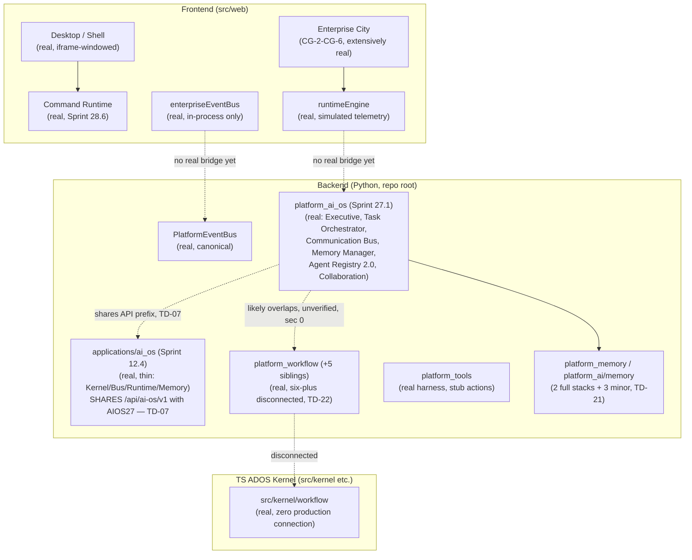
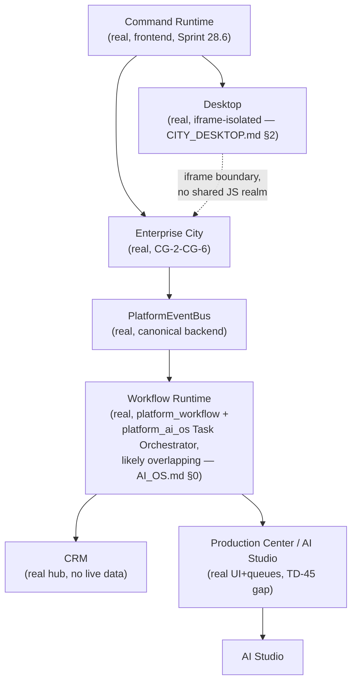

# Enterprise AI Operating System — Architecture Specification

**Sprint:** CG-8 — Architecture Research + Product Research. **Documentation only. `src/` was not
modified.** Grounded entirely in the existing codebase and this engagement's own prior research
(Sprints CG-4 through CG-7) — no parallel system is proposed anywhere in this document.

**Do not duplicate:** `ENTERPRISE_AI_OS.md` (an earlier Bible in this documentation set) already covers
OS philosophy, lifecycle framing, and the real Sprint 27.1 Multi-Agent OS backend (`platform_ai_os`,
`/api/ai-os/v1`) in detail — not repeated here. This document is the CG-8, inventory-first architecture
map: every subsystem the brief asks about, with a precise real/SPEC/duplicate status and a pointer to
whichever CG-4–CG-7 document already has the full depth.

## Implementation reference — the original `AI_OS.md` (Sprint 12.4, preserved verbatim, real)

This file already existed before this sprint, describing an **earlier, thinner** AI OS surface than
`ENTERPRISE_AI_OS.md`'s Sprint 27.1 Multi-Agent OS. Preserved here rather than overwritten, per this
engagement's standing practice:

> **Version:** `3.4.0-alpha` · **Sprint:** 12.4 · **API:** `/api/ai-os/v1`
>
> Unified AI Operating System that orchestrates the AI Ecosystem as one intelligent platform.
>
> Does **not** modify Platform Core or rewrite existing applications.
>
> See: `AI_KERNEL.md`, `SYSTEM_BUS.md`, `AI_RUNTIME.md`.

Those three companion docs are also thin (7 lines each) but precisely identify a real package: **AI
Kernel** ("system, task, resource, agent, memory, and workflow schedulers with priority queues and
tick-based execution," `GET|POST /api/ai-os/v1/kernel`), **System Bus** ("event, message, knowledge,
workflow, memory, plugin, and connector buses," `GET|POST /api/ai-os/v1/bus`), **AI Runtime**
("sandboxed execution, security layer, context/state management, checkpoints, and recovery," `POST
/api/ai-os/v1/runtime`). This maps directly onto `ARCHITECTURE_MAP.md` §2.6's `applications/ai_os`
entry — "Thin (kernel.py, bus.py, runtime.py, memory.py) — shares `/api/ai-os/v1` with hub MAOS" — i.e.
**this Sprint-12.4 surface and Sprint 27.1's Multi-Agent OS (`platform_ai_os`) are two different real
implementations sharing one API prefix**, exactly the collision `TECH_DEBT.md` `TD-07` already tracks.
This document's contribution: naming precisely *which two* real things collide, evidenced by these four
short docs plus `ENTERPRISE_AI_OS.md`'s implementation reference, rather than leaving `TD-07` as an
abstract "three owners, unresolved" note.

## 0. The one cross-cutting finding this sprint adds

Reading `ENTERPRISE_AI_OS.md`'s preserved implementation reference (`platform_ai_os`, Sprint 27.1)
alongside this engagement's CG-7 workflow-engine research (`AUTOMATION_ENGINE.md` §0/§1.1) surfaces a
**likely seventh-plus duplication cluster CG-7 did not have in scope**: `platform_ai_os` has its own
real **Task Orchestrator** (`POST /tasks` — DAG, parallel/sequential/conditional, retry/rollback/
timeout), its own real **Communication Bus** (`GET/POST /agent-bus` — request/response/event/broadcast/
stream + priority queue), and its own real **Agent Registry 2.0** (`GET /agents`). CG-7's research was
scoped to packages literally named `platform_workflow`/`platform_orchestrator`/`platform_tools`/
`events` — it did not read `platform_ai_os`'s internals against that same duplication question, and
this document's own research pass did not re-verify `platform_ai_os`'s source directly either (it
relies on `ENTERPRISE_AI_OS.md`'s prior reading). **This document does not assert `platform_ai_os`'s
Task Orchestrator is source-identical to `platform_workflow`'s engine** — that would overclaim past
what either research pass actually verified — but flags this as the single highest-priority
verification item for whichever sprint next touches automation or agent orchestration; `TD-22`
(workflow engines) and whichever debt item tracks agent-registry duplication may both need a further
revision once checked. See `SPRINT_CG_8_RESULT.md` §5 for this as a formal risk.

## 1. Subsystem inventory (brief's twelve)

| Subsystem | Real status | Detail lives in |
|---|---|---|
| Runtime | **Multiple, disconnected, by design layer** — frontend `enterprise-runtime/runtimeEngine` (client-side, simulated telemetry, real `RuntimeStreamKind` including `"city"`), backend `platform_ai_os`'s Executive/Task layer (real) and the Sprint-12.4 AI Runtime (`applications/ai_os`, sandboxed execution/checkpoints/recovery, real), plus the fully-disconnected TS kernel `src/kernel` (real code, zero production connection) | `CITY_RUNTIME.md` (CG-4, frontend), `ARCHITECTURE_MAP.md` §9 (kernel), `ENTERPRISE_AI_OS.md` + this document's implementation reference (backend) |
| Shell | Real, frontend (`src/shell/enterprise` — Sidebar/TopNav/Dock chrome) | `CITY_DESKTOP.md` §4 (CG-6) |
| Desktop | Real — genuine Window Manager, City opens as a real Desktop window via iframe (the single most consequential frontend-architecture finding of CG-6) | `CITY_DESKTOP.md` (CG-6) |
| Command Runtime | Real — `src/runtime/commandRuntime` (Sprint 28.6): Palette/Shell/Desktop execute through one registry with history, permissions, `command.*` events | `ARCHITECTURE_MAP.md` §3.1, `ACTION_LIBRARY.md` §2 (CG-7, Internal Command/Desktop Action rows) |
| Workflow Runtime | Real, but **six-plus disconnected implementations** — the largest duplication finding of this whole engagement, now potentially larger per §0 | `AUTOMATION_ENGINE.md`, `WORKFLOW_RUNTIME.md` (CG-7) |
| Event Bus | Real, but **at least five** distinct mechanisms at different scopes, none fully bridged: canonical backend `PlatformEventBus`, `platform_ai_os`'s agent-scoped Communication Bus, the Sprint-12.4 System Bus (`applications/ai_os`, event/message/knowledge/workflow/memory/plugin/connector buses — itself internally multi-bus), frontend `enterpriseEventBus`, Dashboard-scoped `dashboardEventBus` — plus 6 further duplicate `EventBus`-named classes (`ARCHITECTURE_MAP.md` §13, `TD-20`) | `ENTERPRISE_AI_OS.md` §10 (the four-mechanism table, now a fifth per this document's System Bus find), `CITY_EVENTS.md` (CG-4), `TRIGGER_SYSTEM.md` §4 (CG-7) |
| AI Studio | Real 17-studio UI, real approval gate, real GPU-queue plumbing; blocked on `TD-45` (no real generation backend) | `CITY_INTEGRATIONS.md` §1 (CG-6) |
| Enterprise City | Real, extensively specified across CG-2 through CG-6 (graphics engine, runtime, states, events, camera, simulation, UX, navigation, collaboration, accessibility, CRM/ERP/AI-Platform/Desktop/AI-Studio/Notifications/Security integration) | The full CG-2–CG-6 document set |
| Production Center | Same real/gap status as AI Studio (largely the same subsystem under two names in this codebase) | `CITY_INTEGRATIONS.md` §1 |
| CRM | Real building routes, real generic module-hub page, **no live domain data** (the module's own roadmap literally names "Live CRM API binding" as future work) | `CITY_CRM.md` (CG-6) |
| Security | Real, substantial RBAC-adjacent frontend layer (`permissionManager`/`roleManager`/`organizationManager`) that **zero frontend surface actually consumes yet**, including City | `CITY_INTEGRATIONS.md` §3 (CG-6) |
| Knowledge Base | See §2 below — new to this sprint | This document |

## 2. Knowledge Base (new research this sprint)

A real, top-level `knowledge/` package exists at the repo root (noted but not detailed in
`ARCHITECTURE_MAP.md`'s "supporting root packages" list). The real Multi-Agent OS's Memory Manager
(`ENTERPRISE_AI_OS.md` §7) already includes a `knowledge` layer as one of its six real memory layers,
and the Sprint-12.4 System Bus (this document's implementation reference) separately names a
"knowledge... bus" as one of its seven bus types — meaning **there may already be three candidate
"knowledge" surfaces** (top-level `knowledge/` package, `platform_ai_os`'s `knowledge` memory layer,
`applications/ai_os`'s knowledge bus), on top of the already-tracked `platform_memory`/`platform_ai/
memory` duplication (`TD-21`). This document does not have file-level confirmation of the top-level
`knowledge/` package's actual contents — flagged as an open verification item for `SPRINT_CG_8_RESULT.md`.
City's own real `knowledge`/`documents` buildings (`cityCatalog.ts`) route to generic module hubs today
— the same "real building, no live domain data" pattern `CITY_CRM.md` found for CRM — with no evidence
found that either building reads from any candidate knowledge store above.

## 3. Architecture diagram (whole-platform AI OS, one view)

## 4. Enterprise permissions (brief §6 — User, Organization, Workspace, Department, Project, Agent, Workflow, Runtime)

| Axis | Real mechanism | Status |
|---|---|---|
| User | Real, frontend `auth/` (`permissionManager`/`roleManager`), backend `platform_identity`/`platform_management` (`ENTERPRISE_AI_OS.md` §11) | Real, header-only auth pending live tokens (`TD-08`) |
| Organization | Real, frontend `organizationManager` (`CITY_INTEGRATIONS.md` §3, CG-6) | Real, unconsumed by City |
| Workspace | Not confirmed as a distinct permission scope separate from Organization in this research pass | Unconfirmed — flagged, not assumed absent |
| Department | Not found as a distinct permission axis anywhere in this survey | Absent — closest real analog is `HumanRole`'s `MANAGER`/`ADMINISTRATOR`/`OPERATOR`/`OWNER` enum (`WORKFLOW_RUNTIME.md` §1), which is role-based, not department-scoped |
| Project | Real `roleManager.projectRoles()` exists (frontend, `CITY_INTEGRATIONS.md` §3) | Real naming exists; depth unconfirmed |
| Agent | **Absent** — `AI_AGENT_LIFECYCLE.md` §2's central gap finding; no agent-specific permission model confirmed anywhere | The clearest gap of the eight axes |
| Workflow | **Absent on `Workflow` itself** — `WORKFLOW_RUNTIME.md` §5's central finding; `ExecutionContext.permissions` is unstructured | Gap, already specified in detail elsewhere |
| Runtime | Real, `platform_identity`/`platform_management`'s header-only auth gates the API surface every runtime action goes through | Real but partial (`TD-08`) |

**One permission model, read from everywhere** — `ENTERPRISE_AI_OS.md` §11's own principle — is the
correct target across all eight axes; this table's job is showing precisely which axes already have a
real, reusable mechanism (User, Organization, Project, partially Runtime) versus which need new work
built as an *extension* of those real mechanisms (Department, Agent, Workflow), never a second
permission system per axis.

## 5. Runtime communication (brief §7 — how the OS's subsystems actually talk to each other)

The one architecturally load-bearing constraint on this whole diagram, already established in
`CITY_DESKTOP.md` §2 (CG-6): **the Desktop↔City edge crosses a real iframe boundary** — every other
edge in this diagram that might be assumed to be "just call the function" is, for that one edge,
actually "separate JS realm, shared only via storage or a real cross-window transport." Any future
work connecting Runtime Communication subsystems should treat that edge as the one requiring special
handling, not a detail to discover later.

## 6. Future scaling (brief §8 — new research this sprint)

**The system is single-process today, with one real exception (Redis-backed FSM state).** Verified:

- No `celery`/`rq`/`kombu`/RabbitMQ client anywhere in the Python code or `requirements.txt`.
- "Kafka" exists only as a **mock connector** (`applications/enterprise_hub/integrations/connectors/
  kafka.py` — `KafkaConnector.invoke()` calls an in-memory store, no real broker, branded "Enterprise
  Kafka Bus" in `facade.py`).
- No distributed-lock mechanism found (no Redlock/etcd/Zookeeper).
- `platform_jobs/job_dispatcher.py`'s `JobDispatcher` runs entirely on `asyncio.create_task`/
  `asyncio.sleep(0.05)` — a single-process in-memory scheduler, not a distributed queue.
- `docker-compose.yml`: 2 services (`postgres`, `redis`), no app service, no replicas.
- `docker-compose.prod.yml`: 6 services (`postgres`, `redis` with `--appendonly yes`, `bot`, `nginx`,
  `prometheus`, `grafana`) — `bot` is a single `build: .`, **no `deploy.replicas`**, no k8s/swarm
  manifest anywhere in the repo.

| Brief concept | Real status | SPEC |
|---|---|---|
| Multi-server | Absent | Requires the durable persistence work `WORKFLOW_RUNTIME.md` §3/`AI_MEMORY.md` §3 already recommend as a prerequisite — in-memory state cannot survive across servers regardless of scaling mechanism |
| Distributed runtime | Absent | Same prerequisite |
| Cluster mode | Absent | Same prerequisite; no orchestration manifest exists to extend |
| Remote execution | Partial — `platform_console` genuinely calls the TS kernel's `RuntimeServer` over HTTP/WS (`ARCHITECTURE_MAP.md` §9/§11.4), a real remote-execution pattern, but scoped to that one frontend↔kernel link, not general-purpose | The one real "remote execution" precedent in this survey — worth studying as a pattern, not directly reusable for backend horizontal scaling |
| High availability | Absent — `docker-compose.prod.yml` has no health-check-gated restart policy or replica count confirmed in this research pass | Flagged unverified beyond what was read |
| Horizontal scaling | Absent | Blocked on the same persistence prerequisite as Multi-server |

**This document does not propose a scaling design** — every real prerequisite this table names
(durable persistence, a real message queue, a real distributed lock) is either already recommended
elsewhere in this Bible or explicitly out of scope for a documentation-only sprint. The honest
contribution here is confirming, with file-level evidence, that horizontal scaling is not close to
ready, rather than speculatively designing a cluster architecture with nothing underneath it.

## 7. What this document does not propose

- No new Runtime, Shell, Event Bus, or Workflow Engine — every subsystem in §1 already has a real
  implementation (or several); the work is consolidation and wiring, not construction.
- No resolution of the `platform_ai_os` vs. `platform_workflow` overlap (§0), or the `TD-07` prefix
  collision this document sharpens (implementation reference) — both flagged for verification, not
  decided here.
- No new Knowledge Base implementation — §2 is a research flag, not a design.

## Related documents

`ENTERPRISE_AI_OS.md` (philosophy-first companion), `AI_KERNEL.md`/`SYSTEM_BUS.md`/`AI_RUNTIME.md`
(the Sprint-12.4 surface this document's implementation reference resolves against `TD-07`),
`AUTOMATION_ENGINE.md`/`WORKFLOW_RUNTIME.md`/`TRIGGER_SYSTEM.md`/`ACTION_LIBRARY.md`/`VISUAL_WORKFLOW.md`
(CG-7, Workflow Runtime detail), `CITY_*.md` (CG-2–CG-6, the full Enterprise City architecture),
`ARCHITECTURE_MAP.md` (whole-repo survey), `TECH_DEBT.md` `TD-07`/`TD-20`/`TD-21`/`TD-22`.
