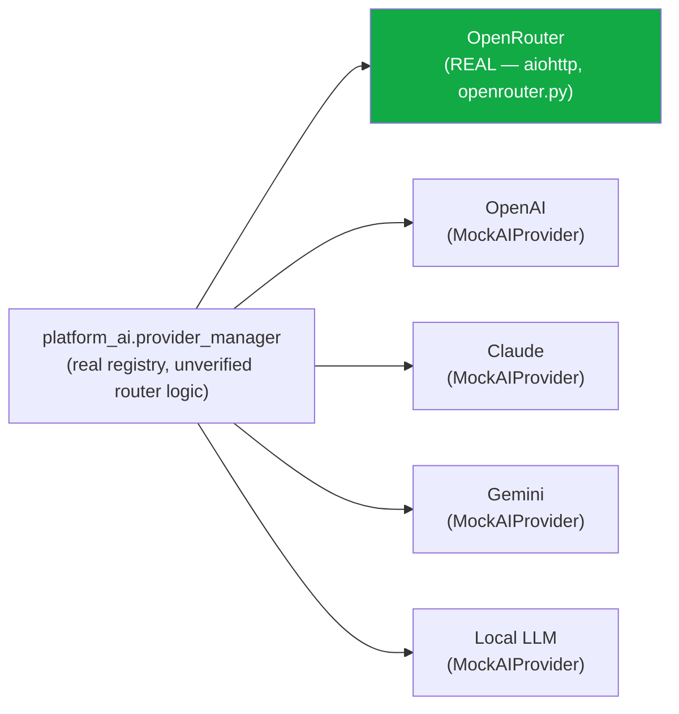

# Enterprise AI Operating System — AI Provider Layer

**Sprint:** CG-8 — Architecture Research + Product Research. Documentation only, `src/` not modified.

**Do not duplicate:** `ARCHITECTURE_MAP.md` §4 already found `src/providers` (TS kernel ecosystem) is
explicitly mock ("no real API keys," Cursor/OpenAI/Claude/GitHub/Local LLM adapters, zero production
connection). This document covers the **Python backend's** provider layer — genuinely different code,
not previously surveyed at this depth in this engagement.

## 0. The headline finding — one real provider, several mock registries

**Only OpenRouter is a real, working AI provider anywhere in this codebase.** Everything else
requested by the brief (OpenAI, Claude, Gemini, Local LLM as distinct integrations) exists only as
registry entries and mock objects.

| Provider | Real status |
|---|---|
| OpenRouter | **Real.** `openrouter.py` (repo root, 175 lines) makes a genuine `aiohttp` HTTP POST to `https://openrouter.ai/api/v1/chat/completions`, model `openai/gpt-5-mini` by default, reads `OPENROUTER_API_KEY` from `config.py`/`platform_configuration/settings.py`/`configuration_center.py`. **Actively imported** by `handlers.py` and at least seven `services/pg_*` engines (`ai_agents.py`, `pg_ai_skill_engine.py`, `pg_dealer_portal_engine.py`, `pg_content_factory_engine.py`, `pg_ai_manager_engine.py`, `pg_ai_procurement_agent_engine.py`, `pg_ai_advertising_agent_engine.py`, `pg_ai_sales_assistant_engine.py`) and `platform_legacy/adapter.py`. This is the one real LLM call path in the entire platform. |
| OpenAI | **Mock.** `platform_ai/provider_manager.py`/`model_registry.py` register an `openai` entry, but it resolves to a `MockAIProvider` (`platform_ai/provider_base.py`) with a fake `response_prefix` (`"[openai]"`-style) — no SDK dependency, no API key, no network call. `platform_integrations/provider_manager.py` separately has an `OPENAI` connector type bootstrapped `enabled=False, description="Future provider"`. |
| Claude/Anthropic | **Mock**, same shape as OpenAI — a `MockAIProvider` registry entry, no real SDK or credential. |
| Gemini | **Mock**, same shape. |
| OpenRouter (registry entry) | Also present in `platform_ai/provider_manager.py`'s registry **alongside** the real, separate `openrouter.py` module — worth flagging as a naming/wiring risk in its own right: the registry's `openrouter` entry may or may not be the same code path as the real, actively-imported `openrouter.py` (this research did not confirm the registry entry calls the real module rather than also being a `MockAIProvider`) — flagged as a verification item, not assumed either way. |
| Local LLM | **Mock** — a `local_llama` registry entry, `MockAIProvider`. |
| Future providers (`deepseek` and similar) | **Mock** — registered the same way, same caveat. |
| `requirements.txt` | Contains **no** `openai`, `anthropic`, `google-generativeai`, or `litellm` package — confirms no real SDK exists for any provider besides the plain-`aiohttp` OpenRouter call. |

## 1. Provider routing / fallback / cost optimization (brief's three asks)

**None of these are real for a multi-provider scenario**, because there is only one real provider to
route between. `platform_ai/provider_manager.py`'s registry *shape* may already support routing/
fallback logic across its registered entries (this research did not confirm the router's internal
logic in depth) — but routing across five providers where four are mocks does not constitute real
multi-provider routing, fallback, or cost optimization in the sense the brief asks about. **This is the
correct, honest status to report**: the *abstraction* for multi-provider routing may exist; the
*providers* to route between do not.

## 2. SPEC — what a real provider layer needs, in order

1. **Verify the OpenRouter registry entry is the same code as the real module** (§0's flagged item) —
   cheapest possible check, should happen before anything else in this document is acted on.
2. **Add real SDK-backed providers one at a time**, starting with whichever the product actually needs
   next (not designed here — a product decision, not an architecture one) — each new real provider
   should implement the same interface `MockAIProvider` already defines (`platform_ai/provider_base.py`,
   real, already the correct shape) rather than a new provider abstraction.
3. **Real routing/fallback only becomes meaningful once step 2 adds a second real provider** — building
   sophisticated routing logic against one real provider and four mocks would be premature.
4. **Cost optimization** depends on step 2 existing (there is nothing to optimize cost *between* with
   only one real provider) — lowest priority of the three brief asks, structurally.

## 3. Non-goals

- No new provider abstraction — `platform_ai/provider_base.py`'s real `MockAIProvider`/provider
  interface shape is reused, not replaced.
- No provider SDK is added or wired in this document — that is implementation work for a future sprint,
  gated on product need per §2 item 2.
- No claim is made about which provider should be added next — out of this document's research scope.

## Related documents

`ARCHITECTURE_MAP.md` §4 (the TS-side `src/providers` mock layer, a separate system), `AI_MEMORY.md`
§3 item 1 (the embeddings-provider question this document's OpenRouter finding directly feeds),
`AI_OS.md` (the whole-OS inventory this document is one row of).
