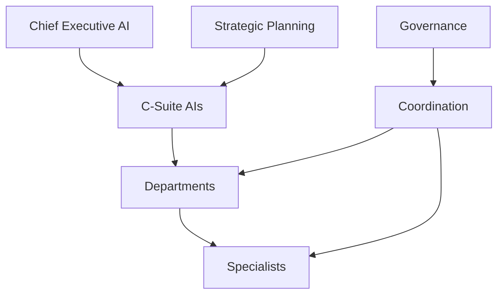

# Autonomous AI Workforce & Executive Orchestration (Sprint 7.4)

> Hierarchy of AI executives, managers and specialists that coordinate work across every application on **AI Platform Core v3.0**.

## Release Summary

| Field | Value |
|-------|-------|
| Ecosystem Version | **1.5.0-alpha** |
| Workforce Layer | **1.0** |
| Executive AI | **1.0** |
| Platform Dependency | **AI Platform Core v3.0** |
| Sprint | **7.4** |

---

## Architecture



Package: `ecosystem/workforce/`

| Module | Role |
|--------|------|
| `executive/` | CEO, COO, CFO, CSO, CMO, CTO, CLO, CAO |
| `management/` | Department roster & org chart |
| `departments/` | Sales, Finance, Marketing, Ops, Support, Dev, Legal, Logistics |
| `specialists/` | Domain specialist agents |
| `coordination/` | Delegation, escalation, balancing, collaboration |
| `governance/` | Approval & escalation policies |
| `planning/` | Objectives and quarterly/weekly/daily plans |
| `execution/` | End-to-end task run |

---

## Executive Guide

```python
from ecosystem import ecosystem
from ecosystem.workforce.models import ExecutiveRole

execs = ecosystem.engine.workforce.executives.list_executives()
decision = await ecosystem.engine.workforce.executives.decide(
    ExecutiveRole.CSO, "Approve Q3 sales push", rationale="Aligned with company OKRs"
)
support = ecosystem.engine.workforce.executives.decision_support("Expand dealer network")
```

---

## Department Guide

```python
depts = ecosystem.engine.workforce.departments.list_departments()
roster = ecosystem.engine.workforce.management.department_roster(DepartmentType.SALES)
chart = ecosystem.engine.workforce.management.org_chart()
```

Specialists: Sales, Financial, Marketing, Developer, Support, Law, Analytics, Inventory.

---

## Planning Guide

```python
planning = ecosystem.engine.workforce.planning

obj = planning.set_objective("Grow marketplace GMV", horizon=PlanHorizon.QUARTERLY, target_value=100)
await planning.update_progress(obj.objective_id, 100)  # completes objective

await planning.create_plan("Week 30", PlanHorizon.WEEKLY, [{"item": "Close 10 deals"}])
report = planning.performance_report()
```

Horizons: company, department, quarterly, weekly, daily.

---

## Coordination & Execution

```python
wf = ecosystem.engine.workforce

task = await wf.coordination.delegate("Qualify inbound lead", priority=TaskPriority.HIGH)
# High/critical priorities require approval
await wf.executives.approve_task(task.executive_role, task)
await wf.coordination.execute(task.task_id)

# Or one-shot:
done = await wf.execution.run("Generate invoice for deal D1", priority=TaskPriority.NORMAL)

await wf.coordination.collaborate("Launch campaign", ["sales", "marketing"])
wf.coordination.balance_work()
```

---

## API Reference

| API | Endpoints |
|-----|-----------|
| Executive | `GET /api/ecosystem/v1/executive`, `POST /executive/decide`, `/executive/support` |
| Departments | `GET /departments`, `GET /departments/{type}` |
| Workforce | `GET /workforce/metrics`, `/org-chart`, `/specialists`, `/tasks`, `POST /delegate`, `/run`, `/escalate`, `/collaborate`, `GET /balance` |
| Planning | `POST /planning/objectives`, `/objectives/{id}/progress`, `/plans`, `GET /performance` |
| Governance | `GET /governance` |

---

## Events

| Event | When |
|-------|------|
| `ExecutiveDecisionMade` | Executive decision recorded |
| `DepartmentTaskAssigned` | Task delegated to specialist |
| `WorkCompleted` | Task finished |
| `EscalationTriggered` | Escalation raised |
| `ObjectiveCompleted` | Objective target met |
| `PlanningUpdated` | Plan created/updated |

---

## Developer Guide

```python
from ecosystem import ecosystem

await ecosystem.engine.workforce.execution.run(
    "Sync inventory across dealers",
    department_type=DepartmentType.LOGISTICS,
    application_id="auto_marketplace",
)
```

**AI Platform Core is not modified** — task execution uses `ecosystem/integrations/platform_bridge.py`.

---

## Tests

```bash
pytest tests/test_workforce.py -q
```

---

## Expected Result

- Sprint 7.4 completed
- Autonomous AI Workforce ready
- Executive AI ready
- Department Coordination ready
- Strategic Planning ready
