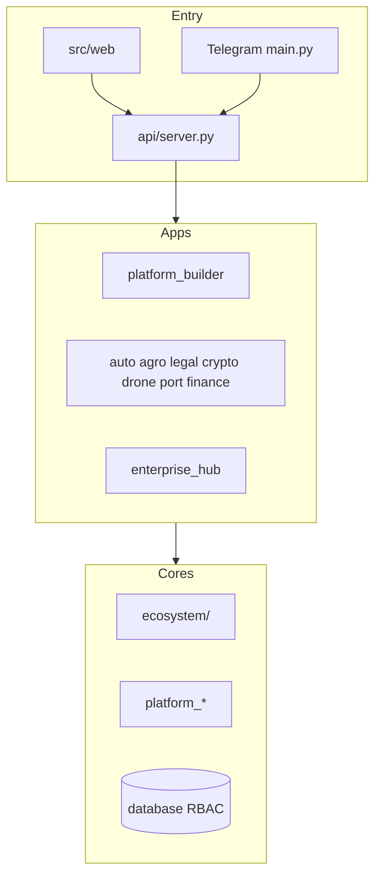

# Architecture Inventory — Sprint 30.2

Complete inventory of the Enterprise AI Platform. Status codes:

| Code | Meaning |
|------|---------|
| **I** | Implemented (code + routes/tests) |
| **P** | Partial (library/API without full product surface) |
| **A** | Architecture / catalog / registry only |
| **F** | Forgotten / planned but never shipped as product |
| **D** | Duplicated concept across layers |

---

## 1. Runtime entrypoints

| Component | Path | Status | Notes |
|-----------|------|--------|-------|
| Telegram bot | `main.py`, `handlers.py` | **I** | Legacy monolith + routers |
| HTTP gateway | `api/server.py` | **I** | Mounts all application routers |
| Web SPA | `src/web/` | **I** | Vite/React; proxy → `:8080` |

---

## 2. Applications (`applications/`)

| Application | Manifest maturity | Status | Web UI |
|-------------|-------------------|--------|--------|
| `platform_builder` | v1.27.0 / Sprint 30.2 | **I** | Full hub UI |
| `auto_marketplace` | Production Ready ~4.2 | **I** | **Missing** vertical web |
| `agro_marketplace` | Production Ready | **I** | Missing vertical web |
| `agro_enterprise` | Production Ready ~4.4 | **I** | Missing vertical web |
| `crypto_enterprise` | Production Ready ~4.8 | **I** | Missing vertical web |
| `legal_enterprise` | Production Ready ~5.0 | **I** | Missing vertical web |
| `drone_platform` | Enterprise Certified | **I** | Missing vertical web |
| `finance_enterprise` | Production suite | **I** | Missing vertical web |
| `port_erp` / `port_enterprise` | Implemented | **I** | Missing vertical web |
| `enterprise_hub` | Large facade (~60 prefixes) | **I/P** | Partial via shell portals |
| `ai_os` | Alpha ~3.4 | **P** | `src/web/ai-os/` |
| `ecosystem` (app) | Alpha integration | **P** | None |
| `executive_center` | Implemented | **P** | Overlaps Mission Control naming |
| `workflow_studio` | Implemented | **P** | Separate from PB workflow hubs |
| `marketplace` | Implemented | **P** | Frame builder only in PB |
| `enterprise` | Implemented | **P** | Hub sibling |

---

## 3. Platform Builder hubs (36 catalog entries)

### Operational hubs (**I**)

Dashboard · Universal Framework · Vertical · AI Builder · Concierge · AI Team · Collaborative AI · Operations Center · Team Map · Visual Behavior · Rendering · Themes · Assets · Simulation · Director · Story · Intelligence · Experience · Workspace OS · Command Center OS · Navigation Intelligence · Workflow Intelligence · Digital Twin · Twin Intelligence · Strategy Engine · Mission Control · Business Ecosystem · Academy · God Mode

### Frame-only builders (**A** / thin UI)

CRM · ERP · Workflow · Knowledge · Automation · Dashboard Builder · Template · Marketplace

---

## 4. Global cores (must remain global)

| Core | Primary location | Status | Duplication risk |
|------|------------------|--------|------------------|
| Mission Control | `platform_builder/mission_control` | **I** | **D** with executive_center, drone mission |
| Digital Twin | `platform_builder/digital_twin` | **I** | **D** with hub EDT, drone twin |
| Workflow Engine | hub + `platform_workflow*` + PB intelligence | **I/P** | **D** triple path |
| Knowledge Graph | hub EKG / EKP | **I/P** | Multiple KG prefixes |
| AI OS | `applications/ai_os` + `platform_ai_os` | **P** | Shared `/api/ai-os/v1` with hub MAOS |
| Builder Studio | Platform Builder | **I** | Frame builders incomplete |

---

## 5. Root / shared layers

| Layer | Path | Status |
|-------|------|--------|
| Root AI Ecosystem v1.5 | `ecosystem/` | **I** |
| Unified AI Ecosystem v3 | `applications/ecosystem/` | **P** |
| Business Ecosystem Foundation | `platform_builder/business_ecosystem/` | **I** (catalog/registry) |
| Platform cores | `platform_*` (~50–70 packages) | **I/P** mix |
| Database / RBAC | `database/`, `repositories/` | **I** |
| Events | `events/` | **P** |
| Services (legacy) | `services/` | **I/D** |

---

## 6. Per-subsystem audit answers

### API Core
- **Implemented:** Multi-prefix gateway, versioning on many enterprise apps, management OpenAPI recording  
- **Partial:** Cross-app contract consistency, SDK packaging  
- **Architecture-only:** Unified OpenAPI for all PB routes  
- **Forgotten:** Deprecation plan for unversioned `/api/*` CRM  
- **Duplicated:** Overlapping health/status endpoints per app  
- **Reuse:** `platform_api/versioning.py`, EAS standardization  
- **Merge?** Documentation ownership only — keep mounts  
- **Separate:** Keep vertical prefixes; do not merge routers  
- **Before Production:** Contract inventory + freeze list  
- **Before Web:** Auth-bearing API contracts for portals  
- **Blocks testing:** Header-only PB auth (no token validation)

### Event Bus
- **Implemented:** `events/`, hub event platform prefixes  
- **Partial:** Cross-vertical event schema governance  
- **Architecture-only:** Single enterprise bus topology doc vs runtime  
- **Duplicated:** Multiple event naming styles  
- **Before Production:** Schema registry enforcement

### Router / Workflow / Knowledge / Twin / Mission / Workspace
See dedicated Routing, Ecosystem, and Production reports. Summary: **I** at PB layer; **D** naming across hub/platform packages; Cafe **F** as product app.

### Authentication / Authorization / RBAC
- **Implemented:** Identity Center UI, DB RBAC v2, ecosystem permissions, God Mode role gate  
- **Partial:** Live identity wiring (`wire_live_identity_service` recommended)  
- **Blocks Web/Prod:** End-to-end token auth across PB + vertical APIs

### Navigation / Caching / Notifications / Search / Indexes
- **Navigation:** **I** (web + PB intelligence)  
- **Caching:** **P** (per-engine in-memory caches; distributed HA claimed in catalogs)  
- **Notifications:** **P** (docs + channels; not unified for all verticals)  
- **Search/Indexes:** **P** (semantic search docs; uneven product wiring)

### Shared components / services / models / interfaces
- **Implemented:** EDS, shared UI kit, EntityStore pattern in PB  
- **Duplicated:** recommendation_engine, strategy_engine, simulation_engine names  
- **Should remain separated:** Industry vertical apps  
- **Should merge (docs only):** Ownership map for twin/mission/command synonyms

---

## 7. Inventory diagram

## Evidence roots

- `applications/platform_builder/catalog.py`  
- `applications/platform_builder/config.py`  
- `api/server.py`  
- Application `manifest.json` files under `applications/`  
