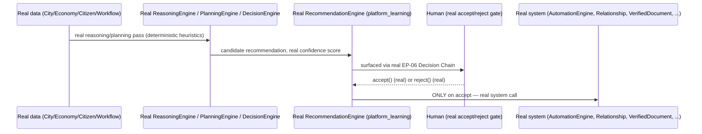

# Enterprise City — Autonomous AI Behavior

**Sprint:** CQ-14 — Architecture Research + AI Orchestration. Documentation only, `src` not modified.

**Do not duplicate:** `ENTERPRISE_INTELLIGENCE_CORE.md` §0 owns the real Decision Engine/Reasoning-
Planning-Decision chain this document's every "AI does X" example routes through.
`RECOMMENDATION_PREDICTIVE_ENGINE.md` §2.3 already established the real `ai_may_act: False` platform
convention — this document's central design constraint, not re-derived.

## 0. The one governing constraint — "autonomous" means "proposes," not "executes," everywhere in this document

The real `platform_predictive_intelligence.bootstrap()` explicitly sets `ai_may_act: False`; the real
`platform_learning.RecommendationEngine` requires an explicit human `accept()`; `EP_06_ENTERPRISE_
INTELLIGENCE.md`'s real Decision Chain is `Observation → Understanding → Recommendation → Decision →
Action → Result` — **Decision is a distinct, human step between Recommendation and Action, already,
in real shipped code.** Every one of the brief's eight "AI does X" examples is designed below as
stopping at Recommendation, never advancing to Action without that real, existing human step —
consistent with `ENTERPRISE_AI_OS.md`'s own already-stated automation philosophy: *"automation
controls when work happens, never whether a human approves."*

## 1. Per-example mapping (brief's eight)

| Brief example | Design |
|---|---|
| AI suggests meetings | **SPEC** — blocked on `EBN_COMMUNICATION.md`'s (CQ-10) confirmed-absent Meeting Room system; the suggestion logic itself would route through the real `DecisionEngine`, but has nothing real to suggest *into* yet |
| AI creates workflows | Real `AutomationEngine` (Sprint 28.9) can register a new automation — but "creates" here means *drafts a proposed workflow definition* via the real `platform_planning.PlanningEngine.plan()` (real, confirmed this sprint), surfaced for human review before `AutomationEngine.registerAutomation()` is ever called |
| AI proposes partnerships | Real `Relationship` (Sprint 29.0) creation already requires the real mutual-acceptance state machine (`EBN_PARTNERSHIP_SYSTEM.md` §3, CQ-10) — an AI proposal is simply one more real `initiatorCompanyId` for that existing flow, never a bypass of it |
| AI detects duplicated work | Real `platform_learning.PatternAnalyzer`'s `_detect_failure_patterns`-shaped logic (CG-14 research), applied to real `AutomationEngine` task titles/descriptions — a real, deterministic pattern-match, not semantic duplicate-detection (that would require real embeddings, which `AI_MEMORY.md` §0 (CG-8) already found don't exist) |
| AI detects business opportunities | Real `platform_predictive_intelligence.OpportunityDetector` (real, if/else threshold rules, confirmed this sprint) |
| AI recommends process improvements | Real `platform_learning.RecommendationEngine` (real, §0 of `ENTERPRISE_INTELLIGENCE_CORE.md` §3) |
| AI prepares contracts | Real `services/storage` + `VerifiedDocument` (`EBN_VERIFIED_DOCUMENTS.md`, CQ-10) — "prepares" means populating a real document draft from a real template, gated by the real e-signature flow (itself confirmed a simulated stub, `EBN_VERIFIED_DOCUMENTS.md` §0) — this document does not claim contract preparation is more automated than the underlying document system actually is |
| AI builds reports automatically | Real `COLLABORATIVE_AI.md` #7 "Executive Summary" (real, Sprint 28.8) — already the closest real precedent to this exact capability |

## 2. Sequence — every example collapses to the same real shape

**No example in §1 skips the Human step.** This is not an implementation detail this document leaves
open — it is the one architectural property every one of the eight examples must preserve, because it
is already how the real platform behaves today, not a new restriction being imposed.

## 3. Non-goals

- No autonomous execution path — every example stops at Recommendation, per §0's constraint.
- No new semantic/embedding-based duplicate detection — §1's "detects duplicated work" row is
  explicit that real embeddings don't exist yet (`AI_MEMORY.md` §0).
- No new document-signing automation — contract preparation still routes through the real, currently-
  simulated e-signature stub, not a bypass of it.

## Related documents

`ENTERPRISE_INTELLIGENCE_CORE.md` §0 (real Decision chain), `RECOMMENDATION_PREDICTIVE_ENGINE.md` §2.1
(the real `ai_may_act: False` finding), `ENTERPRISE_AI_OS.md` §13 (the platform's own stated automation
philosophy), `EBN_PARTNERSHIP_SYSTEM.md`/`EBN_VERIFIED_DOCUMENTS.md` (CQ-10, the real state machines
AI proposals feed into), `AUTOMATION_ENGINE.md` (Sprint 28.9), `COLLABORATIVE_AI.md` (real, Executive
Summary), `ETHICS_GOVERNANCE.md` (CQ-14 sibling, the formal governance layer this document's Human
step feeds).
