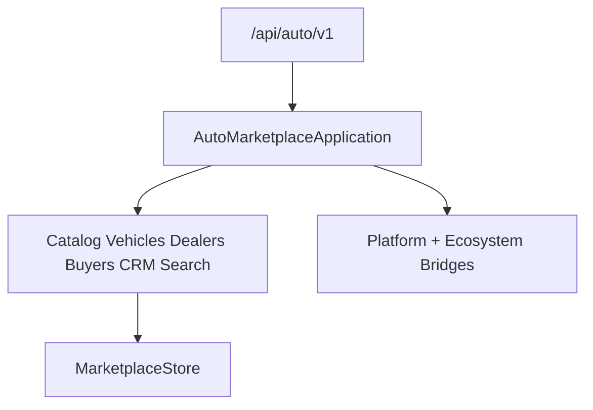

# Auto Marketplace — Foundation (Sprint 10.1)

Auto marketplace foundation for **Auto Marketplace 1.0.0-alpha**.

| Field | Value |
|-------|-------|
| Application name | Auto Marketplace |
| Application version | `1.0.0-alpha` |
| Platform | AI Platform Core v3 (bridge only) |
| Ecosystem | AI Ecosystem v1.5 (bridge only) |
| API | `/api/auto/v1` |

**Hard constraint:** AI Platform Core, AI Ecosystem, Agro Marketplace, and Port ERP are not modified.

## Architecture



## Modules (10.1)

`catalog/` · `vehicles/` · `dealers/` · `buyers/` · `crm/` · `search/` · `favorites/` · `garage/` · `inspection/` · `pricing/` · `documents/` · `shared/`

## Domain Models

Vehicle · Dealer · Buyer · VehicleBrand · VehicleModel · Generation · Configuration · Engine · Transmission · DriveType · FuelType · BodyType · VIN · InspectionReport · PriceHistory · Favorite · Garage

## Catalog Categories

Cars · Motorcycles · Commercial Vehicles · Agricultural Machinery · Construction Machinery · Electric Vehicles · Hybrid Vehicles · Parts · Accessories

## Search Filters

Brand · Model · Year · Mileage · Fuel · Transmission · Body · Region · Price · VIN · Condition

## CRM

Leads · Requests · Appointments · Negotiations · Vehicle reservations · Customer history

## REST API

`/catalog` · `/vehicles` · `/search` · `/dealers` · `/buyers` · `/crm`

```python
from applications.auto_marketplace import auto_marketplace

health = auto_marketplace.health()
assert health["application_version"] == "1.0.0-alpha"
assert health["application_name"] == "Auto Marketplace"
assert health["platform_dependency"] == "AI Platform Core v3"
assert health["ecosystem_dependency"] == "AI Ecosystem v1.5"
```
