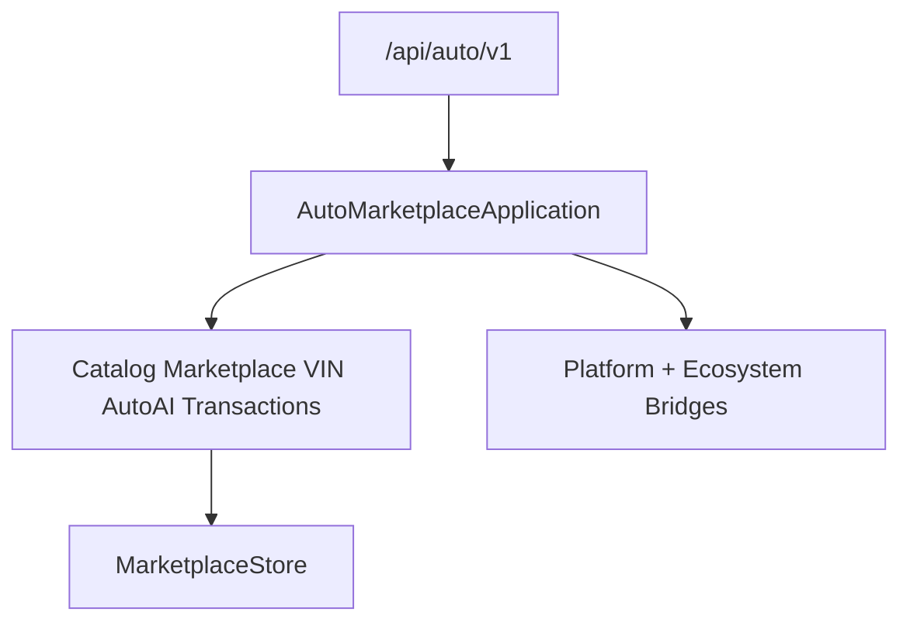

# Auto Marketplace — Transactions (Sprint 10.4)

Vehicle marketplace with auctions, financing, insurance, and transaction workflows for **Auto Marketplace 1.3.0-alpha**.

| Field | Value |
|-------|-------|
| Application name | Auto Marketplace |
| Application version | `1.3.0-alpha` |
| Transaction engine | `1.0` |
| Auction engine | `1.0` |
| Finance engine | `1.0` |
| Insurance engine | `1.0` |
| Platform | AI Platform Core v3 (bridge only) |
| Ecosystem | AI Ecosystem v1.5 (bridge only) |
| API | `/api/auto/v1` |

**Hard constraint:** AI Platform Core, AI Ecosystem, Agro Marketplace, and Port ERP are not modified.

## Architecture



## Modules (10.4)

`auctions/` · `financing/` · `leasing/` · `insurance/` · `transactions/` · `escrow/` · `payments/` · `ownership_transfer/` · `contracts/` · `documents/`

## REST API

`/auctions` · `/finance` · `/leasing` · `/insurance` · `/transactions` · `/payments`

## Docs

- [AUTO_VIN.md](AUTO_VIN.md)
- [AUTO_AI.md](AUTO_AI.md)
- [AUTO_TRANSACTIONS.md](AUTO_TRANSACTIONS.md)

```python
from applications.auto_marketplace import auto_marketplace

health = auto_marketplace.health()
assert health["application_version"] == "1.3.0-alpha"
assert health["transaction_engine"] == "1.0"
assert health["auction_engine"] == "1.0"
assert health["finance_engine"] == "1.0"
assert health["insurance_engine"] == "1.0"
```
