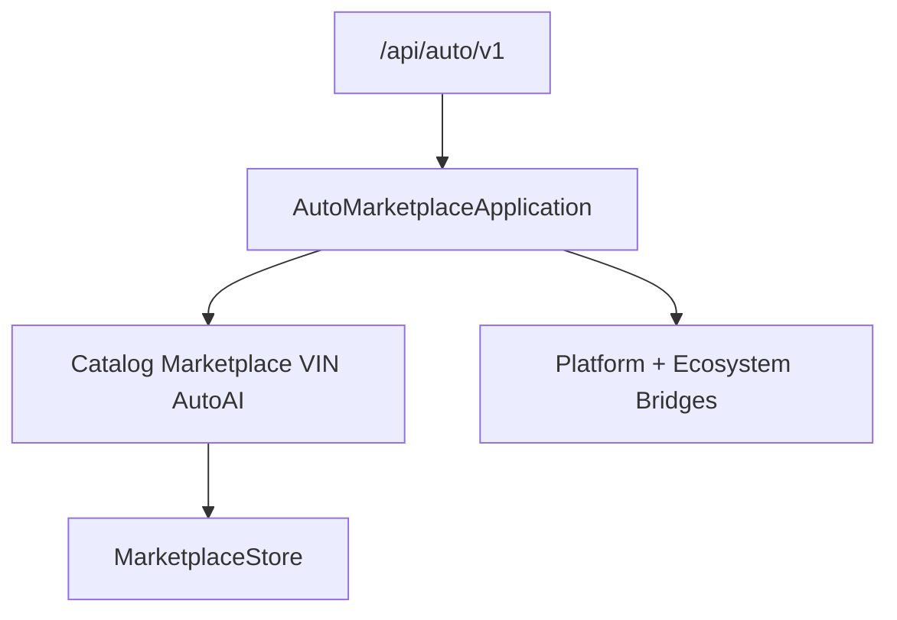

# Auto Marketplace — Foundation through AI Intelligence (Sprint 10.3)

Vehicle marketplace with AI intelligence for **Auto Marketplace 1.2.0-alpha**.

| Field | Value |
|-------|-------|
| Application name | Auto Marketplace |
| Application version | `1.2.0-alpha` |
| VIN / Dealer engines | `1.0` |
| Auto AI engine | `1.0` |
| Recommendation engine | `1.0` |
| Platform | AI Platform Core v3 (bridge only) |
| Ecosystem | AI Ecosystem v1.5 (bridge only) |
| API | `/api/auto/v1` |

**Hard constraint:** AI Platform Core, AI Ecosystem, Agro Marketplace, and Port ERP are not modified.

## Architecture



## Modules (10.3)

`ai/` · `recommendations/` · `matching/` · `inspection_ai/` · `pricing_ai/` · `forecasting/` · `risk/` · `assistant/` · `knowledge/` · `analytics/`

## REST API

`/ai` · `/recommendations` · `/pricing-ai` · `/inspection` · `/forecast` · `/assistant`

## Docs

- [AUTO_VIN.md](AUTO_VIN.md)
- [AUTO_AI.md](AUTO_AI.md)

```python
from applications.auto_marketplace import auto_marketplace

health = auto_marketplace.health()
assert health["application_version"] == "1.2.0-alpha"
assert health["auto_ai_engine"] == "1.0"
assert health["recommendation_engine"] == "1.0"
```
