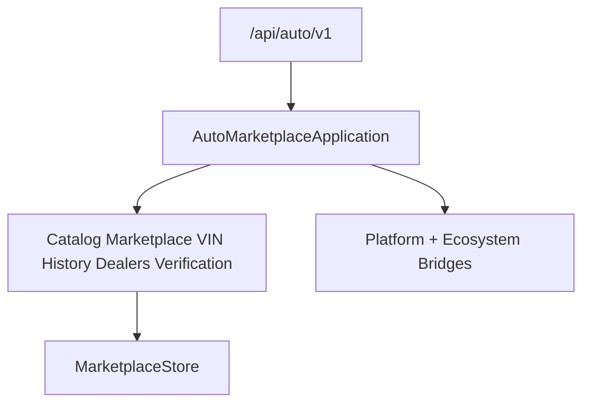

# Auto Marketplace — Foundation through Marketplace (Sprint 10.2)

Vehicle marketplace for **Auto Marketplace 1.1.0-alpha**.

| Field | Value |
|-------|-------|
| Application name | Auto Marketplace |
| Application version | `1.1.0-alpha` |
| VIN engine | `1.0` |
| Dealer engine | `1.0` |
| Platform | AI Platform Core v3 (bridge only) |
| Ecosystem | AI Ecosystem v1.5 (bridge only) |
| API | `/api/auto/v1` |

**Hard constraint:** AI Platform Core, AI Ecosystem, Agro Marketplace, and Port ERP are not modified.

## Architecture



## Modules (10.2)

`marketplace/` · `vin/` · `history/` · `dealer_network/` · `auctions/` · `listings/` · `media/` · `verification/` · `ownership/` · `valuation/`

## Marketplace Channels

Private Sellers · Dealers · Official Dealers · Auctions · Wholesale · Retail · Commercial Vehicles · Agricultural Machinery · Construction Equipment · Motorcycles · Electric Vehicles

## Dealer Network

Profiles · Verification · Ratings · Inventory · Branches · Managers · Lead assignment · Analytics

## Vehicle Verification

Photo · VIN · Duplicate detection · Fraud detection · AI image validation · Damage estimation

## Pricing / Valuation

Market · Average · Dealer · Wholesale · Retail · Price history · AI valuation

## REST API

`/marketplace` · `/vin` · `/history` · `/dealers` · `/verification` · `/pricing`

## Docs

- [AUTO_VIN.md](AUTO_VIN.md)

```python
from applications.auto_marketplace import auto_marketplace

health = auto_marketplace.health()
assert health["application_version"] == "1.1.0-alpha"
assert health["vin_engine"] == "1.0"
assert health["dealer_engine"] == "1.0"
```
