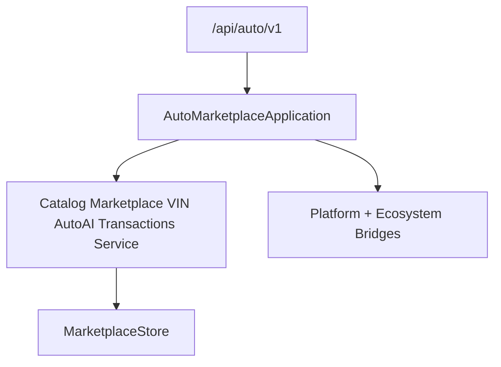

# Auto Marketplace — Service & Parts (Sprint 10.5)

Vehicle marketplace with service centers, parts, and maintenance for **Auto Marketplace 1.4.0-alpha**.

| Field | Value |
|-------|-------|
| Application name | Auto Marketplace |
| Application version | `1.4.0-alpha` |
| Service engine | `1.0` |
| Parts engine | `1.0` |
| Maintenance engine | `1.0` |
| Platform | AI Platform Core v3 (bridge only) |
| Ecosystem | AI Ecosystem v1.5 (bridge only) |
| API | `/api/auto/v1` |

**Hard constraint:** AI Platform Core, AI Ecosystem, Agro Marketplace, and Port ERP are not modified.

## Architecture



## Modules (10.5)

`service_centers/` · `repair_orders/` · `maintenance/` · `appointments/` · `parts/` · `inventory/` · `suppliers/` · `warranty/` · `diagnostics/` · `service_history/`

## REST API

`/service` · `/maintenance` · `/parts` · `/inventory` · `/appointments` · `/warranty`

## Docs

- [AUTO_VIN.md](AUTO_VIN.md)
- [AUTO_AI.md](AUTO_AI.md)
- [AUTO_TRANSACTIONS.md](AUTO_TRANSACTIONS.md)
- [AUTO_SERVICE.md](AUTO_SERVICE.md)

```python
from applications.auto_marketplace import auto_marketplace

health = auto_marketplace.health()
assert health["application_version"] == "1.4.0-alpha"
assert health["service_engine"] == "1.0"
assert health["parts_engine"] == "1.0"
assert health["maintenance_engine"] == "1.0"
```
