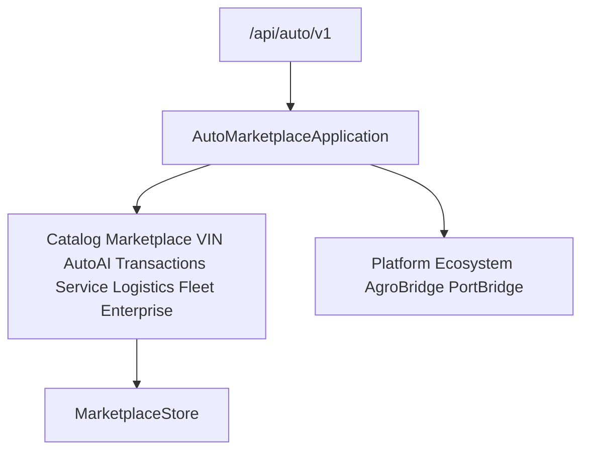

# Auto Marketplace — Commercial Release 2.0.0

Enterprise integration, global vehicle network, and production certification for **Auto Marketplace 2.0.0**.

| Field | Value |
|-------|-------|
| Application name | Auto Marketplace |
| Application version | `2.0.0` |
| Enterprise engine | `1.0` |
| Global network | `1.0` |
| Production ready | `true` |
| Platform | AI Platform Core v3 (bridge only) |
| Ecosystem | AI Ecosystem v1.5 (bridge only) |
| API | `/api/auto/v1` |

**Hard constraint:** AI Platform Core, AI Ecosystem, Agro Marketplace, and Port ERP are not modified.

## Architecture



## Modules (10.8)

`enterprise/` · `integrations/` · `production/` · `deployment/` · `release/` · `health/` · `monitoring/` · `analytics_global/` · `network/` · `partner_registry/` · `digital_exchange/`

## REST API

`/enterprise` · `/network` · `/partners` · `/production` · `/health`

## Docs

- [AUTO_VIN.md](AUTO_VIN.md)
- [AUTO_AI.md](AUTO_AI.md)
- [AUTO_TRANSACTIONS.md](AUTO_TRANSACTIONS.md)
- [AUTO_SERVICE.md](AUTO_SERVICE.md)
- [AUTO_LOGISTICS.md](AUTO_LOGISTICS.md)
- [AUTO_FLEET.md](AUTO_FLEET.md)
- [AUTO_ENTERPRISE.md](AUTO_ENTERPRISE.md)
- [AUTO_RELEASE.md](AUTO_RELEASE.md)

```python
from applications.auto_marketplace import auto_marketplace

health = auto_marketplace.health()
assert health["application_version"] == "2.0.0"
assert health["enterprise_engine"] == "1.0"
assert health["global_network"] == "1.0"
assert health["production_ready"] is True
```
