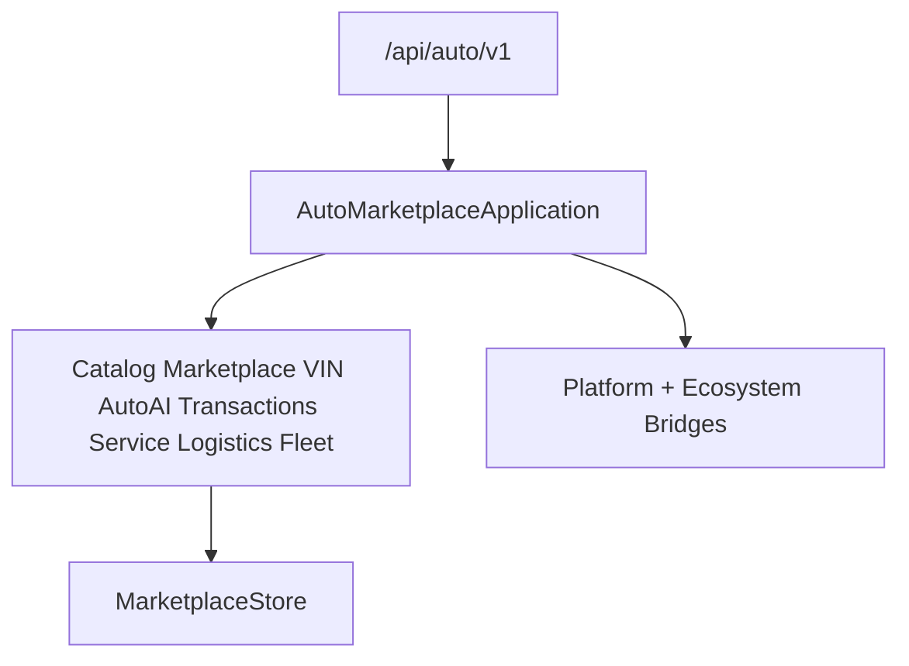

# Auto Marketplace — Fleet & Mobility (Sprint 10.7)

Fleet management, rental, corporate mobility, and AI operations for **Auto Marketplace 1.6.0-alpha**.

| Field | Value |
|-------|-------|
| Application name | Auto Marketplace |
| Application version | `1.6.0-alpha` |
| Fleet engine | `1.0` |
| Rental engine | `1.0` |
| Operations engine | `1.0` |
| Platform | AI Platform Core v3 (bridge only) |
| Ecosystem | AI Ecosystem v1.5 (bridge only) |
| API | `/api/auto/v1` |

**Hard constraint:** AI Platform Core, AI Ecosystem, Agro Marketplace, and Port ERP are not modified.

## Architecture



## Modules (10.7)

`fleet/` · `rental/` · `leasing/` · `subscriptions/` · `corporate/` · `dispatch/` · `telematics/` · `drivers/` · `operations/` · `executive/` · `mobility/` · `ai_operations/`

## REST API

`/fleet` · `/rental` · `/leasing` · `/drivers` · `/dispatch` · `/operations`

## Docs

- [AUTO_VIN.md](AUTO_VIN.md)
- [AUTO_AI.md](AUTO_AI.md)
- [AUTO_TRANSACTIONS.md](AUTO_TRANSACTIONS.md)
- [AUTO_SERVICE.md](AUTO_SERVICE.md)
- [AUTO_LOGISTICS.md](AUTO_LOGISTICS.md)
- [AUTO_FLEET.md](AUTO_FLEET.md)

```python
from applications.auto_marketplace import auto_marketplace

health = auto_marketplace.health()
assert health["application_version"] == "1.6.0-alpha"
assert health["fleet_engine"] == "1.0"
assert health["rental_engine"] == "1.0"
assert health["operations_engine"] == "1.0"
```
