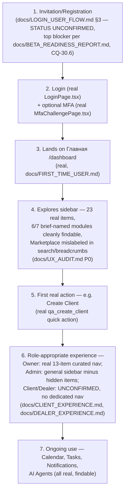

# Sprint CQ-30.7 — Beta User Journey

**Scope:** end-to-end journey for a first Enterprise Beta customer, composing every real system this
review and its predecessors have confirmed. Documentation only, `src` not modified.

## Journey map

## Per-stage evaluation

| Stage | Real/confirmed | Risk |
|---|---|---|
| 1. Invitation/Registration | **Unconfirmed real** | Blocking if absent — see `docs/BETA_READINESS_REPORT.md` (CQ-30.6) |
| 2. Login + MFA | Real, both pages exist | None |
| 3. Landing | Real `/dashboard` | Minor: distinct from "Рабочий стол," not self-explaining (`docs/NAVIGATION_REVIEW.md` §3) |
| 4. Sidebar exploration | Real, 23 items, one mislabeled | Marketplace mislabeling in search/breadcrumbs (P0) |
| 5. First action | Real quick actions exist and are well-formed | None found |
| 6. Role-appropriate experience | Real for Owner/Admin; unconfirmed for Client/Dealer | High for any Beta cohort including external Client/Dealer users |
| 7. Ongoing use | Real — Calendar, Tasks, Notifications, AI Agents all findable | None found in the core loop |

## The journey's single biggest unknown

Stage 1 (Invitation/Registration) gates every stage after it. This document does not re-investigate it
(already thoroughly scoped in `docs/LOGIN_USER_FLOW.md`/`docs/BETA_READINESS_REPORT.md`) — it is
restated here as literally the first node in the journey map because a UX journey document that didn't
lead with it would understate its importance.

## Recommended Beta cohort sequencing, given the real gaps found

Given Owner/Admin experiences are real and mature, and Client/Dealer are not: **recommend Beta's first
cohort be internal-role-only (Owner/Admin/Manager/Employee) users at partner companies**, deferring
real external Client/Dealer access until `docs/CLIENT_EXPERIENCE.md`/`docs/DEALER_EXPERIENCE.md`'s
gaps are closed. This lets Beta launch on schedule using the parts of the product that are genuinely
ready, without either persona group having a confusing or unbuilt first experience.

## Non-goals

- No new onboarding flow designed — this document sequences real, already-evaluated pieces.
- No commitment on Client/Dealer timeline — that's a product/roadmap decision this review informs but
  doesn't make.

## Related documents

`docs/LOGIN_USER_FLOW.md`/`docs/BETA_READINESS_REPORT.md` (the Stage 1 blocker), `docs/FIRST_TIME_
USER.md`/`docs/UX_AUDIT.md`/`docs/OWNER_EXPERIENCE.md`/`docs/CLIENT_EXPERIENCE.md`/`docs/DEALER_
EXPERIENCE.md` (CQ-30.7 siblings, every stage's supporting evidence).
