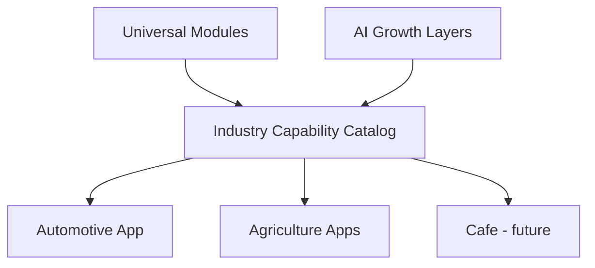

# Business Ecosystem Audit — Sprint 30.2

Audits every ecosystem against original business ideas. Capabilities in PB catalogs are **extension points**, not proof of a full product UI.

Legend: **I** implemented app/API · **P** partial · **A** architecture/catalog · **F** missing product · **W** web-ready · **T** test-ready · **B** production blocker

---

## Registry overview

| Ecosystem | Backend app | Catalog prepared | Web vertical | Testing | Prod blockers |
|-----------|-------------|------------------|--------------|---------|---------------|
| Automotive | `auto_marketplace` **I** | Yes | **F** | Strong API tests | Web + live auth |
| Agriculture | `agro_*` **I** | Yes | **F** | Strong | Web + live auth |
| Beauty | `platform_beauty_*` + hub **P** | Yes | **F** | Library/hub | First-class app + web |
| Cafe | None **A/F** | Yes | **F** | Catalog only | Entire product surface |
| Crypto (Bidex) | `crypto_enterprise` **I** | Yes | **F** | Strong | Web + BidEx channel clarity |
| Legal | `legal_enterprise` **I** | Yes | **F** | Strong | Web |
| Drone | `drone_platform` **I** | Yes | **F** | Certified | Web |
| Manufacturing…Custom | Registry only **A** | Template | **F** | N/A | Not started |

---

## Automotive — original ideas

| Concept | Status | Notes |
|---------|--------|-------|
| Dealer / CRM / Trade-In / Insurance / Leasing / Service | **I/P** | Auto marketplace + dealer CRM APIs |
| Marketing / Lead Processing | **I/P** | Present in auto modules |
| Customer Portal | **P** | API/partner; no dedicated React portal |
| AI Sales / AI Production | **P** | Buyer/seller AI APIs; production via enterprise libs |
| Ready for Web | **No** | Needs portal composition on universal modules |
| Ready for Testing | **API yes / Web no** | |
| Production blockers | Web UI, unified auth, OpenAPI for portal contracts |

## Agriculture

| Concept | Status |
|---------|--------|
| Commodity Trading / Grain Marketplace | **I** (agro apps) |
| Export / Import / Sea Freight / Containers / B/L / Certificates / Port | **I/P** (agro + port enterprise) |
| Trader Portal / AI Trader | **P** |
| Web / Prod blockers | Same pattern — API strong, web missing |

## Beauty

| Concept | Status |
|---------|--------|
| Salon / Cosmetology / CRM / Appointments / Marketing / Telegram | **P** (platform_beauty + hub BOS/BWS/BCJ) |
| AI Concierge / AI Production / Owner Dashboard | **P/A** |
| Blockers | No `applications/beauty_*`; no beauty web app |

## Cafe

| Concept | Status |
|---------|--------|
| Restaurant / Delivery / Kitchen / Reservations / Loyalty / AI Waiter | **A/F** catalog only |
| Blockers | No application package |

## Crypto (Bidex)

| Concept | Status |
|---------|--------|
| Bidex / Wallet / OTC / P2P / AML / KYC / Payments / Reporting / AI Compliance | **I/P** in crypto_enterprise + legacy BidEx handlers |
| Blockers | Web; clarify BidEx vs crypto_enterprise product boundary |

## Legal

| Concept | Status |
|---------|--------|
| Lawyer CRM / Cases / Documents / Contracts / Calendar / Client Portal / AI Lawyer | **I/P** legal_enterprise |
| Blockers | Web client portal |

## Drone

| Concept | Status |
|---------|--------|
| R&D / Manufacturing / Fleet / Telemetry / Mission / Warehouse / Production / Digital Twin | **I** drone_platform |
| Blockers | Web operator UI; naming overlap with PB Mission Control |

---

## AI Growth Layer (platform requirement)

Every ecosystem **must** compose these **platform layers** (not industry forks):

| Layer | Platform home | Ecosystem binding status |
|-------|---------------|--------------------------|
| AI Concierge | PB Concierge + ecosystem assistant | Bind per org — **extend** |
| AI Team Orchestrator | Collaborative AI / EAO / AI Team Center | Bind per org |
| AI Production Department | Enterprise production / EPD libs | Bind per org |
| AI Marketing Department | AI Marketing OS / hub AMO | Bind per org |
| AI Sales Department | Sales AI docs + vertical AI APIs | Bind per org |
| AI Customer Success | Partial / docs | Needs explicit module binding |
| AI Analytics | Visual intelligence + hub analytics | Bind per org |

**Rule:** Each organization has its own AI team; users stay within permissions; roles map to AI capabilities via RBAC — **do not** clone these engines per industry.

---

## Extension diagram

