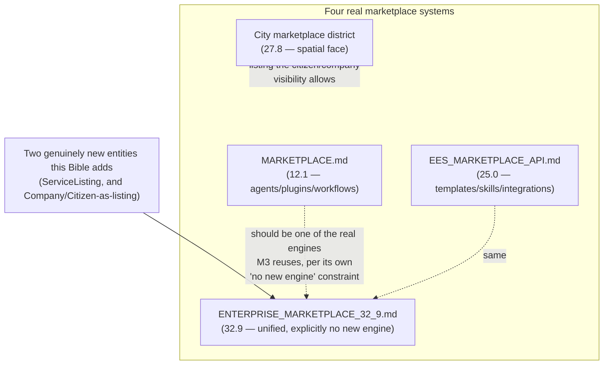

# Enterprise City — Business Marketplace Architecture

**Sprint:** CQ-13 — Architecture Research + Product Research. Documentation only, `src` not modified.

**Do not duplicate:** Real, existing marketplace systems, cited below rather than re-described.

## 0. The headline finding — the platform already has at least four real marketplace systems

This is the marketplace-domain instance of the exact pattern CG-7 found for workflow engines: **before
designing anything new, this research found the brief's "design Marketplace architecture" ask already
has multiple, independent, real answers**, none consolidated:

| Real marketplace | Scope | API | Sprint |
|---|---|---|---|
| `MARKETPLACE.md` | AI agents, plugins, connectors, workflows, business applications — package/plugin/connector/workflow/application/agent registries, versioning, install/update/rollback, licenses | `/api/marketplace/v1` | 12.1 |
| `EES_MARKETPLACE_API.md` | industry_solutions, ai_skills, templates, integrations, ui_packs, workflow_packs, dashboard_packs | (EES's own public API/SDK) | 25.0 |
| `ENTERPRISE_MARKETPLACE_32_9.md` | "Unified Marketplace" — explicitly **"No new Marketplace Engine"** in its own text — reuses AI Builder Studio catalogs, AI Team, Workflow Automation, Skill/Prompt libraries | Platform Builder, `/api/platform-builder/v1` family | 32.9 |
| Real City `marketplace` building/district (D9, `CITY_DISTRICTS.md`, CG-9) | The spatial/City-visible face — routes to `/marketplace` | — | 27.8 |

Plus **vertical-scoped marketplaces** already real: `auto_marketplace` (420 files, the platform's
largest real vertical, `CITY_DISTRICTS.md` D17/CQ-11), `agro_marketplace` (185 files, D18),
`FREIGHT_MARKETPLACE.md`/`FREIGHT_EXCHANGE.md` (real, Sprint 15.6, tender/bid/auction/negotiate/book —
directly relevant to `TENDERS_PROCUREMENT.md`), and `AUCTION_PLATFORM.md` (real, `/api/seller-ai/v1/
auctions`, bidding/reserve-price/winner-processing).

**The correct response to this brief section is therefore identical in shape to `AUTOMATION_ENGINE.md`
§0's (CG-7) conclusion: this document does not design a new marketplace.** It surveys the real ones
against the brief's eleven requested listing categories, and recommends which real system each
category should extend.

## 1. Per-category mapping (brief's eleven)

| Brief category | Real system to extend |
|---|---|
| Companies | `BUSINESS_NETWORK.md`'s real `BusinessProfile` (Sprint 29.0) — a company "listing" is a `BusinessProfile` with `visibility: "public"`, not a new record |
| Professionals | `DIGITAL_CITIZEN.md`'s real `Citizen` (Sprint 29.1) — same pattern, a discoverable citizen profile |
| AI Agents | `MARKETPLACE.md`'s real agent registry (Sprint 12.1) — already the correct real home |
| Services | `ENTERPRISE_ECONOMY.md` §4's new `ServiceListing` (SPEC, this sprint) — the one genuinely new entity this Bible proposes, since no real system owns "a company/citizen offers this specific service" today |
| Products | Vertical marketplaces (`auto_marketplace`, `agro_marketplace`) already own physical/vertical products — not re-designed here |
| Digital Assets | `DIGITAL_ASSETS.md` (this sprint's sibling document) |
| Templates | `EES_MARKETPLACE_API.md`'s real `templates` category (Sprint 25.0) — already the correct real home |
| Workflows | `MARKETPLACE.md`'s real `workflow` registry (Sprint 12.1) **and** `EES_MARKETPLACE_API.md`'s real `workflow_packs` (Sprint 25.0) — **two real, overlapping homes**, flagged as a consolidation candidate in its own right, not solved by this document |
| Knowledge Packages | `EES_MARKETPLACE_API.md`'s real `ai_skills`/nothing named "knowledge package" exactly — closest real fit, not an exact match |
| Enterprise Modules | `ENTERPRISE_MARKETPLACE_32_9.md`'s real "one-click connect ready-made solutions" (Sprint 32.9) — already the correct real home |
| Integrations | `EES_MARKETPLACE_API.md`'s real `integrations` category (Sprint 25.0) — already the correct real home |

## 2. Consolidation recommendation (the one architectural decision this document makes)

**Recommendation**: `ENTERPRISE_MARKETPLACE_32_9.md`'s own stated design ("No new Marketplace Engine
... reuse AI Builder Studio catalogs, AI Team, Workflow Automation, Skill/Prompt libraries") is already
the correct architectural instinct — this document extends that same instinct one level further: the
*new* things this Bible needs (Companies/Professionals/Services-as-listings) should also register into
Sprint 32.9's real unified surface, not spawn a fifth marketplace. The City `marketplace` building (D9)
remains the one spatial rendering surface for whichever real listings visibility allows through —
consistent with `CITY_CRM.md`/`CITY_ERP.md`'s established "real building, no new engine" discipline.

## 3. Non-goals

- No new Marketplace Engine — the single most important constraint this document inherits from
  `ENTERPRISE_MARKETPLACE_32_9.md`'s own real text and applies to every brief category in §1.
- No consolidation of `MARKETPLACE.md`'s workflow registry vs. `EES_MARKETPLACE_API.md`'s
  `workflow_packs` is performed here — flagged as a real duplication, not resolved, per this
  documentation-only sprint's scope.
- No new listing UI/UX is designed — this document is entity/system mapping only.

## Related documents

`MARKETPLACE.md`/`EES_MARKETPLACE_API.md`/`ENTERPRISE_MARKETPLACE_32_9.md` (real, pre-existing),
`CITY_DISTRICTS.md` D9/D17/D18 (CG-9/CQ-11, the City-visible and vertical marketplace faces),
`ENTERPRISE_ECONOMY.md` §4 (`ServiceListing`), `TENDERS_PROCUREMENT.md` (the bid/tender-specific real
systems, `FREIGHT_EXCHANGE.md`/`AUCTION_PLATFORM.md`), `BUSINESS_NETWORK.md`/`DIGITAL_CITIZEN.md`
(real, Sprint 29.0/29.1, the entities that become listings).
