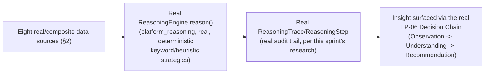

# Enterprise City — Business Observatory & City Intelligence

**Sprint:** CQ-14 — Architecture Research + AI Orchestration. Documentation only, `src` not modified.
Covers the brief's §2 (Business Observatory) and §6 (City Intelligence) together — both describe
continuous, aggregate analysis, one platform-wide and one spatially rendered in City.

**Do not duplicate:** `ENTERPRISE_INTELLIGENCE_CORE.md` §0 already established the real Decision
Engine/Reasoning-Planning-Decision chain this document's insight generation reads from —
`platform_observability/metrics_manager.py`'s real aggregation of `reasoning_metrics`/
`planning_metrics`/`decision_metrics`/`learning_metrics` (confirmed this sprint) is the closest real
precedent to a "Business Observatory" anywhere in this codebase, and is cited, not re-designed.

## 1. What exists today (verified)

`platform_observability/metrics_manager.py` already aggregates real metrics from the real
reasoning/planning/decision/learning packages (`ENTERPRISE_INTELLIGENCE_CORE.md` §0) — this is a real,
working **cross-cutting metrics observatory**, just not yet scoped to the brief's eight subjects
(Companies/Citizens/Projects/Meetings/Workflows/Automation/Economy/City Activity/AI Performance). This
document proposes extending its real aggregation surface, not building a parallel one.

## 2. Per-subject mapping

| Brief subject | Real data source |
|---|---|
| Companies | Real `BusinessProfile` (Sprint 29.0) |
| Citizens | Real `Citizen`/`Membership` (Sprint 29.1) |
| Projects | Real `AutomationEngine` tasks (Sprint 28.9) |
| Meetings | **Absent** — `EBN_COMMUNICATION.md` §2 (CQ-10) already found no real meeting system exists |
| Workflows | Real `AutomationEngine`/`WorkflowRuntime` (Sprint 28.9) |
| Automation | Same real source |
| Economy | `ENTERPRISE_ECONOMY.md` (CQ-13) — itself a composite over real `BusinessProfile`/`Relationship` fields |
| City Activity | Real `CityLiveStatus`/`DistrictRuntimeSummary` (CG-4/CG-9) |
| AI Performance | Real `platform_observability.metrics_manager`'s reasoning/planning/decision/learning metrics — **already the most real subject in this table** |

## 3. Continuous insight generation — reuses the real Reasoning pipeline, doesn't add a second one

**Honesty note, load-bearing for this whole document**: the real `ReasoningEngine`'s strategies
(`RuleBasedStrategy`, `ChainOfThoughtStrategy`, etc., confirmed this sprint) are deterministic
keyword/regex matching and fixed-weight scoring, **not statistical or LLM-based reasoning**. "Generate
insights continuously" is therefore proposed as *periodic re-evaluation of the same real deterministic
rules against fresh data*, not a claim that the platform will discover genuinely novel patterns beyond
what its real, fixed heuristics already check for. Overstating this would be the same category of
mistake `AI_MEMORY.md` §0 (CG-8) already flagged for the fake-embeddings finding — a plausible-looking
capability that isn't what it appears.

## 4. City Intelligence (brief §6)

| Brief example | Real/SPEC source |
|---|---|
| Business hotspots | `DistrictRuntimeSummary` (`CITY_SIMULATION.md` §1.2, CG-4) — already a real-shaped aggregation, just needs a "hotspot" threshold rule (SPEC, small) |
| Growing districts | Same aggregation, trended over time via real Timeline events |
| Emerging industries | `CITY_DISTRICTS.md` D16–D19 (CQ-11) — the real-vertical-grounded specialization findings, tracked over time |
| Traffic optimization | `CITY_RUNTIME_ARCHITECTURE.md` §1.7 Traffic Runtime (CQ-11) — this document adds only the *optimization* framing (which real roads to prioritize rendering), not a new traffic model |
| Resource utilization | `AI_AGENT_LIFECYCLE.md`'s real `queueDepth`/`memoryMb` fields (CG-8), aggregated |
| Logistics optimization | `CITY_DISTRICTS.md` D19 (`port_erp`/`port_enterprise` real grounding, CQ-11) |
| Enterprise heat maps | A rendering of the same `DistrictRuntimeSummary` aggregation as a City-wide color overlay — reuses CG-2's real layer system (`Effects` layer), no new rendering primitive |
| Business clusters | Derived from `EBN_BUSINESS_GRAPH.md`'s real relationship edges (CQ-10) — graph community detection, not a new data source; the detection algorithm itself is not specified in this documentation-only pass |

## 5. Non-goals

- No new metrics/observability engine — extends the real `platform_observability.metrics_manager`.
- No claim of statistical/ML-based insight generation — §3's honesty note is load-bearing, not a
  disclaimer to skim past.
- No graph-clustering algorithm specified for Business clusters (§4) — the data source is real, the
  algorithm is future implementation work.

## Related documents

`ENTERPRISE_INTELLIGENCE_CORE.md` §0 (the real Decision/Reasoning chain), `CITY_SIMULATION.md` §1.2/§3
(CG-4, `DistrictRuntimeSummary`, performance budget), `CITY_DISTRICTS.md` D16–D19 (CQ-11, real vertical
grounding), `EBN_BUSINESS_GRAPH.md` (CQ-10, relationship edges for clustering),
`CITY_RUNTIME_ARCHITECTURE.md` §1.7 (CQ-11, Traffic Runtime).
