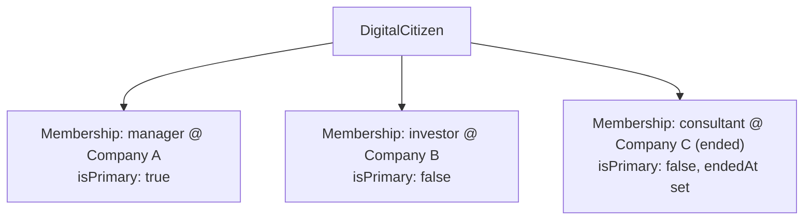

# Enterprise Digital Citizens — Organization Membership

**Sprint:** CQ-12 — Architecture Research + UX Research. Documentation only, `src` not modified.

**Do not duplicate:** `DIGITAL_CITIZEN.md` owns the citizen entity this document's memberships attach
to; `ENTERPRISE_BUSINESS_NETWORK.md` (CQ-10) owns the `Company` entity a membership points at.
`CITY_USER_JOURNEYS.md` (CG-5) already documented nine role-shaped personas (CEO, Manager, Sales,
Developer, Administrator, Operator, Client, Partner, Guest) — this document reconciles the brief's
eighteen membership roles against that real prior work rather than re-deriving personas from scratch.

## 0. Correction — a real Membership-shaped table already exists

This document's first-draft `Membership` entity (§2) was written assuming no real per-person,
per-organization role table existed — targeted research this sprint found one, closer to this brief's
need than `HumanRole` (workflow-task-assignment only, already known from CG-7):
**`database/models/role.py`'s `PermissionRole`/`EngineRoleCode`** enum already includes `OWNER`,
`ADMIN`, `MANAGER`, `ACCOUNTANT`, `LAWYER`, `PARTNER`, `OPERATOR`, `VIEWER` — five of this brief's
eighteen roles, verbatim or near-verbatim — joined via **`database/models/user_role.py`'s
`PermissionUserRole`** (`user_id`, `role_id`, `assigned_at`), a genuine M2M table between a person and
a role. This is the real foundation §2's `Membership` should extend (add `companyId` and the brief's
remaining roles to `EngineRoleCode`, and reuse `PermissionUserRole`'s shape for the join), not a
parallel table.

**A third, disconnected role concept was also found**, worth naming since this engagement keeps
finding the same duplication pattern at every layer: `database/models/users.py`'s real `User.role`
field stores a *single* canonical CRM role string (`SUPER_ADMIN`/`AUTO_MANAGER`/`AGRO_MANAGER`/
`CLIENT`, etc.) directly on the Telegram-identity user record — a third, independent role
representation alongside `HumanRole` (workflow-scoped) and `EngineRoleCode`/`PermissionUserRole`
(RBAC-scoped, multi-role-capable). Whichever sprint implements `Membership` should reconcile these
three, not add a fourth.

## 1. Reconciling eighteen roles against nine existing personas

`CITY_USER_JOURNEYS.md` (CG-5) already gives five of the brief's eighteen roles a full, real-grounded
journey (CEO, Manager — as the generic department-manager pattern, Sales, Developer, Administrator).
This document does not re-write those — it extends the *entity* model (a `Membership` record) that
those personas' journeys implicitly assumed but never formalized as data.

| Brief role | Reconciled against |
|---|---|
| Owner | **Real** — `EngineRoleCode.OWNER` (§0) — verbatim match |
| CEO | `CITY_USER_JOURNEYS.md` §1 (real persona); no matching `EngineRoleCode` value, closest real role code is `ADMIN` |
| Director | New — a level between Manager and CEO, not previously modeled, no `EngineRoleCode` match |
| Manager | **Real** — `EngineRoleCode.MANAGER` (§0), plus `CITY_USER_JOURNEYS.md` §2's persona |
| Engineer / Developer | `CITY_USER_JOURNEYS.md` §4 (Developer persona); no matching `EngineRoleCode` value |
| Operator | **Real** — `EngineRoleCode.OPERATOR` (§0), plus `CITY_USER_JOURNEYS.md` §6's real persona |
| Sales | `CITY_USER_JOURNEYS.md` §3 (real persona); no matching `EngineRoleCode` value |
| Marketing | New — no dedicated persona document exists yet, closest analog is the real `marketing` CRM-district building (`CITY_DISTRICTS.md` D7) |
| Accountant | **Real** — `EngineRoleCode.ACCOUNTANT` (§0), verbatim match; also ties to the real `finance` district (`CITY_DISTRICTS.md` D2) |
| Lawyer | **Real** — `EngineRoleCode.LAWYER` (§0), verbatim match; also ties to the real `legal_enterprise` backend vertical (`ARCHITECTURE_MAP.md` §2.6) |
| Driver | New — ties directly to `CITY_OBJECT_MODEL.md` §3's `VehicleInstance` (CQ-11) — a Driver is the human behind a `car`/`delivery_van`/`ship` marker, once Pedestrian Runtime's presence model exists |
| Builder | New — ties to `CITY_OBJECT_MODEL.md` §2.1's Construction Site state (CQ-11) — a Builder is the human behind `construction_equipment` |
| Designer | New — no real backend or district precedent found |
| Investor | `EBN_BUSINESS_GRAPH.md` §1 (CQ-10, already has an `investor` `RelationshipType` at the *company* level) — this document's Investor role is the *person* acting on behalf of that relationship |
| Partner | **Real** — `EngineRoleCode.PARTNER` (§0), verbatim match; also `CITY_USER_JOURNEYS.md` §8 (already honest: the *City journey* is mostly vision, blocked on Portal infra, even though the role code itself is real) |
| Consultant | New — closest real precedent is `PartnerContact` (`database/models/partner_engine.py`, real, found in CQ-10 research) — an external contact record, not an employee |
| External Contractor | Same real precedent as Consultant — `PartnerContact` |
| (Client, Guest — brief doesn't request these here but CG-5 already covers them) | `CITY_USER_JOURNEYS.md` §7/§9 |

## 2. Entity model — extends the real `PermissionUserRole`, not a new table

**Design decision, mirroring `EBN_PARTNERSHIP_SYSTEM.md`'s own two-axis lesson (CQ-10)**: a citizen's
relationship to a company is not a single field on `DigitalCitizen` — it is a **separate `Membership`
record**, because the brief explicitly requires supporting multiple organizations simultaneously (a
person can be a Consultant at one company and an Investor in another at the same time). Per §0, this
is proposed as an **extension of the real `PermissionUserRole`** (`user_id`, `role_id`, `assigned_at`)
— adding `companyId` and `isPrimary`/`visibility` fields, and extending the real `EngineRoleCode` enum
with the brief's remaining roles — not a new table built from scratch.

```ts
// Extends the real EngineRoleCode enum (OWNER/ADMIN/MANAGER/ACCOUNTANT/LAWYER/PARTNER/OPERATOR/VIEWER, §0)
// with the brief's remaining roles:
type MembershipRole =
  | "owner" | "ceo" | "director" | "manager" | "engineer" | "developer" | "operator" // owner/manager/operator real
  | "sales" | "marketing" | "accountant" | "lawyer" | "driver" | "builder" | "designer" // accountant/lawyer real
  | "investor" | "partner" | "consultant" | "external_contractor"; // partner real

interface Membership {
  citizenId: string;             // DIGITAL_CITIZEN.md — extends the real PermissionUserRole.user_id
  companyId: string;             // NEW field on the real PermissionUserRole shape — ENTERPRISE_BUSINESS_NETWORK.md §3 (CQ-10)
  role: MembershipRole;          // extends the real EngineRoleCode enum, §0
  isPrimary: boolean;            // NEW field — exactly one Membership per citizen should be primary, see §3
  startedAt: string;             // real PermissionUserRole.assigned_at
  endedAt?: string;              // never deleted — nothing disappears (ENTERPRISE_BUSINESS_NETWORK.md §0 item 2), a past
                                  // Membership stays on the citizen's real Experience/Activity History (DIGITAL_CITIZEN.md §1)
  visibility: "public" | "network_only" | "partners_only" | "private"; // same real Visibility enum, CQ-10
}
```

## 3. Multiple organizations, one primary



A citizen's **primary** Membership is what determines their default City entry point and Digital
Workplace binding (`DIGITAL_LIFE.md` §1) — the same "which building does this citizen's work happen
in" question `CITY_USER_JOURNEYS.md`'s personas already answer per-role, now formalized as data instead
of narrative. Non-primary Memberships are still real and still visible per their own `Visibility`
scope — a citizen's Investor role at Company B doesn't disappear from their profile just because their
Manager role at Company A is primary.

## 4. Permissions

A `Membership`'s `role` is the input to the real permission chain (`permissionManager`/`roleManager`,
`CITY_INTEGRATIONS.md` §3, CG-6) — this document does not propose a second permission model. What a
citizen can see/do inside a company's data is gated by their `Membership.role` there, resolved through
the same real chain every other CQ/CG document has extended, never independently.

## 5. Non-goals

- No new persona documents — the five roles CG-5 already covers are cited, not re-written.
- No second permission system — `Membership.role` feeds the real, existing chain.
- No design for Designer's or Marketing's real backend grounding — both flagged as having no real
  precedent found, left as pure SPEC rather than forced onto a loose analog.

## Related documents

`DIGITAL_CITIZEN.md` (the entity a `Membership` attaches to), `ENTERPRISE_BUSINESS_NETWORK.md` §3
(CQ-10, `Company`), `CITY_USER_JOURNEYS.md` (CG-5, the five real personas), `EBN_BUSINESS_GRAPH.md`
§1 (CQ-10, company-level `RelationshipType`, the Investor role's company-side counterpart),
`CITY_INTEGRATIONS.md` §3 (CG-6, the real permission chain).
