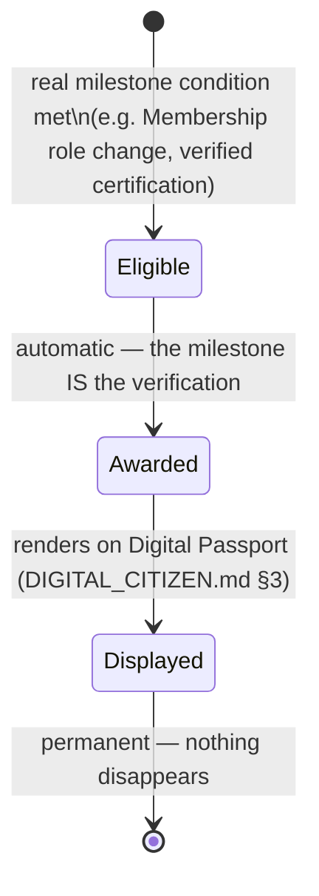

# Enterprise Digital Citizens — Social Business Layer, Reputation & Professional Growth

**Sprint:** CQ-12 — Architecture Research + Product Research + Game Design Research. Documentation
only, `src` not modified. Covers the brief's §6 (Social Business Layer), §7 (Reputation System), and
§8 (Professional Growth) together — all three describe how a citizen's standing with other citizens
evolves, and share one governing constraint the brief itself states twice ("must remain
business-oriented," "no entertainment mechanics").

**Do not duplicate:** `ENTERPRISE_BUSINESS_NETWORK.md` §3.1–3.2 (CQ-10) already designed the Trust
Score / Reputation split at the *company* level, inverting a real `risk_score` and generalizing a
real `Partner.rating` field — this document applies the identical pattern to *people*, citing the same
real precursors rather than re-deriving the split from scratch. `EBN_GAMIFICATION_MONETIZATION.md` §1
(CQ-10) already established the "must decompose into a real signal" test for gamification — applied
here verbatim to Professional Growth.

## 1. Social Business Layer (brief §6) — one relationship type, reconciled

### 1.1 "Friends" is the one brief item this document pushes back on

The brief lists Colleagues, Friends, Partners, Mentors, Investors, Clients, Suppliers, Recommended
Contacts, Communities, Professional Networks — then states "everything must remain business-oriented"
in the same breath. **"Friends" is in direct tension with that constraint** — a literal friendship
graph is exactly the kind of social-network feature this whole engagement's discipline (CG-9's
Smoke/Weather rejections, CQ-11's Pedestrian Runtime restraint) would flag as scope creep into
entertainment territory. This document recommends **"Trusted Colleague"** instead — a real,
business-legible relationship (repeat successful collaboration across multiple `Membership`s or
projects) rather than an undefined personal-affinity graph.

### 1.2 Relationship model

```ts
type CitizenRelationshipType =
  | "colleague"          // shared active Membership at the same company
  | "trusted_colleague"  // colleague relationship + repeat successful collaboration (replaces "Friends")
  | "partner"            // acting as the human counterpart of a company-level Partnership (EBN_PARTNERSHIP_SYSTEM.md)
  | "mentor"             // SPEC — no real precedent, lowest priority
  | "investor"           // acting on behalf of a company-level investor RelationshipType (EBN_BUSINESS_GRAPH.md §1)
  | "client"             // colleague at a company with a customer-type Partnership to the viewer's company
  | "supplier";          // same shape, supplier-type Partnership

interface CitizenRelationship {
  citizenId: string;
  otherCitizenId: string;
  type: CitizenRelationshipType;
  derivedFromMembershipIds?: string[]; // most relationship types are DERIVED, not independently declared
  visibility: "public" | "network_only" | "connections_only" | "private";
}
```

**Design principle**: most relationship types are **derived** from real `Membership`/`Partnership`
data (colleague = shared company Membership; client/supplier = the human face of a real company-level
Partnership), not independently maintained — the same "compute, don't store a second source of truth"
discipline `CITY_SIMULATION.md` §1.2 (CG-4) already established for district aggregation. Only
`mentor` has no derivation path and is flagged lowest priority.

### 1.3 Recommended Contacts, Communities, Professional Networks

- **Recommended Contacts** — SPEC, a derived suggestion (shared Memberships-of-Memberships, i.e.
  colleagues of colleagues at partnered companies) — not a new data type, a query over §1.2's real
  relationship graph.
- **Communities / Professional Networks** — **not recommended as a new grouping primitive.** No real
  precedent exists, and a generic "community" feature is exactly the kind of open-ended social surface
  this Bible's own discipline should be suspicious of — if a real product need emerges (e.g., an
  industry-vertical group tied to a real `CityDistrict`, `CITY_DISTRICTS.md`'s specialization work,
  CQ-11), it should attach to that real district rather than exist as a freestanding social feature.

## 2. Reputation System (brief §7)

| Brief factor | Real/derived source |
|---|---|
| Completed Projects | Real `AutomationEngine` task completion, once citizen-attributed (`DIGITAL_LIFE.md` §1) |
| Experience | Derived from `Membership.startedAt`/`.endedAt` history (`CITIZEN_ORGANIZATION_MEMBERSHIP.md` §2) — real once Memberships exist |
| Recommendations | SPEC — no real precedent; proposed as a `TrustedColleague`-gated endorsement (only citizens with a real `trusted_colleague` relationship, §1.2, can recommend each other) to resist the same abuse risk `ENTERPRISE_BUSINESS_NETWORK.md` §3.2 already flagged for company-level peer endorsement |
| Certifications | `DIGITAL_CITIZEN.md` §1's `CitizenCertification` (SPEC entity, no real precedent) |
| Verified Identity | `DIGITAL_CITIZEN.md`'s `TrustLevel` ladder | Real precursor: the same real `kyc.py`/`compliance.py` verification-tier pattern `ENTERPRISE_BUSINESS_NETWORK.md` §3.3 already found for companies — worth checking whether those real tables support a person-scoped row, not just company-scoped, before assuming a fully separate system is needed |
| Business Activity | Real per-citizen `AuditLog`/`PlatformAuditLog` (`DIGITAL_CITIZEN.md` §0) — the strongest real input in this whole table |
| Company History | Derived from `Membership` records, including ended ones (nothing disappears) |
| AI Skills | `PERSONAL_AI.md` §2 — which of the seven AI kinds a citizen has configured/uses regularly |
| Platform Contributions | Not independently confirmed real — closest analog is the real Activity History (`AuditLog`) filtered to contribution-shaped actions; not designed further here |
| Trust Index | This document's `TrustLevel` (`DIGITAL_CITIZEN.md` §1) — the composite the other nine factors feed |

### 2.1 Composite formula (SPEC, mirroring the company-level split)

Reputation Score (activity/relationship-driven) and Trust Level (verification-driven) stay **separate
axes**, exactly matching `ENTERPRISE_BUSINESS_NETWORK.md` §3.1's reasoning for companies: a
high-activity but unverified citizen should not read as more trustworthy than their verification
status actually supports.

## 3. Professional Growth (brief §8) — the "no entertainment mechanics" test, applied literally

### 3.1 Every element must decompose into a real signal (restated from `EBN_GAMIFICATION_MONETIZATION.md` §1)

| Brief element | Real signal it must decompose into |
|---|---|
| Career Levels | Derived from `Membership` role progression (e.g. Manager → Director) — never a points total |
| Expertise Levels | Derived from verified `CitizenCertification`s + `CitizenSkill.verifiedBy` (`DIGITAL_CITIZEN.md` §1) — unverified self-reported skills should not count toward a level |
| Achievements | Same automatic, milestone-triggered mechanism `EBN_GAMIFICATION_MONETIZATION.md` §3 (CQ-10) already specified for companies — a `CitizenTimelineEvent` (mirroring the real shared-Timeline pattern), never manually awarded |
| Professional Milestones | Same mechanism as Achievements — "milestone" is this brief's naming for the same real event |
| Industry Recognition | SPEC, lowest priority — no real precedent; would need external verification (e.g. a real industry body integration) to avoid becoming a self-declared, ungrounded badge |
| Verified Competencies | `CitizenCertification.documentRef`, once a real verification flow exists (`EBN_VERIFIED_DOCUMENTS.md`, CQ-10) |

### 3.2 State diagram (mirrors `EBN_GAMIFICATION_MONETIZATION.md` §3's real company-achievement pattern)



## 4. Non-goals

- No "Friends"/personal-affinity graph — §1.1 explicitly recommends against it.
- No Communities/Professional Networks as a new grouping primitive — §1.3.
- No manually-awarded achievements — §3.2, same automatic-only discipline as the company level.
- No new verification-tier system for `TrustLevel` — §2's Verified Identity row flags checking the
  real company-level tables for person-scoping before building a parallel one.

## Related documents

`ENTERPRISE_BUSINESS_NETWORK.md` §3.1–3.3/§3.5 (CQ-10, the Trust/Reputation split and verification-tier
pattern this document mirrors), `EBN_GAMIFICATION_MONETIZATION.md` §1/§3 (CQ-10, the real-signal test
and automatic-achievement mechanism), `EBN_BUSINESS_GRAPH.md` §1 (CQ-10, company-level
`RelationshipType`, the source for Investor/Client/Supplier relationship derivation),
`CITIZEN_ORGANIZATION_MEMBERSHIP.md` (Membership records this document derives relationships/experience
from), `DIGITAL_CITIZEN.md` §0/§3 (real Activity History, Digital Passport rendering).
