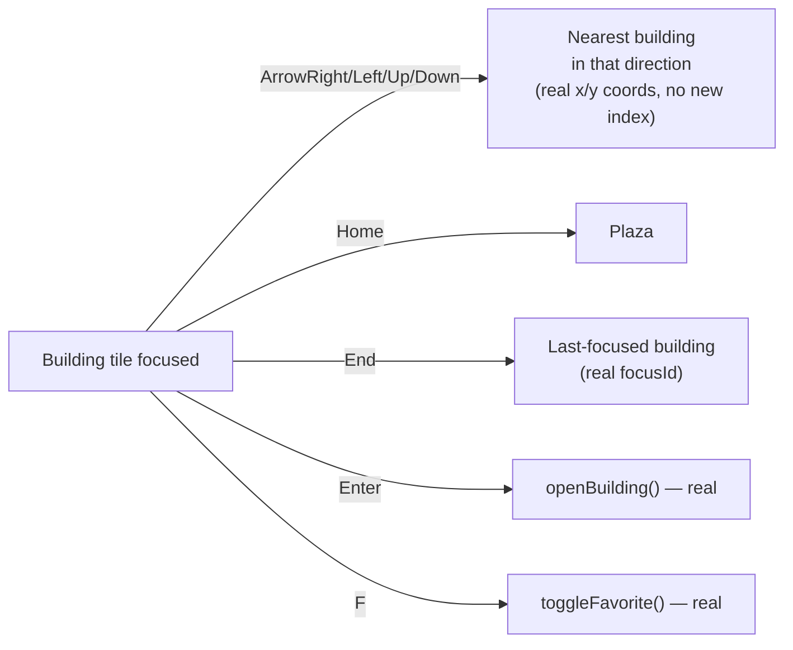

# Enterprise City — Accessibility Specification

**Sprint:** CG-5 — Research & Specification only. No source code was modified.

**Do not duplicate:** `design-system/accessibility/index.ts` (`accessibilityManager`) is the real,
platform-wide accessibility contract (WCAG AA standard, `data-contrast`/`data-reduced-motion`
attributes, `eds-focus-ring` class). `CITY_ANIMATION_SYSTEM.md` §2 and `CITY_RUNTIME.md` §3 already
fully specify City's reduced-motion behavior — not repeated here beyond a one-line cross-reference.
This document covers the accessibility surfaces the brief asks for that are **not** already specified
elsewhere: keyboard-only usage, screen reader support, high contrast, color blindness, font scaling.

## 1. Keyboard-only usage

**Real today:** every interactive City element (`.ec-building`, district labels, toolbar buttons,
search input) is a native `<button>`/`<input>` — real Tab order, real `Enter`/`Space` activation, no
custom keydown interception blocking default behavior anywhere in the map stage.

**Real gap:** no spatial keyboard navigation. Tabbing through 34 buildings in DOM order (not visual
proximity) is real but unusable as a primary navigation method — a keyboard-only user reaching the
`security` building (near the end of `CITY_BUILDINGS`) must Tab through every building before it,
regardless of where it sits on screen.

**SPEC (this document's single highest-priority recommendation):**

Nearest-neighbor resolution uses the real `CityBuilding.x/y` percentage coordinates already driving
the visual layout — no new spatial index, just a distance/angle comparison over the existing 34-item
array (cheap at this scale, consistent with `CITY_SIMULATION.md` §3's performance budget). This
directly closes `CITY_NAVIGATION_GUIDE.md` §3's gap — specified once here, cross-referenced there.

## 2. Screen reader support

**Real today, and genuinely decent:** City already has real `aria-label`s on every major region
(breadcrumbs, glance strip, search input, legend, minimap, district quick-jump) and correctly marks
decorative-only elements `aria-hidden` (grid overlay, plaza ring, road/workflow SVG lines, silhouette
icons). Each building tile's `aria-label` already composes label + state (`"${building.label} —
${stateLabelRu(status)}"`, real) — a screen reader user gets the same state information a sighted user
reads from color/badge.

**Real gap:** no `aria-live` region anywhere in City. A building's state changing (e.g. transitioning
to Critical while the user is focused elsewhere on the page) is silent to a screen reader — the visual
flash (`CITY_BUILDING_STATES.md`) has no auditory/announced equivalent.

**SPEC:** one `aria-live="polite"` region (visually hidden, standard pattern), updated by the same
City Runtime Adapter (`CITY_RUNTIME.md` §2) that already drives visual effect triggers — when a
building crosses into `Critical`/`Offline` (health axis) specifically (not every minor tone change,
which would be announcement noise), push one short sentence: `"{building label} is now critical"`.
Deliberately scoped to health-axis transitions only, mirroring `CITY_CAMERA.md` §6.2's Focus Event
severity gate — the same "don't cry wolf" restraint applies to audio announcements as to camera
movement.

## 3. High contrast

**Real today:** `[data-contrast="high"]` (`design-system/styles/tokens.css`) — real, but thin: only
overrides `--eds-border` to pure black and folds muted text into full-contrast text. City inherits this
automatically (all City CSS uses `var(--eds-*)` tokens, confirmed — no hardcoded colors anywhere added
by CG-2/CG-3), so **no City-specific work is needed for basic high-contrast support** — it already
works via the token system.

**Real gap, City-specific:** the state-color language (`CITY_STATE_LABELS[...].css` →
`.ec-state-ok`/`.ec-state-attention`/`.ec-state-critical`/etc.) distinguishes states primarily by
border/background *color* (green/amber/red-family `color-mix()` blends) — under `data-contrast="high"`,
these color relationships are not specifically strengthened beyond the generic border-darkening above.
**SPEC:** verify (in whichever sprint implements this) that the existing state color-mix percentages
stay legibly distinct at high contrast, and if not, add `[data-contrast="high"] .ec-state-*` overrides
following the exact pattern `tokens.css` already establishes — an extension of the real mechanism, not
a new one.

## 4. Color blindness

**Real today:** nothing color-blindness-specific exists anywhere in the platform (confirmed — no
deuteranopia/protanopia filter, palette, or pattern-redundancy mechanism found in any design-system
file). This is a genuine, platform-wide gap this document does not claim is City-specific, but City's
state language is one of the most color-dependent surfaces in the product (six states, mostly
distinguished by hue), so it is documented here with the most concrete proposal:

**SPEC:** the state legend (`.ec-legend`, real) already exists and already pairs each color with text
(`CITY_STATE_LABELS[...].ru`/`.ua`) — this is the right foundation. Extend it: every building tile
already shows its state as text too (`ec-building-state`, real — not color-only). The one remaining
color-only signal is the **border/background color itself** at a glance, before reading text — **SPEC**
proposes adding a small state **icon or border pattern** (solid/dashed — `waiting` already uses
`border-style: dashed`, real, a genuinely good existing precedent) so every state is distinguishable by
shape/pattern, not hue alone, extending the one pattern that already exists (`waiting`'s dashed border)
to the rest of the six-state set rather than inventing a new visual language.

## 5. Reduced motion

Fully specified already — `CITY_ANIMATION_SYSTEM.md` §2 (effect/animation collapse),
`CITY_CAMERA.md` §2 (camera collapse to instant), `CITY_RUNTIME.md` §3 (Idle mode's animation
suppression). This document adds nothing beyond confirming the real mechanism
(`isReducedMotionActive`, CG-3) already combines the platform's real `data-reduced-motion` attribute
with the OS-level `prefers-reduced-motion` query — the same signal source this document's §1 keyboard
navigation and §2 screen-reader work should also respect where relevant (e.g. the proposed aria-live
announcement in §2 is not a motion concern and is unaffected by reduced motion, correctly).

## 6. Font scaling

**Real today (implicit, but genuinely real):** every City typography value
(`.ec-building-label`, `.ec-building-state`, etc.) is defined in `rem` (via the real `fontSizes` token
scale, `design-system/tokens/index.ts` — e.g. `caption: "0.75rem"`), which means **browser-level and
OS-level font-size/zoom scaling already works correctly for all City text** without any City-specific
code, because `rem` units scale with the root font-size by definition. No explicit in-app "font scale"
setting exists anywhere in the platform (confirmed no such control in the design system) — the real
mechanism is "respect the browser/OS setting," which City already does by using `rem` consistently.

**Real risk to flag, not yet a confirmed bug:** City building tiles have **fixed pixel-adjacent
percentage dimensions** (`width`/`height` as `%` of the map container) but **text sizes that don't
scale with tile size** — at a large OS font-scale setting, a small building tile's label/state text
could overflow or clip (`.ec-building-state` already has `overflow: hidden; text-overflow: ellipsis;`,
real, so it degrades to truncation rather than visual breakage, which is the correct fallback even if
not ideal). **SPEC**: no fix proposed without first confirming this is a real problem at common
OS font-scale settings (125%, 150%) — flagged as a verification item for whichever sprint does
browser-based accessibility QA (see `SPRINT_CG_3_RESULT.md` §6's same honest gap about this
environment lacking browser automation — the same limitation applies here).

## 7. Non-goals

- No new "accessibility mode" toggle distinct from the real, existing `data-contrast`/
  `data-reduced-motion` mechanism.
- No color-blindness simulation/preview tool proposed as part of City work specifically — if built,
  it belongs at the design-system level (benefits every surface, not just City).
- No City-specific font-scale control — the real `rem`-based mechanism is sufficient; adding a
  second, City-only scale control would fragment from the platform-wide (nonexistent, OS-deferred)
  approach rather than match it.

## Related documents

`design-system/accessibility/index.ts` (real, platform-wide contract), `CITY_ANIMATION_SYSTEM.md` §2
and `CITY_CAMERA.md` §2 (reduced motion, fully owned there), `CITY_NAVIGATION_GUIDE.md` §3 (the
keyboard-navigation gap this document's §1 resolves), `CITY_BUILDING_STATES.md` §3.2 (the health-axis
transitions §2's proposed `aria-live` announcement fires on).
