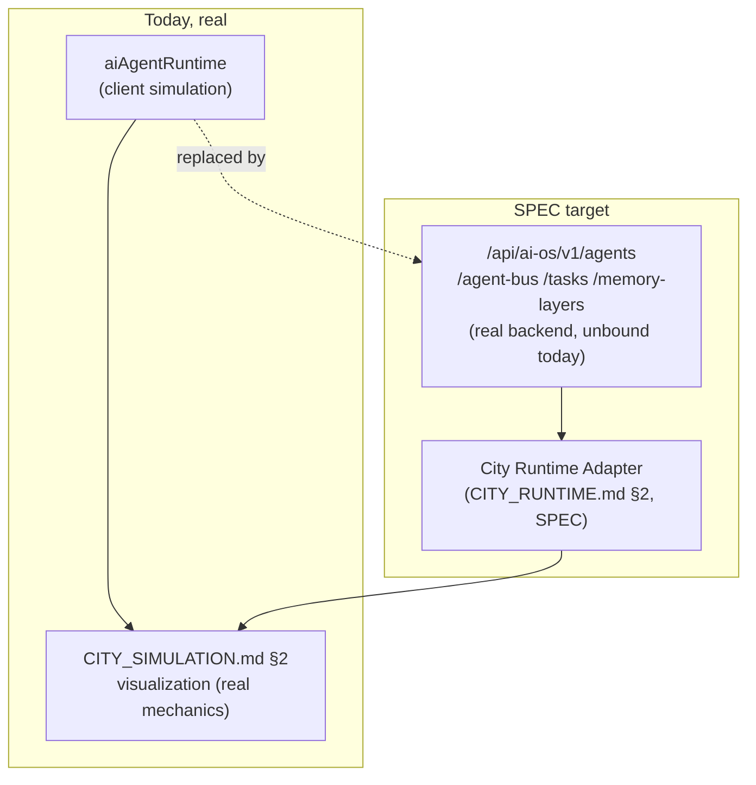

# Enterprise City — AI Platform Integration

**Sprint:** CG-6 — Architecture Research + Enterprise Integration Research. No source code was
modified.

**Do not duplicate:** `CITY_SIMULATION.md` §2 (Sprint CG-4) already fully specifies *how AI activity
visually appears* in City (agent movement, thinking, communication, queue visualization) — this
document does not repeat that. This document is one layer up: **which real AI platform system City's
visualization should actually be reading from**, which is the more consequential open question
`CITY_SIMULATION.md` §2 built on top of an already-real-but-narrow source (`aiAgentRuntime`) without
interrogating whether that was the *right* source. This document interrogates it.

## 1. What exists today (verified) — the central finding of this document

**Two independent AI agent models exist in this codebase, and City's visualization (`CITY_SIMULATION.md`
§2) is wired to the smaller, simulated one, not the real backend one.**

| | Real backend Multi-Agent OS | Frontend-simulated Agent Runtime |
|---|---|---|
| Package | `platform_ai_os` (Python, Sprint 27.1) | `enterprise-runtime/aiAgentRuntime.ts` (TS, client-side) |
| API surface | Real, documented: `/api/ai-os/v1` — `/maos/health`, `/maos/dashboard`, `/executive`, `/agents`, `/agent-bus`, `/tasks` (DAG orchestrator), `/memory-layers` (short/session/workspace/organization/knowledge/semantic), `/collaborate` (discuss/vote/select_best/critique/merge) | No backend — `tick()` mutates an in-memory array client-side |
| Is it called from the frontend today? | **No** — the real `/ai-os` frontend page defines an `AI_OS_API` constant naming these endpoints but never actually calls it; it renders `buildExecutiveDashboard()`, static demo data | N/A — it *is* the frontend, by construction |
| What City visualization uses today | Nothing — not wired at all | This one — `CityLiveStatus.aiActive`/`processLabel` for `ai_team`/`concierge`/`ai_studio` buildings already reads real `aiAgentRuntime`-adjacent signals via `productionRuntime.monitor().agentsActive`, and `CITY_SIMULATION.md` §2's proposed agent-movement visualization is scoped against this model's real fields (`status`, `queueDepth`, `workflow`) |

**The consequence**: everything City shows about "AI activity" today, and everything `CITY_SIMULATION.md`
§2 specified building on top of, reflects a **client-side simulation**, not the platform's real,
documented multi-agent backend. This is not a defect introduced by this sprint or CG-4 — both were
honest about `aiAgentRuntime` being the real, shipped source available to build against — but it is a
gap this document surfaces explicitly because "AI Platform integration," read literally, means City
should eventually reflect the *real* backend, and no path from here to there existed in writing before
this document.

## 2. Per-concept mapping (SPEC — the real backend concept City should eventually read from)

| Brief concept | Real backend layer (`platform_*`, per `CLAUDE.md`'s AI agent stack) | Real endpoint (if known) | Current frontend reality |
|---|---|---|---|
| AI Agents | `platform_agents` (agent registry) | `/api/ai-os/v1/agents` | Simulated only (`aiAgentRuntime`) |
| Knowledge | `platform_memory`'s knowledge layer | `/api/ai-os/v1/memory-layers` (one of six named layers) | No frontend binding found |
| Memory | `platform_memory` (short/session/workspace/organization/knowledge/semantic — six real layers) | `/api/ai-os/v1/memory-layers` | No frontend binding found |
| Workflows | `platform_workflow` + `platform_orchestrator`'s DAG orchestrator | `/api/ai-os/v1/tasks` | The real, separate `enterprise-workflow` frontend module exists (`WorkflowCenterPage`) but this research did not confirm it calls `/tasks` either — flagged as a second research gap, not assumed either way |
| Reasoning | `platform_reasoning` + `platform_planning` + `platform_decision` | Not confirmed exposed via `/api/ai-os/v1` in this research pass | No frontend binding found |
| Execution | `platform_tools` (workflow/tool execution) | `/api/ai-os/v1/tasks` (same DAG orchestrator as Workflows) | No frontend binding found |
| Monitoring | `/maos/health`, `/maos/dashboard` | Real, documented endpoints | The real `/ai-os` page renders a dashboard shape but from `buildExecutiveDashboard()` static data, not these endpoints |

> **Already-tracked ambiguity, not re-derived here:** `TECH_DEBT.md` `TD-07` flags that the
> `/api/ai-os/v1` prefix itself is shared between three different backend owners
> (`applications/ai_os`, `platform_ai_os`, and "hub MAOS"). Any implementation sprint acting on this
> table's endpoint column must resolve `TD-07` first — binding the frontend to the wrong one of the
> three owners would be a real regression risk this document is not in a position to rule out.

## 3. Visualization inside City (pointer only — fully specified elsewhere)

Owned entirely by `CITY_SIMULATION.md` §2 (agent movement/thinking/communication/queue/knowledge-flow/
workflow-execution/background-processing) and `CITY_EVENTS.md` §2 (Agent started, Workflow finished
event mappings). This document's only addition: every one of those specifications should be read as
**"visualize whatever the current real agent-state source provides"** — today that's `aiAgentRuntime`
(simulated), and the moment §4's migration below happens, the same visual mechanics apply unchanged,
because CG-2/CG-3's effect/animation primitives were never coupled to *which* backend supplies the
data in the first place. This is a genuine strength of the existing architecture worth stating
explicitly: **the visualization layer does not need to change when the data source does.**

## 4. Proposed migration path (SPEC)

Proposed steps, each independently shippable (no big-bang cutover):
1. Confirm whether the real `/ai-os` frontend page's dormant `AI_OS_API` calls are trivial to activate
   (i.e., the backend is genuinely reachable, just unwired) — if so, that page should be fixed first,
   independent of City, since it's a simpler, non-spatial surface to validate the real API against.
2. Once `/ai-os` is confirmed real-data-bound, the City Runtime Adapter (`CITY_RUNTIME.md` §2) adds
   `/api/ai-os/v1/agents`/`/agent-bus` as a new subscribed source, **alongside** `aiAgentRuntime`, not
   replacing it immediately — City can show whichever source is available, falling back to the
   simulation if the real API is unreachable (a resilience pattern, not a permanent dual-source design).
3. Only once the real source has been the primary one in production for a observed period should
   `aiAgentRuntime`'s simulation be considered for removal — and only from City's read path; whether
   `enterprise-runtime` keeps it for its own dashboard is out of this document's scope.

## 5. What this document does not propose

- No new AI backend — every real endpoint named above already exists (per prior research in this
  engagement); this document proposes wiring, not building.
- No change to `CITY_SIMULATION.md` §2's visual mechanics — confirmed source-agnostic (§3).
- No removal of `aiAgentRuntime` — it remains the real fallback/interim source (§4 step 2).
- No new memory/reasoning model — `platform_memory`'s six real layers and `platform_reasoning`/
  `platform_planning`/`platform_decision` are referenced, not redesigned.

## Related documents

`CITY_SIMULATION.md` §2 (visualization mechanics, unchanged by this document), `CITY_EVENTS.md`
(event catalog Agent-started/Workflow-finished map onto), `CITY_RUNTIME.md` §2 (the Adapter §4's
migration path extends), `ENTERPRISE_AI_OS.md` (the fuller real/vision reconciliation of the backend
this document's §1/§2 tables summarize).
