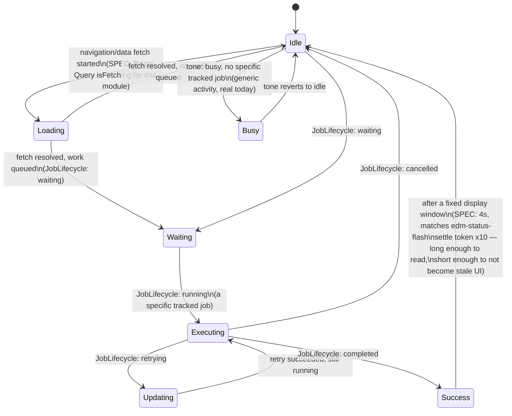
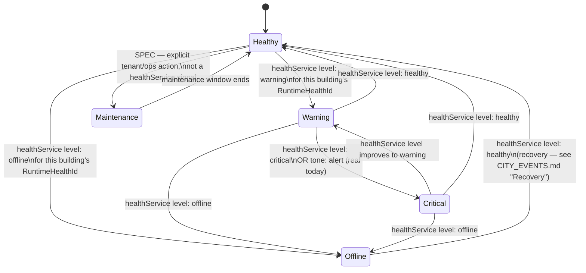
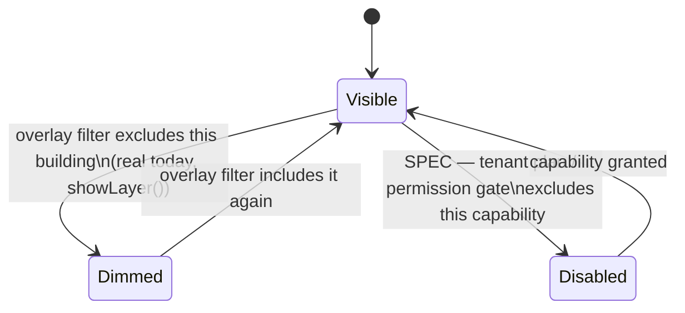

# City Building States Specification

**Sprint:** CG-4 — Research & Specification only. No source code was modified for this document.

**Companions:** [`CITY_RUNTIME.md`](./CITY_RUNTIME.md) (owns the lifecycle these states live inside),
[`CITY_EVENTS.md`](./CITY_EVENTS.md) (owns what triggers each transition).

## 1. What exists today (verified)

Buildings already have a real, shipped state model — two independent axes, not one flat enum:

**Axis A — `CityActivityTone`** (`cityCatalog.ts`, drives everything): `idle | active | busy | alert`.

**Axis B — `CityVisualState`** (`cityVisualLanguage.ts`, derived from tone + `CityLiveStatus` via
`resolveVisualState()`): `ok | attention | critical | running | waiting | done`. This is what actually
paints (`CITY_STATE_LABELS[...].css` → `.ec-state-ok`, `.ec-state-attention`, etc.).

**Axis C — interaction state** (component-local booleans in `EnterpriseCityPage.tsx` /
`CityBuildingTile`, real): `is-focused`, `is-dimmed`, `has-ai`, `is-plaza`, plus CG-3's transient
effect class (`buildingEffects[id]?.className`) and portal marker (`is-portal`).

The brief's 19-state list (Idle, Loading, Busy, Offline, Error, Updating, Waiting, Executing, Success,
Warning, Maintenance, Hidden, Disabled, Selected, Hovered, Focused, Pinned, Alert, Critical) is a
**superset vision** this document reconciles against the three real axes above, not a replacement for
them. The reconciliation is the deliverable — implementers should be able to read this table and know
exactly which real field or CG-2/CG-3 primitive backs every requested state.

## 2. Reconciliation table

| Requested state | Axis it belongs on (SPEC) | Backed by (real, today) | Gap (SPEC — what's missing) |
|---|---|---|---|
| Idle | Lifecycle | `tone: "idle"` → `resolveVisualState` → `ok` (when no tasks/notifications) | none — already real |
| Loading | Lifecycle | *(none)* | new — see §3.1 |
| Busy | Lifecycle | `tone: "busy"` → `running` | none — already real |
| Offline | Health | `healthService` `HealthLevel: "offline"`, not yet joined per-building | join health-by-building (see `CITY_RUNTIME.md` §2 Adapter) |
| Error | Health | `AiAgentRuntime.status: "error"` (agent-hosting buildings only), not yet joined | join agent-runtime-by-building |
| Updating | Lifecycle | `JobLifecycle: "retrying"` is the closest real analog | new distinct state — see §3.1 |
| Waiting | Lifecycle | `tone: "idle" && tasks > 0"` → `waiting`; also `JobLifecycle: "waiting"` | none — already real, two real sources agree |
| Executing | Lifecycle | `tone: "busy"` (same bucket as Busy today) | **SPEC split**: distinguish "busy" (generic activity) from "executing" (a specific tracked job/workflow is running) — see §3.1 |
| Success | Lifecycle (terminal) | `done` (`CityVisualState`) when `processLabel` matches `/done\|stable\|quiet/` — currently a **string-match heuristic**, not a real terminal signal | tie to real `JobLifecycle: "completed"` instead of label text-matching — flagged as a real fragility, see §5 |
| Warning | Health | `attention` (`CityVisualState`, `notifications >= 3 \|\| tasks >= 5`) | none — already real, different trigger condition than "Warning" as a health signal; see §3.2 for the reconciliation |
| Maintenance | Health | *(none)* | new — see §3.2 |
| Hidden | Visibility | `showLayer()` overlay filter → `dimmed=true` (visually dimmed, not removed) | **SPEC clarification**: "Hidden" as requested implies not rendered at all; recommend keeping the real dim-not-remove behavior (better for spatial constancy — see §4) and treating "Hidden" as an alias for the existing dimmed state rather than adding a second, harder removal |
| Disabled | Visibility | *(none — every real building is always interactive)* | new, for a tenant/plan-gated capability — see §3.3 |
| Selected | Interaction | `openBuilding`/`panTo` → CG-3 `triggerBuildingEffect(id, "selection")` | none — already real (CG-3) |
| Hovered | Interaction | `onMouseEnter`/`onFocus` → CG-3 `triggerBuildingEffect(id, "hover")` + CSS `:hover` | none — already real (CG-3 + CSS) |
| Focused | Interaction | `focusId === b.id` → `is-focused` class (`edm-breathe` loop) | none — already real |
| Pinned | Interaction | `cityNavigation.isFavorite(id)` (real, but currently only reflected in the sidebar "Favorites" card, not on the tile itself) | **SPEC**: add a `is-pinned` tile marker sourced from the existing `cityNavigation.favorites()` — no new data, just a new visual read of real data |
| Alert | Health | `tone: "alert"` → `critical` (`CityVisualState`) | none — already real |
| Critical | Health | same as Alert — `CityVisualState.critical` | **SPEC clarification**: "Alert" and "Critical" as requested are the same real state under two names; recommend one canonical name (`critical`, already shipped) and treating "Alert" as its trigger-side name (an *event* can be an Alert; the *building state it causes* is Critical) — see `CITY_EVENTS.md` §2 |

## 3. New states this document specifies (SPEC)

None of these exist in code today. Each is scoped to reuse an existing data source wherever one
exists, per the table above.

### 3.1 Lifecycle axis (mutually exclusive — a building has exactly one)

Real today: `idle → waiting → running(busy) → done`. Proposed full axis:

- **Busy vs. Executing** is the one real split this document proposes: *Busy* is today's generic
  "something's happening" signal (`tone: "busy"`, no specific job attached — e.g. CRM pipeline churn).
  *Executing* is reserved for when the City Runtime Adapter (`CITY_RUNTIME.md` §2) can point at a
  specific `RuntimeJobRecord` from `jobManager` for that building — richer (can show progress, ETA),
  strictly additive (falls back to Busy when no job record exists), never a breaking rename of the
  existing `tone: "busy"` behavior.
- **Success** should be re-grounded on `JobLifecycle: "completed"` instead of today's `processLabel`
  regex heuristic (`/done|stable|quiet/i`) — see §5 fragility note.

### 3.2 Health axis (mutually exclusive — a building has exactly one; independent of lifecycle axis)

Real today: `ok / attention / critical` are actually **lifecycle-axis side effects** in
`resolveVisualState` (attention triggers on notification/task *count*, not a health signal). Proposed
split: health should be its own axis, sourced from `healthService`/`AiAgentRuntime.status`/
`AiAgentRuntime.health`, not from notification counts.

- **Maintenance** is deliberately the one health state *not* sourced from `healthService` — it is an
  explicit, operator-declared state (a building's backing module is intentionally taken down for a
  migration, etc.), not a detected failure. **SPEC**: model as a City Runtime Adapter override that
  suppresses the health axis entirely while active, rather than a `healthService` value (keeps
  `healthService` itself free of a City-only concept it has no reason to know about).
- **Warning (health) vs. Attention (`CityVisualState`, real today)** — these currently look similar
  but are not the same signal. Recommend keeping `attention`'s existing notification/task-count
  trigger as a **lifecycle-axis** signal (too many things queued) and introducing health-axis
  `Warning` as a **separate, second** visual treatment sourced from `healthService`, so a building can
  be simultaneously "busy but healthy" (lots of legitimate work) or "quiet but unhealthy" (a health
  check failing with nothing queued) — these are genuinely different situations an executive glancing
  at the City should be able to tell apart, which the current single-axis model cannot express.

### 3.3 Visibility axis (mutually exclusive; independent of the other two axes)

- **Disabled** is new: a building whose backing module the current tenant/plan doesn't have access to.
  **SPEC**: render the tile (spatial constancy — see §4) but non-interactive, with a distinct
  "unlock/upgrade" affordance instead of `onOpen`. Source: whatever tenant-capability check already
  gates the module's own route (out of City's scope to invent — City only *reads* that decision).
- **Hidden**, per the reconciliation table, is recommended to remain an alias for the real `Dimmed`
  state rather than a true remove-from-DOM state — see §4.

### 3.4 Interaction axis (multi-select overlay — zero or more apply simultaneously, independent of the three axes above)

Already real except Pinned's tile-level marker:

| Interaction state | Source | Multiple at once? |
|---|---|---|
| Hovered | `:hover` CSS + CG-3 `triggerBuildingEffect(id,"hover")` | Only one building at a time (pointer-driven) |
| Focused | `focusId === b.id` | Only one at a time |
| Selected | CG-3 `triggerBuildingEffect(id,"selection")` (transient, clears itself) | Transient, effectively one at a time in practice |
| Pinned | `cityNavigation.isFavorite(id)` (real) — **SPEC**: surface as `is-pinned` on the tile | Many simultaneously (a user can favorite several buildings) |

## 4. Why buildings are dimmed, never removed (design principle, restated)

Every visibility-axis and filter-driven state (Dimmed, proposed Disabled, proposed Hidden-as-alias)
keeps the tile mounted at its real `x/y/w/h` coordinates and only reduces opacity. This is already the
real behavior (`is-dimmed` → `opacity: 0.22`) and this document recommends every future visibility
state follow the same rule: **a building's position in the City is spatial memory** — a user who has
learned "CRM is top-left of the CRM district" should never lose that anchor because a filter or a
plan-gate temporarily hid it. Removing a tile from the DOM (a real `Hidden` distinct from `Dimmed`)
would break that spatial constancy for no real benefit, so this document explicitly recommends against
building it, even though the brief's "Hidden" naming would technically justify a stricter
interpretation.

## 5. A real fragility this research surfaced

`resolveVisualState`'s `"done"` branch matches `processLabel` against
`/done|stable|quiet/i` — a **string heuristic on a human-readable label**, not a structured signal.
This works today because every seed `processLabel` was hand-written to cooperate with the regex, but
it is exactly the kind of thing that silently breaks the first time a real backend supplies a
`processLabel` that doesn't happen to contain one of those words. This document recommends (§3.1)
re-grounding Success on `JobLifecycle: "completed"` once the City Runtime Adapter exists to join job
records to buildings — flagged here as a concrete implementation priority, not just a style note (see
`SPRINT_CG_4_RESULT.md` §5 risks).

## 6. Full transition table (all axes combined, reference)

| From | To | Trigger | Axis |
|---|---|---|---|
| Idle | Loading | data fetch starts | Lifecycle (SPEC) |
| Loading | Idle / Waiting | fetch resolves | Lifecycle (SPEC) |
| Idle / Waiting | Busy | `tone: busy`, no job record | Lifecycle (real) |
| Waiting | Executing | `JobLifecycle: running` with job record | Lifecycle (SPEC) |
| Executing | Updating | `JobLifecycle: retrying` | Lifecycle (SPEC) |
| Executing | Success | `JobLifecycle: completed` | Lifecycle (SPEC, replaces regex) |
| Executing | Idle | `JobLifecycle: cancelled` | Lifecycle (SPEC) |
| Success | Idle | display window elapses (4s) | Lifecycle (SPEC) |
| Healthy | Warning | `healthService` level rises | Health (SPEC) |
| Warning | Critical | `healthService` level rises, or `tone: alert` | Health (real tone path + SPEC health path) |
| any Health | Offline | `healthService` level: offline | Health (SPEC) |
| Offline | Healthy | `healthService` recovers | Health (SPEC) — see `CITY_EVENTS.md` "Recovery" |
| Healthy | Maintenance | operator action | Health (SPEC, not `healthService`-sourced) |
| Visible | Dimmed | overlay filter excludes | Visibility (real) |
| Visible | Disabled | plan/permission gate | Visibility (SPEC) |
| (none) → Hovered/Focused/Selected/Pinned | multi-select overlay | pointer/keyboard/nav/favorite | Interaction (real, Pinned tile-marker SPEC) |
