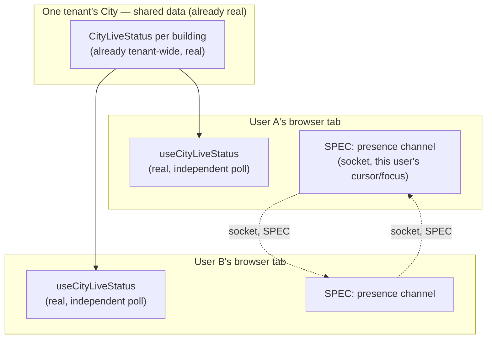

# Enterprise City — Multi-User Collaboration Specification

**Sprint:** CG-5 — Research & Specification only. No source code was modified.

**Do not duplicate:** `COLLABORATION.md`, `MULTI_AGENT_COLLABORATION.md`, and
`AI_TEAM_COLLABORATION_32_6.md` already document the platform's real **AI-agent-to-agent** collaboration
engine (`platform_collaboration`: negotiation, consensus, structured agent communication). **This
document is about a completely different concept the brief also calls "collaboration": multiple real
human users occupying the same City at once.** The two should not be conflated — this document does
not reference or extend the AI-collaboration engine, and flags this distinction explicitly because the
naming collision is real and easy to trip over in a future search.

## 1. What exists today (verified) — the honest headline

**No human presence, multiplayer, cursor-sharing, or building-occupancy mechanism exists anywhere in
City today.** Direct search confirms zero matches for presence/multiplayer/cursor-sharing/occupancy
concepts in `enterprise-city/` or `design-system/`. Every section below is **SPEC** — this document's
job is to specify the feature honestly against real, adjacent infrastructure, not to imply any of it
is built.

**What does exist, and is directly relevant to feasibility:** a real, connectable Socket.IO transport
(`workspace/realtime/liveUpdates.ts`, `getSocket()`) already wired for `workspace:refresh`,
`event_bus:message`, and `notifications:new` events — but **degrades silently to polling when
`VITE_SOCKET_URL` is unset**, which is the shipped default (`connect()` returns
`{ connected: false, reason: "socket_url_unset" }` and callers proceed anyway). This is the single most
important grounding fact in this document: **real-time transport infrastructure exists in the
platform, but is not actively carrying anything presence-related, and is often inert by default
configuration.** Any collaboration feature this document specifies inherits that same dependency and
that same honest caveat — it does not work over the existing `enterpriseEventBus` alone (that bus is
in-process/local-tab only, per its own header comment "thin wrapper over liveUpdates + local
listeners"), it requires the socket layer to actually be configured and connected.

## 2. Multiple users, shared City (SPEC)

The City's own data model already supports this better than most surfaces would: buildings/districts
are **tenant-shared, not per-user** (`CITY_BUILDINGS`/`CITY_DISTRICTS` are static catalogs, not scoped
to a session), and `CityLiveStatus` is derived from tenant-wide sources (`useLiveEnterprise`,
`productionRuntime.monitor()`) — meaning **two users in the same tenant already see the same building
states today**, just not in the same browser session simultaneously in any coordinated way (each
user's `useCityLiveStatus` polls independently; there is no shared "room"). Proposed model:



Building *data* is already correctly shared (top box, real). What's missing is the thin *presence*
layer connecting the two independent sessions (dotted lines) — proposed as a new, narrow socket channel
scoped specifically to "who's looking at what," never a second copy of building data itself.

## 3. Presence (SPEC)

Proposed minimal payload, deliberately small:

```ts
// SPEC — proposed, not implemented
type CityPresence = {
  userId: string;
  displayName: string;
  focusBuildingId: CityBuildingId | null; // real type, reused
  lastActiveAt: string;
};
```

Presence is proposed as **ephemeral, socket-only state** — never persisted (`localStorage` or
otherwise), never joined into `CityLiveStatus`, and never a new `enterpriseEventBus` event type (a
presence heartbeat firing every few seconds through the app-wide bus would be exactly the kind of
event-storm `CITY_SIMULATION.md` §3's coalescing budget exists to guard against — presence gets its
own narrow channel specifically to avoid that).

## 4. Cursor sharing (SPEC, explicitly lower priority than presence)

Showing another user's literal camera viewport or pointer position on the map. This document
recommends **against** literal live-cursor-position sharing as a first build: the City's camera
(`CityViewport`) is a single shared value **per session**, not per-pointer, so "cursor sharing" here
more naturally means **viewport sharing** — seeing where a colleague's camera is currently focused
(building-level granularity, from §3's `focusBuildingId`), not a literal moving dot tracking mouse
pixels the way a design tool's multiplayer cursor works. A pixel-accurate shared cursor is
disproportionate engineering effort for a spatial map whose real interaction unit is "which building,"
not "which pixel" — recommend scoping any "cursor sharing" ask down to building-level presence (§3)
unless a concrete product need for finer granularity is identified.

## 5. Activity indicators (SPEC)

A small avatar stack or count badge on a building tile when one or more other users currently have it
`focusBuildingId`-focused (§3) — reuses the exact same transient-effect mechanism CG-3 already ships
(`triggerBuildingEffect`, a new effect kind e.g. `"co_presence"` resolving to a distinct, non-continuous
highlight per CG-2's `visualEffects.ts` table) rather than a new rendering primitive.

## 6. Building occupancy (SPEC)

The aggregate form of §5 — "N people are currently in the CRM building" as a small badge, computed
client-side from the presence channel's current member list filtered by `focusBuildingId`, not a
server-tracked occupancy counter. No capacity limit or "occupancy full" concept is proposed — unlike a
literal building, there is no reason to cap how many users can look at the same tile.

## 7. AI agent visibility (SPEC, ties directly to `CITY_SIMULATION.md` §2)

This is the one item in this document that is **not** about human presence — it's the human-facing
counterpart to `CITY_SIMULATION.md` §2's AI agent visualization (agent movement, thinking,
communication). Multiple human users watching the City should see the **same** AI agent markers,
since agent activity (`aiAgentRuntime`, real, tenant-wide) is exactly as shared as building data
(§2's top box) — no new synchronization is needed for this part, because unlike human presence, agent
state already comes from one real, shared source every session polls independently and consistently.
The only genuinely multi-user-specific question is whether one user's camera-follow of an agent
(`CITY_CAMERA.md` §6.1) should be visible to others as a presence signal (§3/§5) — proposed: yes,
reusing `focusBuildingId`'s mechanism, an agent-follow is just a continuously-updating focus.

## 8. What this document explicitly does not propose

- No shared/synchronized camera control ("driving" the map for someone else) — each user's
  `CityViewport` stays independently owned, matching how every other real per-user UI state in the
  platform works today (dock layout, workspace tabs, etc. are all per-session).
- No text/voice chat inside City — if real-time human communication is wanted, it belongs to whatever
  platform-wide collaboration surface handles that already (out of City's scope to build a second one).
- No occupancy limits or building "locking."
- No persistence of presence data — a user closing their tab should disappear from others' view
  within one heartbeat interval, not linger as stale state.

## Related documents

`CITY_SIMULATION.md` §2 (AI agent visualization — the real, shared, non-presence part of "who/what is
active"), `CITY_EVENTS.md` (the event model this document deliberately does not extend, and why),
`COLLABORATION.md`/`MULTI_AGENT_COLLABORATION.md` (the different, AI-agent concept this document is
not about — cross-linked only to prevent confusion, not because they share any mechanism).
