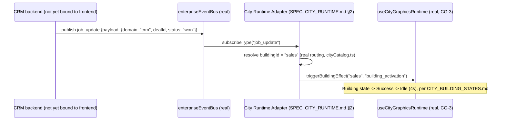

# Enterprise City — CRM Integration

**Sprint:** CG-6 — Architecture Research + Enterprise Integration Research. No source code was
modified.

**Do not duplicate:** `CITY_BUILDING_STATES.md`/`CITY_EVENTS.md` (Sprint CG-4) already specify how any
object's state/event reaches a building visually — this document does not re-specify that mechanism,
only what CRM-specific objects should feed into it. `CITY_RUNTIME.md` §2's City Runtime Adapter is the
real integration point every proposal below assumes, not a new one.

## 1. What exists today (verified) — the honest headline

**There is no dedicated CRM frontend module.** `crm`/`sales`/`marketing` City buildings (real,
`cityCatalog.ts`) all route into `/crm`, which resolves to the generic, catalog-driven
`EnterpriseModulePage` (`src/modules/EnterpriseModulePage.tsx`) — a real, working "module hub" pattern
(Overview / Statistics / Recent Activity / Quick Actions / Status / Configuration / Roadmap) but with
**no Clients, Leads, Deals, Tasks, Calendar, Contacts, or Activities entity views anywhere in the
frontend**. The real `moduleCatalog.ts` entry for `crm` states this outright — its own `roadmap` field
lists `"Live CRM API binding"` as **future work**, not shipped. This document's proposals are
therefore all downstream of that roadmap item landing; none of them are buildable in the frontend
today without it.

This is consistent with the platform's real layering (`CLAUDE.md`): business domain logic is expected
to live in the Python backend (`services/`, `repositories/`, ~380+ modules) — this research is
frontend-scoped (as every CG sprint has been) and did not verify specific real CRM API endpoints in
that backend. Flagged explicitly as a research gap, not silently assumed to not exist — a future
integration sprint should confirm what `services/`/`repositories/` already expose before building any
of §2 below.

## 2. Per-object representation (SPEC, all gated on "Live CRM API binding")

| CRM object | Proposed City representation | Reuses (real, CG-2/CG-3/CG-4) |
|---|---|---|
| Clients | A count badge on the `crm` building (e.g. "142 active"); a Client with an open Critical issue drives that building toward `Critical` health state | `CITY_BUILDING_STATES.md` §3.2 health axis |
| Leads | Feeds the `Waiting`/`Executing` lifecycle split — a lead actively being worked is `Executing`, a queued/unassigned lead pool size is a badge, not a per-lead building | `CITY_BUILDING_STATES.md` §3.1 |
| Deals | The highest-value CRM object for City-level visualization: a deal closing (`JobLifecycle`-equivalent "won") triggers a `Success` flash (`CITY_BUILDING_STATES.md` §3.1) on `sales`; a stalled deal (no activity N days) is the natural trigger for an `attention`-tone badge, already real for count-based triggers today (`resolveVisualState`'s `notifications >= 3` rule) |
| Tasks | Maps directly onto the existing `CityLiveStatus.tasks` field — **already real and wired**: `crm`'s seed status already carries a `tasks` count (`CITY_STATUS_SEED`). The only gap is that count is currently static seed data, not a live task query — closing that gap is a `useCityLiveStatus.ts` data-source change, not a new City mechanism |
| Calendar | Lowest-fit CRM object for a spatial building metaphor — **not recommended** as a building-level visualization; better represented as a City-wide "today's meetings" strip in the header if ever built, out of this document's building-centric scope |
| Contacts | No standalone visualization proposed — Contacts are the supporting data behind Clients/Leads/Deals, not an independent countable signal a building badge needs |
| Activities | The real event stream a future `job_update`/`notification`-typed `enterpriseEventBus` publish would carry (`CITY_EVENTS.md` §2) — an Activity is the CRM-specific instance of a Live Event, not a new event category |

### 2.1 Illustrative sequence (SPEC — a deal closing)

## 3. What this document does not propose

- No new CRM-specific event type — a deal/lead/task update rides the real `job_update`/`notification`
  types (`CITY_EVENTS.md` §1), scoped by a `domain: "crm"` payload field, never a new bus.
- No per-Client or per-Deal building — City's spatial unit is the **module** (`crm`, `sales`,
  `marketing`), not the individual record; drilling into a specific Client/Deal happens after
  `openBuilding()` hands off to the real CRM route, same as today.
- No Calendar building or view (§2's Contacts/Calendar rows).
- No frontend CRM entity model duplicating whatever the real backend already owns.

## Related documents

`CITY_RUNTIME.md` §2 (the Adapter), `CITY_EVENTS.md` (event catalog CRM events extend), `CITY_BUILDING_
STATES.md` (the states CRM data drives), `CITY_ERP.md` (the sibling document — ERP is in an identical
"real hub, no live binding" position).
