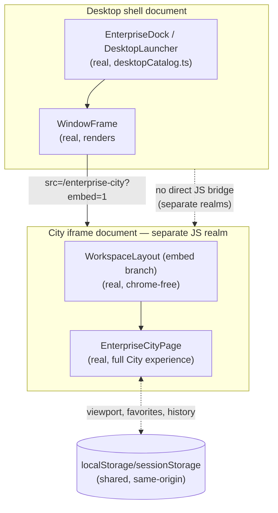

# Enterprise City — Enterprise Desktop Integration

**Sprint:** CG-6 — Architecture Research + Enterprise Integration Research. No source code was
modified.

**Do not duplicate:** `CITY_NAVIGATION_GUIDE.md` §6 covers the navigation-level relationship (the
"Desktop OS" link, Launcher/Dock reachability) at a summary level and now points here for the full
architecture. `ENTERPRISE_CITY_BIBLE.md`'s "Reality update" already resolved that City and Desktop are
siblings, not one nested inside the other conceptually — this document does not revisit that framing,
it documents the concrete technical mechanism underneath it, which turned out to be more consequential
than the earlier framing implied.

## 1. What exists today (verified) — the central finding of this document

**Desktop windows are iframes, not in-process component mounts — and City is a real, confirmed
example.**

`enterprise-desktop/desktopCatalog.ts` has a real catalog entry: `{ id: "city", label: "Enterprise
City", path: "/enterprise-city", icon: "city", group: "ops" }`. When a user opens it,
`WindowFrame.tsx` renders:

```tsx
// Real, WindowFrame.tsx
const embedSrc = `${path}${path.includes("?") ? "&" : "?"}embed=1`;
// ...
<iframe title={win.title} src={embedSrc} className="edt-window-frame" loading="lazy" />
```

For City this resolves to `/enterprise-city?embed=1`, which loads inside an `<iframe>` — a genuinely
**separate document and separate JavaScript execution context** from the Desktop shell. That URL hits
the real `EnterpriseCityPage.tsx`, wrapped in `WorkspaceLayout`, whose own embed branch
(`params.get("embed") === "1"`) renders chrome-free (`<div className="edt-embed-root">`) — the correct,
already-real behavior `TD-44` names as the exception (`WorkspaceLayout` is one of the two hubs `TD-44`
confirms already honors `embed=1` correctly; City inherits this correctly *because* it uses
`WorkspaceLayout`, not by any City-specific code).

## 2. The consequence: what does and does not cross the iframe boundary

This is the architecturally significant finding this sprint surfaces — not previously documented
anywhere in this engagement's prior research:

| Mechanism | Crosses the Desktop↔City iframe boundary? | Why |
|---|---|---|
| `sessionStorage`/`localStorage` (`ews_city_viewport_v1`, `ews_city_favorites_v1`, etc.) | **Yes** | Same-origin iframes share the browser's storage for that origin — City's camera position, favorites, and history all work correctly whether opened as a full page or a Desktop window |
| `enterpriseEventBus` (real, in-process listeners) | **No** | Its own header comment already says "local listeners" — a City instance running inside the Desktop iframe has its own separate `enterpriseEventBus` module instance in its own JS realm; a `publish()` call in the Desktop shell's main document does not reach listeners registered inside the City iframe, and vice versa |
| CG-3's `useCityGraphicsRuntime` in-memory state (camera animation queue, transient effects) | **No** (obviously — it's React component state, inherently scoped to its own document) | Not a defect — this state was never meant to be cross-window shared |
| `runtimeEngine`/`jobManager`/`aiAgentRuntime` (real, module-level singletons) | **No** | Same reasoning as `enterpriseEventBus` — each iframe gets its own module instantiation; a City-as-Desktop-window sees its **own independent copy** of these "singletons," not the Desktop shell's |
| Route navigation (`navigate()`, e.g. `openBuilding`) | **Contained within the iframe** | Clicking a building inside a City Desktop window navigates *within that iframe*, not the outer Desktop shell — real, correct behavior for a windowed app, but means the outer Desktop's own routing/URL bar (if any) is unaware of it |

**The practical implication**: every "real" mechanism this engagement's prior CG-2 through CG-6
research has described as a shared, tenant-wide, or platform-wide singleton (`enterpriseEventBus`,
`runtimeEngine`, `jobManager`, `aiAgentRuntime`) is **only actually singular within one document/tab**.
A user with City open both as a full page in one browser tab *and* as a Desktop window in another tab
(or even both open in the same tab, main view + Desktop window) is looking at **two independent
JavaScript realms**, each with its own instance of every one of these "singletons" — they will not
necessarily agree with each other in real time, only eventually (once both realms' independent
`useCityLiveStatus` polls next resolve against the same real backend data).

## 3. How Desktop and City cooperate today (real, confirmed correct within the above constraint)



What already works, without any City-specific accommodation: window chrome (move/resize/close, real
`WindowFrame` controls), the embed-mode chrome suppression (§1), and persistence via shared storage
(§2's storage row). What is architecturally **not** shared, and should not be assumed to be by any
future integration sprint: live event/state synchronization between a Desktop-windowed City and
anything outside its iframe.

## 4. Window Manager, Dock, Workspace, Shell, Command Runtime — per-concept notes (SPEC where noted)

- **Window Manager** (`WindowFrame`, real) — no change proposed; City is already a correctly-behaving
  citizen of it via the mechanism in §1.
- **Dock** (`EnterpriseDock`, real) — City's Dock icon/launch entry is real and correct; no gap found.
- **Workspace** (`WorkspaceLayout`, real, and the broader `workspace/` tab system) — City participates
  in `WorkspaceLayout`'s embed contract but this research did not confirm whether City participates in
  the *tabbed* Workspace experience (`WorkspaceTabBar`, real elsewhere) the same way ordinary hub pages
  do — flagged as a research gap: does opening City from a Workspace tab context behave like any other
  tab, or does it always take over the full view? **SPEC**: whichever sprint next touches this
  boundary should confirm this explicitly rather than assume either answer.
- **Shell** (`src/shell/enterprise/`, real Sidebar/TopNav/Dock chrome) — suppressed entirely in City's
  embed mode (§1, correct) and present in City's normal full-page mode (via `FullLayout`, real,
  `WorkspaceLayout`'s non-embed branch) — no gap, this is the intended, working toggle.
- **Command Runtime** (`command-center-runtime/`, real — `useEnterpriseKeyboard`,
  `AiCommandCenterPanel`, `useEnterpriseStatus`, `EnterpriseMetricsStrip`) — this is the Command
  Center's own runtime layer, **distinct from** `enterprise-runtime/runtimeEngine` (the one
  `CITY_RUNTIME.md` grounds City's simulation tick in) despite the similar naming. This research did
  not find City subscribing to `command-center-runtime`'s status/keyboard hooks — **SPEC**: if City is
  ever opened as a Desktop window *alongside* an open Command Center panel, `useEnterpriseKeyboard`'s
  global shortcuts should be confirmed to still route correctly given §2's iframe-isolation finding
  (a global keyboard shortcut registered in the Desktop shell's document does not automatically reach
  keystrokes typed while focus is inside the City iframe — a real, likely-unverified interaction).

## 5. Risks this document surfaces for `SPRINT_CG_6_RESULT.md`

1. Any future feature that assumes `enterpriseEventBus`/`runtimeEngine`/`jobManager`/`aiAgentRuntime`
   behave as true cross-window singletons will silently misbehave the moment City is opened as a
   Desktop window alongside its full-page counterpart — this is the most important finding in this
   entire sprint's research and should inform every other document's "SPEC" proposals that assume
   real-time cross-surface synchronization (`CITY_COLLABORATION.md`'s presence proposal, in
   particular, would need a genuine cross-window transport — `BroadcastChannel` or the socket layer,
   not the in-process event bus — the moment Desktop-windowed City is a supported scenario).
2. Command Runtime keyboard-shortcut routing across the iframe boundary (§4) is unverified.
3. Workspace tab participation (§4) is unverified.

## Related documents

`CITY_NAVIGATION_GUIDE.md` §6 (corrected by this document's research), `CITY_COLLABORATION.md`
(whose presence proposal inherits this document's cross-window transport implication),
`ENTERPRISE_CITY_BIBLE.md` (City vs. Desktop as siblings — the framing this document's mechanism sits
underneath), `TECH_DEBT.md` `TD-44` (double-chrome embed debt — City is confirmed *not* affected, since
it correctly uses `WorkspaceLayout`).
