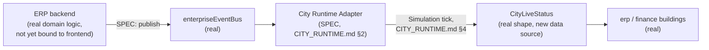

# Enterprise City — ERP Integration

**Sprint:** CG-6 — Architecture Research + Enterprise Integration Research. No source code was
modified.

**Do not duplicate:** Same governing mechanism as `CITY_CRM.md` — this document does not re-specify
event propagation or building-state transitions (`CITY_EVENTS.md`, `CITY_BUILDING_STATES.md`), only
what ERP-specific objects should feed into them.

## 1. What exists today (verified) — same honest position as CRM

The `erp` City building routes to `/erp`, resolving to the same generic `EnterpriseModulePage` pattern
`CITY_CRM.md` §1 describes. The real `moduleCatalog.ts` entry's own `roadmap` lists `"Inventory
sync"`, `"Procurement workflows"`, and `"Plant floor connectors"` as **future work** — confirming, in
the module's own words, that Orders/Inventory/Warehouse/Purchasing are not live-bound today. Same
frontend-scoped research caveat as `CITY_CRM.md` §1 applies: this document did not verify what the
Python backend (`services`/`repositories`) already exposes for these domains.

**Naming clarification, not a new finding** — `USER_JOURNEYS.md`'s cross-journey findings already
flagged a real "Production district naming collision" between the operational `production` concept
(ERP/manufacturing) and the AI Production Center (`prod_image`/`prod_video`/etc., a content-generation
product). This document does not re-discover that finding; it only notes that the brief's "Production"
under ERP is the operational-manufacturing sense, and any future implementation must resolve which
`CityDistrictId`/building it targets explicitly rather than assume — the real `production` district
today is the **AI Production Center's**, not a manufacturing floor's.

## 2. Per-object representation (SPEC, all gated on the real backend binding existing)

| ERP object | Proposed City representation | Note |
|---|---|---|
| Orders | Count + status-mix badge on `erp` (open/fulfilled/backordered), same badge pattern `CITY_CRM.md` §2 proposes for Deals | |
| Inventory | Low-stock threshold breach → `attention`/`Warning` health signal on `erp`, reusing the real count-threshold pattern (`resolveVisualState`'s existing `notifications >= 3` rule) rather than a new inventory-specific visual | |
| Warehouse | No standalone building proposed — Warehouse is operational detail behind Inventory/Orders, same reasoning `CITY_CRM.md` §2 applies to Contacts | |
| Purchasing | Feeds the `Waiting`/`Executing` lifecycle split exactly as Leads do for CRM — a purchase order in flight is `Executing`, a backlog is a count badge | |
| Finance | **Already has its own, separate, real City building and district** (`finance`, `cityCatalog.ts`) — this document recommends Finance/Accounting data continue to target that existing building, not the `erp` building, avoiding a two-buildings-same-data ambiguity | |
| Accounting | Same as Finance — routes to the real `finance` building, not `erp` | |
| Production (operational/manufacturing sense) | **No real City building exists for this sense of "Production" today** — the real `production` district is the AI Production Center's. If operational/manufacturing production is ever built, this document recommends a **new, explicitly-named** district (e.g. `manufacturing`, not reusing `production`) rather than overloading the existing one — a genuine new-district case, unlike every other object in `CITY_CRM.md`/this document, which map onto real existing buildings | |

## 3. Live synchronization (SPEC)

The brief calls this out specifically for ERP — proposed model, reusing `CITY_RUNTIME.md` §4's
existing three-loop design rather than inventing an ERP-specific sync mechanism:

Two synchronization models are compatible with the real architecture, and this document recommends the
first:

1. **Push, via `enterpriseEventBus`** — an ERP backend event (order created, inventory threshold
   crossed) publishes once, the Adapter reacts once. Matches the real bus's own design intent and
   avoids polling entirely for state that changes only occasionally (order/inventory events are not
   high-frequency).
2. **Poll, via `useCityLiveStatus`'s existing 12s cadence** — simpler to build (no new publisher
   needed on the backend side), but reintroduces the "up to 12s stale" latency `CITY_RUNTIME.md` §1
   already documents as the real, current tradeoff for every other live-status source. Acceptable as
   an interim step if push-based publishing isn't ready, but not the target end state.

No new synchronization primitive is proposed beyond these two, both of which are extensions of real,
existing mechanisms.

## 4. What this document does not propose

- No new City district for Orders/Inventory/Warehouse/Purchasing — all route through the existing
  `erp` building.
- No second Finance representation — Finance/Accounting explicitly target the real, existing `finance`
  building rather than duplicating data onto `erp` too.
- No manufacturing-floor district is built by this document — only the naming recommendation (§2) for
  if one ever is.

## Related documents

`CITY_CRM.md` (sibling document, identical grounding pattern), `CITY_RUNTIME.md` §4 (the tick model
§3 above extends), `CITY_EVENTS.md`, `CITY_BUILDING_STATES.md`, `USER_JOURNEYS.md` (source of the
Production-naming-collision finding this document defers to rather than re-deriving).
