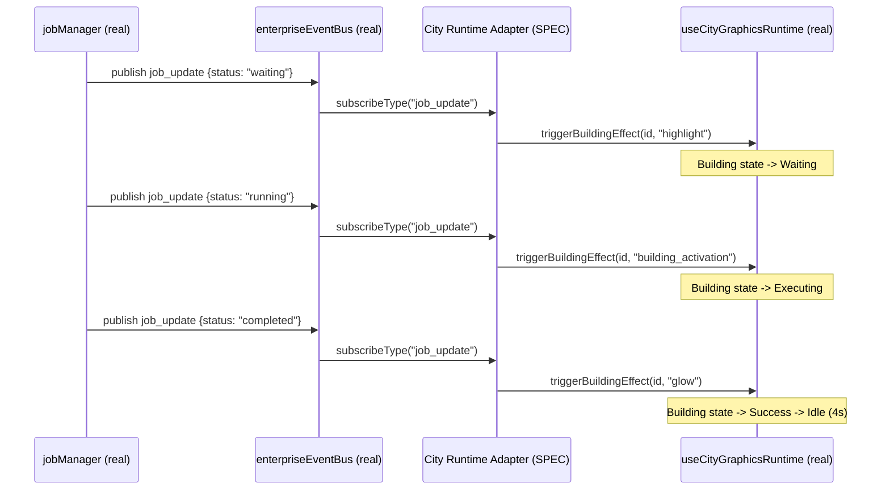
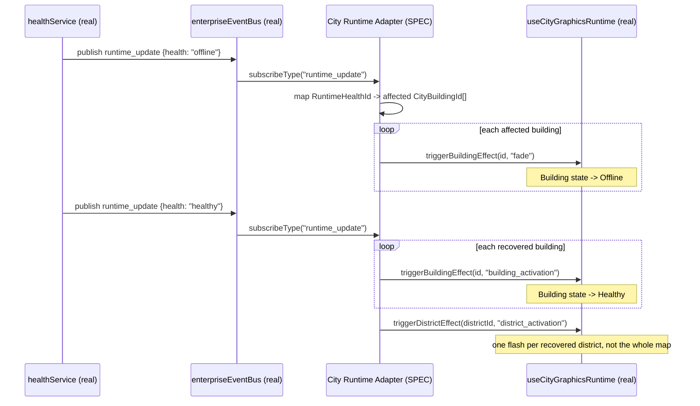
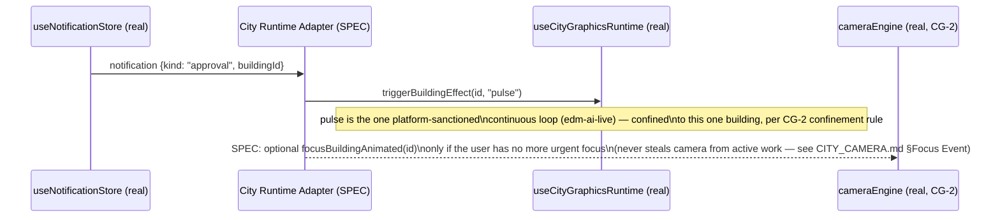

# City Live Events Specification

**Sprint:** CG-4 — Research & Specification only. No source code was modified for this document.

**Companions:** [`CITY_RUNTIME.md`](./CITY_RUNTIME.md) §5 (propagation mechanics),
[`CITY_BUILDING_STATES.md`](./CITY_BUILDING_STATES.md) (what an event transitions a building to),
[`CITY_CAMERA.md`](./CITY_CAMERA.md) (focus-event camera reaction),
[`CITY_SIMULATION.md`](./CITY_SIMULATION.md) §1 (district-to-district communication, which is this
same event model applied district-wide instead of building-wide).

## 1. The one governing rule

**No new event bus.** The platform already has `enterpriseEventBus`
(`src/web/src/integration-hub/enterpriseEventBus.ts`) — a real, typed, cross-surface bus, explicitly
documented in its own header as "a thin wrapper over `liveUpdates` + local listeners. No second
realtime stack." Every requested runtime event in this document is specified as riding on that real
bus's real `EnterpriseEventType` union, not as a new channel:

```ts
type EnterpriseEventType =
  | "navigate" | "open_module" | "open_city_building" | "open_production"
  | "ai_request" | "job_update" | "runtime_update" | "notification"
  | "context_changed" | "session_restored" | "workflow_update"
  | "provider_update" | "desktop_update" | "city_update";
```

Also real and directly relevant: `RuntimeStreamKind` (`runtimeEngine.publishStream`) already includes
`"city"` as a first-class value — `EnterpriseCityPage.tsx` already calls
`runtimeEngine.publishStream("city", { surface: "city" })` on mount. And `JobLifecycle`
(`jobManager`) already covers most of the requested job-related events:
`running | waiting | completed | failed | cancelled | retrying`.

## 2. Requested event catalog → real bus mapping

| Requested event | Rides on (`EnterpriseEventType`) | Real source today | City reaction (SPEC) |
|---|---|---|---|
| Agent started | `ai_request` | `aiAgentRuntime.setAgent(id, { status: "busy" })` (real) | Building housing that agent → `Executing` (lifecycle axis); `triggerBuildingEffect(id, "building_activation")` |
| Workflow finished | `workflow_update` | real event type, not yet published by a real workflow completion path | Building → `Success`; `district_activation` if the workflow spans the whole district (see `CITY_SIMULATION.md` §1) |
| Approval requested | `notification` (payload-typed as an approval) | `useNotificationStore` (real) | Building → `Warning`-adjacent visual (attention badge, real today via `notifications` count) + **SPEC**: a `pulse` effect confined to that one building, per CG-2's confinement rule |
| Job queued | `job_update` | `jobManager.upsert(...)` (real) | Building → `Waiting` |
| Job completed | `job_update` | `jobManager.setStatus(id, "completed")` (real) | Building → `Success` (see `CITY_BUILDING_STATES.md` §5 fragility fix) |
| Error | `job_update` (payload `status: "failed"`) or `runtime_update` (payload health) | `jobManager.setStatus(id,"failed")` / `healthService` (both real) | Building → `Error`/`Critical` (health axis) |
| Warning | `runtime_update` | `healthService.getLevel() === "warning"` (real) | Building → `Warning` (health axis, see reconciliation in `CITY_BUILDING_STATES.md` §3.2) |
| Notification | `notification` | `useNotificationStore` (real, already joined into `CityLiveStatus.notifications`) | none new — already real |
| Production running | `runtime_update` (`stream: "production"`) or `job_update` | `productionRuntime.monitor()` (real, already joined into Production-district `CityLiveStatus` in `useCityLiveStatus.ts`) | none new — already real |
| Deployment | `desktop_update` or `provider_update` (closest real types) | no real source yet | **SPEC gap** — see §5 |
| User login | `session_restored` | real event type, real auth flow | Plaza building → brief `building_activation` ("welcome back") — cosmetic only, no new auth logic |
| User activity | `context_changed` | real event type | Feeds the Idle-mode inactivity timer (`CITY_RUNTIME.md` §3) — not a per-building visual by itself |
| Connection lost | `runtime_update` (payload `health: "offline"`) | `healthService` level `offline` (real) | All buildings mapped to that `RuntimeHealthId` → `Offline` (health axis); District-level banner (SPEC, see `CITY_SIMULATION.md` §1) |
| Recovery | `runtime_update` (payload `health` transitions off `offline`) | `healthService` level improving (real) | Affected buildings → `Healthy`; one `district_activation` flash per recovered district, never a whole-map celebration (confinement rule, consistent with CG-2's `pulse` rule) |

Two rows (**Workflow finished**, **Deployment**) name a real `EnterpriseEventType` that exists in the
type union but has no real publisher wired up yet anywhere in the codebase today — flagged explicitly
in §5 as gaps for a future sprint to close, not silently assumed to already work.

## 3. Payload shape (SPEC — proposed, extends the real `EnterpriseEvent` type, adds no new type)

```ts
// Real, unmodified:
type EnterpriseEvent = {
  type: EnterpriseEventType;
  source: OsSurfaceId | "system" | "hub";
  path?: string;
  payload?: Record<string, unknown>;
  at: string;
};

// SPEC — a City-specific payload shape convention, not a new EnterpriseEventType:
type CityEventPayload = {
  buildingId?: CityBuildingId;   // when the event targets one building
  districtId?: CityDistrictId;   // when the event targets a whole district
  severity?: "info" | "warning" | "critical";
  jobId?: string;                // cross-reference into jobManager.list()
  agentId?: string;               // cross-reference into aiAgentRuntime.list()
};
```

This is a *convention* for what goes in the existing `payload: Record<string, unknown>` field, not a
schema change to `EnterpriseEvent` itself — fully backward compatible with every existing publisher.

## 4. Propagation sequence — three representative flows

### 4.1 Job lifecycle (queued → running → completed)



### 4.2 Connection lost → Recovery



### 4.3 Approval requested (human-in-the-loop)



## 5. Gaps this research surfaced (for Cursor)

- **`workflow_update` and `desktop_update`/`provider_update`** exist as real `EnterpriseEventType`
  values but this research found no real publisher for "a workflow finished" or "a deployment
  happened" anywhere in the current tree. Recommend: whichever future sprint builds real workflow
  completion or deployment tracking should publish through these existing types rather than adding
  new ones — the type union already anticipated both.
- **Approval requests** currently arrive as generic `notification` records
  (`useNotificationStore`) with no structured `kind` field distinguishing "needs your approval" from
  "FYI" — the City reaction proposed in §2 assumes such a field exists or is added at the notification
  layer (out of City's scope to add; flagged as a cross-team dependency).
- **User login** (`session_restored`) is real, but this research found no current subscriber anywhere
  that reacts to it visually — the Plaza "welcome back" reaction in §2 would be the first consumer.

## 6a. Sprint CQ-11 addition — Business-flavored City Events

Extends §2's mapping table with the brief's nine new event examples — every one rides an existing
real `EnterpriseEventType` (§1) or a Sprint CQ-10 payload convention (`EBN_PARTNERSHIP_SYSTEM.md` §5),
never a new type:

| Event | Rides on | Notes |
|---|---|---|
| Project started / completed | `job_update` / `workflow_update` | Same as `CITY_EVENTS.md` §2's Job queued/completed rows — "Project" is this brief's naming for the same real signal |
| Building upgraded | `city_update`, payload carries the new `BusinessTier` (`CITY_LIVING_ECONOMY.md` §1.3, CQ-10) | New payload field, not a new event type |
| Company joined | `session_restored` or a new `company_update`-scoped payload on `notification` — **not independently confirmed real**; flagged, not assumed |
| New partnership | `partnership_update` (`EBN_PARTNERSHIP_SYSTEM.md` §5, CQ-10) | Already fully specified there |
| Advertisement activated | `city_update`, scoped to a Billboard object (`CITY_VISUAL_STATES.md` §8, CG-9) | |
| Meeting started | `EBN_COMMUNICATION.md` §5's `communication_update` (CQ-10, itself SPEC) | |
| Workflow running | `runtime_update` / `workflow_update` — now backed by the platform's real Sprint 28.9 Automation Engine | See `SPRINT_CQ_11_RESULT.md` for the current integration status |
| AI analysis | `ai_request` | Real, existing type |

## 6. Non-goals

- No new event type is proposed anywhere in this document — every requested event maps onto an
  existing `EnterpriseEventType`.
- No polling loop is proposed for event delivery — everything here is push-based via
  `enterpriseEventBus.subscribe`/`subscribeType`, matching how the real bus already works.
- District-to-district communication (brief §3) is **not** a separate event mechanism — see
  `CITY_SIMULATION.md` §1: districts communicate through this exact same bus, scoped by
  `districtId` in the payload convention (§3), never a second inter-district channel.
