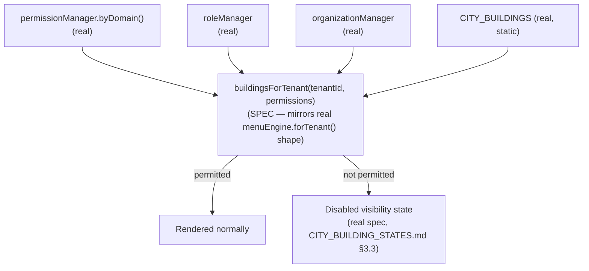

# Enterprise City — Platform Integrations (AI Studio, Notifications, Security)

**Sprint:** CG-6 — Architecture Research + Enterprise Integration Research. No source code was
modified. Houses the brief's §5 (AI Studio), §6 (Notifications), §7 (Security) — the three integration
topics with no dedicated document name, following the same allocation pattern `CITY_USER_EXPERIENCE.md`
used in Sprint CG-5 for brief sections without a named file.

## 1. AI Studio integration (§5)

### 1.1 What exists today (verified) — the most real of every domain this sprint covers

Unlike CRM/ERP (`CITY_CRM.md`/`CITY_ERP.md`, both thin hub pages with no live backend), the AI
Production Center is **genuinely substantial and already integrated into City**, per this engagement's
prior research (`TECH_DEBT.md` `TD-45`): a real 17-studio UI shell, real agent-assignment controls, and
a real approval-gated pipeline — all shipped. City already has real, dedicated buildings for most of
the brief's requested objects: `prod_prompt` ("Creative prompts"), `prod_brand` ("Brand kit"),
`prod_image`/`prod_video`/`prod_reels`/`prod_ads` (generation studios), `prod_publish` ("Publishing"),
`mission_control` (live operations). **`useCityLiveStatus.ts` already joins real GPU-adjacent queue
data** — `productionRuntime.monitor().queues` (`generation`, `render`, `publishing`, `task`) — directly
into these buildings' `CityLiveStatus.tasks`/`processLabel` (confirmed real, Sprint 28.2 per its own
code comment).

**The one real gap** (already tracked, not re-discovered): `TD-45` — no studio can actually generate
anything; no provider, no Content Factory route exists. City's visualization of Production is
therefore **honest today** — it shows real queue *plumbing* activity (jobs moving through the pipeline
once something is queued) but the thing that would populate that pipeline with real generated content
doesn't exist yet.

### 1.2 Per-object representation

| AI Studio object | City representation | Status |
|---|---|---|
| Prompt Library | `prod_prompt` building | Real building, real route |
| Brand Library | `prod_brand` building | Real building, real route |
| Media (generated assets) | Would live inside whichever studio building generated it — no separate "media library" building proposed; browsing generated media is the studio route's job once entered, not City's | No gap — correctly out of City's spatial scope |
| Generation | `prod_image`/`prod_video`/`prod_reels`/`prod_ads` buildings, queue depth already real (§1.1) | Real, blocked only by `TD-45` |
| Publishing | `prod_publish` building, real `Publish Q {n}` processLabel already wired (`useCityLiveStatus.ts`) | Real |
| Approval | The real, structurally-enforced Approval stage (`AI_PRODUCTION_CENTER_BIBLE.md` §4, `USER_JOURNEYS.md` §0 already names this as the platform's only confirmed cross-domain approval gate) — City's representation: the "Approval requested" Live Event (`CITY_EVENTS.md` §2) already specifies the visual (pulse + distinct badge) | Real event source, SPEC visual per CG-4/CG-5 |
| GPU jobs | `productionRuntime.monitor().queues.render` — already real, already joined (§1.1) | Real |

### 1.3 Non-goal

No new AI Studio building or district is proposed — every requested object already has a real home in
the existing catalog.

## 2. Notifications integration (§6)

**Do not duplicate:** `CITY_EVENTS.md` (Sprint CG-4) already fully specifies the event catalog, bus
mapping, and propagation sequences for exactly this list (Event Bus, Alerts, Jobs, Queues, Health,
Notifications). `CITY_COLLABORATION.md` §1 (Sprint CG-5) already documents the real, currently-dormant
Socket.IO transport underlying "Live updates." This section adds only what those two do not already
cover: **where City already surfaces this today, and the one open Synchronization question the brief
asks about that neither prior document addressed.**

### 2.1 Where City already surfaces this (real, confirmed)

The City header already embeds: `glance.critical`/`.attention`/`.running`/`.ai` counts
(`cityGlance()`, real), an `unread` notification badge (real, `useNotificationStore`), an `MC
{live|check}` badge (real, mission-control link health), and — genuinely notable, easy to miss —
**`<EnterpriseRuntimeMonitorCompact />` is already mounted directly in City's header** (real,
`EnterpriseCityPage.tsx`), meaning City already surfaces a live compact view of the real Runtime
Engine's health independent of anything CG-4/CG-5 proposed. This is a real, positive integration
finding this document surfaces for the first time.

### 2.2 Synchronization (the one genuinely new question)

The brief asks specifically about synchronization. The honest answer, given `CITY_RUNTIME.md` §1's
already-documented real cadence (12s `useCityLiveStatus` poll) and `CITY_DESKTOP.md` §2's iframe-
isolation finding: **City today has no cross-window/cross-tab synchronization guarantee at all** — two
open City instances (e.g. a full page and a Desktop-windowed copy, per `CITY_DESKTOP.md`) each poll
independently and will show the same data only *eventually*, within roughly one 12s cycle of each
other, never instantly. **SPEC recommendation**: if tighter synchronization is ever required, it
should ride the real, existing `liveUpdates`/Socket.IO layer (`CITY_COLLABORATION.md` §1) rather than
tightening the poll interval — a push-based `workspace:refresh`-equivalent event for City specifically
would give near-instant cross-window consistency without increasing poll frequency/cost for the common
single-window case.

## 3. Security integration (§7)

### 3.1 What exists today (verified) — the central finding of this section

**City has zero permission, role, or tenant-boundary enforcement today.** Direct verification: no
`tenant`-scoping code exists anywhere in `enterprise-city/` beyond an unrelated search-token string.
Every one of the 34 real buildings renders identically for every authenticated user, regardless of
role or organization. This stands in real contrast to the platform's actual RBAC-adjacent frontend
layer, which is substantial and real: `auth/managers/permissionManager.ts` (`list()`, `byDomain()`,
`syncWithCoreRbac()` — note the real method name implying a genuine backend RBAC sync point),
`auth/managers/roleManager.ts` (`systemRoles()`, `organizationRoles()`, `projectRoles()`,
`customRoles()`, `templates()`), `auth/managers/organizationManager.ts` (`list()`, `get(id)` — a real
multi-tenant organization model). The real, platform-wide navigation tree already demonstrates the
correct pattern City should follow: `navigation/managers/menuEngine.ts`'s real
`forTenant(tenantId, permissions)` filters the entire menu tree by exactly these two inputs — **City
is the one major navigation surface in the platform that does not yet do this.**

### 3.2 Per-concept mapping (SPEC)

| Security concept | Real platform mechanism | City integration (SPEC) |
|---|---|---|
| Permissions | `permissionManager.byDomain(domain)` | Gate `openBuilding()`/tile interactivity per building's implied domain (e.g. `finance` building requires a finance-domain permission) |
| Roles | `roleManager.list()`/`organizationRoles()` | Determines which permission set applies — City reads roles only indirectly, through the permission check above, never re-implementing role logic itself |
| Authentication | Real, platform-wide (`auth/` — login/MFA/session), already covers City since City sits behind the same route guard as every other page | No City-specific work — inherited for free |
| Organization boundaries | `organizationManager` (real, multi-org model) | Determines *which* buildings exist for this session at all — e.g. a district representing a capability the org hasn't licensed should use the real `Disabled` visibility state already specified in `CITY_BUILDING_STATES.md` §3.3, not a City-specific hiding mechanism |
| Tenant isolation | `menuEngine.forTenant()`'s real pattern | City's building catalog filter should mirror this exact function shape — `buildingsForTenant(tenantId, permissions)` — rather than inventing a different filtering convention from the one real precedent already proven correct elsewhere in the platform |
| Audit | `auth/managers/activityCenter.ts` (real) | City already calls `telemetry.userActivity()` on nearly every interaction (`city_enter:*`, `city_search:*`, `city_advice:*` — all real, confirmed throughout `EnterpriseCityPage.tsx`) — **open question, not yet confirmed either way in this research pass**: does `telemetry.userActivity` feed into the real `activityCenter` audit log, or is it a separate, audit-adjacent-but-not-audit telemetry pipe? Flagged for `SPRINT_CG_6_RESULT.md`'s risk list rather than assumed |

### 3.3 Proposed integration point (SPEC)

This adds **no new security model** — it is a City Runtime Adapter (`CITY_RUNTIME.md` §2)
responsibility that reads three already-real managers and applies the already-specified `Disabled`
state, exactly the same "adapter reads real sources, drives real presentation primitives" pattern
every other CG-4/CG-5/CG-6 SPEC proposal in this engagement has followed.

## 4. Non-goals

- No new event bus, notification store, or realtime transport (§2) — every synchronization proposal
  rides real, existing infrastructure.
- No new permission/role/organization model (§3) — City reads three already-real managers.
- No new AI Studio building or backend (§1) — representation is already real; generation capability
  gap is `TD-45`'s, not City's, to close.

## Related documents

`CITY_EVENTS.md`, `CITY_RUNTIME.md` (§2 Adapter, extended by §3.3 here), `CITY_BUILDING_STATES.md`
§3.3 (`Disabled` state, reused not reinvented), `CITY_COLLABORATION.md` §1 (Socket.IO transport, §2.2
here builds on), `CITY_DESKTOP.md` §2 (the iframe-isolation finding §2.2's synchronization answer is
grounded in), `TECH_DEBT.md` `TD-45` (AI Studio's real gap), `ENTERPRISE_NAVIGATION.md` (the real
`forTenant()` precedent §3.2/§3.3 extend).
