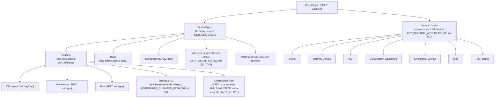

# Enterprise City — Object Model & Enterprise Transport

**Sprint:** CQ-11 — Architecture Research + UI Research + Game Design Research. Documentation only,
`src` not modified.

**Do not duplicate:** CG-2's real `sceneGraph.ts` already defines the *structural* hierarchy (City →
District → Building → Floor → Room → Interactive Object) — this document does not replace it. This is
a **content taxonomy**: what kinds of `Building`, `Road`, and moving object actually exist, layered
onto that real structural tree, answering the brief's "what are the nouns of this world" question
CG-2 deliberately left generic.

## 1. Object hierarchy



## 2. Static objects

### 2.1 Building subtypes — states, not new entities

**Design decision**: Office/Warehouse/Port/Business HQ/Construction Site are not proposed as new scene-
graph node types — they are **real `CityBuilding` records with a `subtype` field and, for Construction
Site specifically, a transient state**, consistent with this whole engagement's rule of extending the
real building model rather than adding parallel entity types:

```ts
type BuildingSubtype = "office" | "warehouse" | "port" | "headquarters" | "generic";
// SPEC — additive field on the real CityBuilding shape (cityCatalog.ts), not a new type

// Construction Site is NOT a fifth subtype — it's a temporary overlay state on ANY subtype,
// active while a company's real BusinessTier or headquartersBuildingId claim is being processed
// (ENTERPRISE_BUSINESS_NETWORK.md §3, CITY_LIVING_ECONOMY.md §1.3). A building under construction
// renders a distinct visual (scaffolding-style overlay, real CG-2 layer/effect mechanism) while
// `constructionUntil: string` is set, then reverts to its normal subtype rendering — nothing new
// is created or destroyed, matching CITY_LIVING_ECONOMY.md §0's "nothing disappears" rule applied
// to the inverse case (nothing appears out of nowhere either — growth is visible in progress).
```

- **Office** — the default; most real buildings today (`crm`, `sales`, `hub`, etc.) are implicitly this.
- **Warehouse** — proposed for ERP/logistics-flavored buildings (`erp` district, `CITY_DISTRICTS.md`
  D8) once real inventory data exists (`CITY_ERP.md` §1, CG-6, still gated on live binding).
- **Port** — ties directly to the real `port_erp`/`port_enterprise` backend verticals
  (`ARCHITECTURE_MAP.md` §2.6) — see `CITY_DISTRICTS.md`'s CQ-11 addition (District Specialization) for
  the district-level version of this same grounding.
- **Business HQ** — already real as a concept (`Company.headquartersBuildingId`,
  `ENTERPRISE_BUSINESS_NETWORK.md` §3) — this subtype is the rendering-level acknowledgment that a
  claimed building looks different (via `BusinessTier`, `CITY_LIVING_ECONOMY.md` §1.3) from an
  unclaimed one.

### 2.2 Road and Intersection

**Road** is real (`streetGraph()`, `cityDistricts.ts`) — an edge between two building centroids, no
change proposed. **Intersection (SPEC, new)**: today's `streetGraph()` has no node concept where
multiple edges meet — it's a flat edge list. Proposed: an `Intersection` is a **derived, computed**
point (SPEC, not stored) wherever two or more real edges' rendered paths would visually cross, used
only by Traffic Runtime (`CITY_RUNTIME_ARCHITECTURE.md` §1.7) to decide where a `VehicleInstance`
yields to another — a rendering/traffic-flow convenience, not a new real graph node type stored
anywhere.

### 2.3 Advertisement / Billboard and Parking

Both already specified where they matter: Billboards in `CITY_VISUAL_STATES.md` §8 (CG-9,
real-advisor-data-bound) and `EBN_GAMIFICATION_MONETIZATION.md` §2/§4 (CQ-10, monetization surface) —
not repeated here. **Parking** is new and low-priority: this document proposes it only as a passive
map-decoration slot near high-traffic districts (Production, CRM — `CITY_DISTRICTS.md` D4/D7), with no
real data binding identified — flagged as the one purely-decorative object in this entire model,
**explicitly excluded from the "represents a real event" requirement** because it represents
capacity/infrastructure, not an event, the same way a road itself isn't required to represent an event
(only its *flow state* is). Not recommended for near-term construction given its low signal value.

## 3. Dynamic objects — Enterprise Transport (brief §6)

Every dynamic object is a `VehicleInstance` (`CITY_RUNTIME_ARCHITECTURE.md` §1.3) with a different
`kind` — one pool, one real event-binding rule (`representsEventId`, mandatory), styled per-kind:

| `VehicleKind` | Represents (real event source) | Visual note |
|---|---|---|
| `drone` | AI agent movement (`CITY_SIMULATION.md` §2.2, CG-4) | Aerial marker |
| `delivery_van` | A Supplier/Dealer partnership's real handoff (`EBN_BUSINESS_GRAPH.md`, CQ-10) or a job/workflow handoff (`CITY_SIMULATION.md` §2.4) | Ground marker |
| `car` | A business meeting or in-person handoff event (`EBN_COMMUNICATION.md` §2, CQ-10's Meeting Room, once real) | Ground marker, lowest priority — most speculative real-event binding in this table |
| `construction_equipment` | A building entering the Construction Site state (§2.1) | Stationary-at-destination marker, not a traveling one — represents work happening at a fixed point, the one `VehicleKind` that doesn't travel a `streetGraph()` path |
| `emergency` | A building crossing into `Critical`/`Offline` health state (`CITY_BUILDING_STATES.md` §3.2, CG-4) | Highest-priority visual treatment of any vehicle kind — reserved animation-budget slot (`CITY_SIMULATION.md` §3, CG-4's max-8-animations ceiling) |
| `ship` | A Port-subtype building's real logistics event, once `port_erp`/`port_enterprise` binds live data (§2.1) | Ground marker, water-district-styled |
| `rail` (future) | Not scoped — no real event source identified; explicitly future, not designed further in this pass | — |

## 4. Non-goals

- No new scene-graph node type — every static object is a real `CityBuilding`/`streetGraph()` edge
  with an additive field or derived overlay.
- No decorative vehicle spawning — every `VehicleKind` row names its real event source; `rail` is
  explicitly left undesigned rather than filled in speculatively.
- No new traffic-simulation engine — Intersection (§2.2) is a derived convenience for the real Traffic
  Runtime, not a stored entity.

## Related documents

`CITY_RUNTIME_ARCHITECTURE.md` §1.3/§1.7 (Vehicle/Traffic Runtime, the mechanism this document's
taxonomy plugs into), `CITY_DISTRICTS.md` (District Specialization, CQ-11 addition — the district-level
grounding for Port/Warehouse subtypes), `ENTERPRISE_BUSINESS_NETWORK.md`/`CITY_LIVING_ECONOMY.md`
(CQ-10, Business HQ and Construction Site's real data sources), `CITY_VISUAL_STATES.md` §8 (CG-9,
Billboards), `EBN_GAMIFICATION_MONETIZATION.md` (CQ-10, monetization framing for premium visuals).
