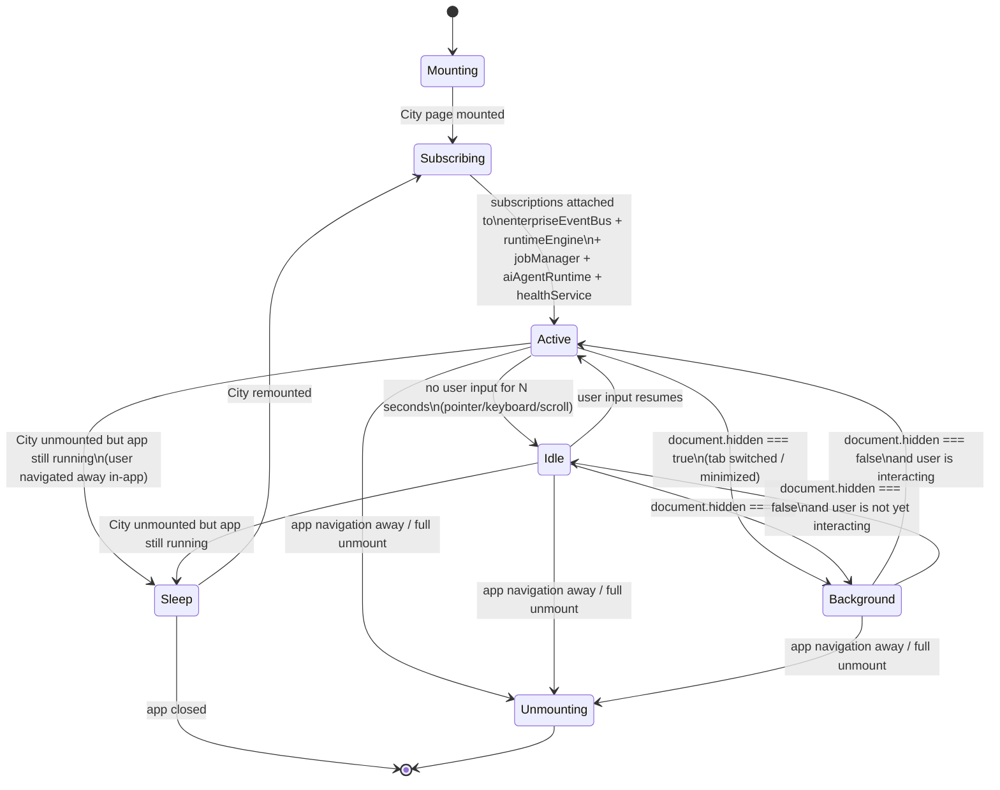
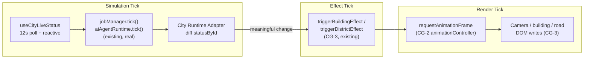
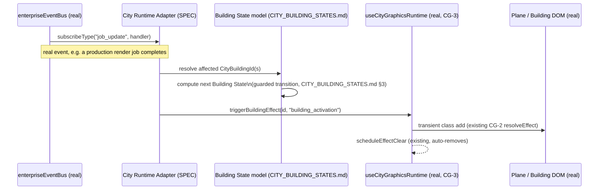

# City Runtime Specification

**Sprint:** CG-4 — Research & Specification only. **No code was written for this document.** Every
claim below about "real today" is verified against the current source tree at the time of writing;
every claim about future behavior is explicitly marked **SPEC** and is a design proposal for Cursor to
implement in a future sprint, not a description of existing code.

**Companions:** [`CITY_BUILDING_STATES.md`](./CITY_BUILDING_STATES.md) (§2 of the brief),
[`CITY_EVENTS.md`](./CITY_EVENTS.md) (§4), [`CITY_CAMERA.md`](./CITY_CAMERA.md) (§5),
[`CITY_SIMULATION.md`](./CITY_SIMULATION.md) (§3, §6, §7),
[`SPRINT_CG_4_RESULT.md`](./SPRINT_CG_4_RESULT.md) (§8 + summary).

## 0. The one governing rule

**City Runtime is not a Runtime.** The platform already has a real Enterprise Runtime Engine
(`src/web/src/enterprise-runtime/` — `runtimeEngine`, `healthService`, `jobManager`,
`aiAgentRuntime`), a real cross-surface event bus (`src/web/src/integration-hub/enterpriseEventBus`),
and a real client-side live-status derivation (`useCityLiveStatus.ts`). "City Runtime" in this document
means **the City-scoped adapter layer that subscribes to those real systems and drives the CG-2/CG-3
Graphics Engine** — it is presentation orchestration, not a second data/business runtime. Every
design decision below is checked against this rule before anything else.

## 1. What exists today (verified)

| Layer | Real module | What it actually does |
|---|---|---|
| Data | `useCityLiveStatus()` | Derives `Record<CityBuildingId, CityLiveStatus>` client-side from `useNotificationStore`, `useLiveEnterprise` snapshot polling, and `productionRuntime.monitor()`. Re-derives on a **12-second interval** (`window.setInterval(() => setPulse(p => p+1), 12_000)`) plus whenever its React-Query-backed inputs change. This is the real "simulation tick" today — a 12s poll, not a continuous clock. |
| Runtime telemetry | `runtimeEngine` (`start/stop/isStarted/subscribe/getSnapshot/publishStream`) | Its own internal interval-driven tick, emits `"heartbeat" \| "production" \| "runtime"` stream kinds, publishes `runtime_update` onto `enterpriseEventBus`. `EnterpriseCityPage.tsx` already calls `runtimeEngine.publishStream("city", { surface: "city" })` on mount — `"city"` is already a first-class `RuntimeStreamKind` value. |
| Job lifecycle | `jobManager` (`list/counts/upsert/setStatus/tick/cancel/retry`) | Real `JobLifecycle` union: `running \| waiting \| completed \| failed \| cancelled \| retrying`. Already has its own `tick()`. |
| AI agents | `aiAgentRuntime` (`list/activeCount/tick/setAgent`) | Real per-agent record: `status: idle \| busy \| waiting \| error \| offline`, `queueDepth`, `memoryMb`, `workflow`, `health`. Already has its own `tick()`. |
| Health | `healthService` (`start/stop/subscribe/getItems/getLevel/levelForId`) | Real `HealthLevel`: `healthy \| warning \| critical \| offline`, per `RuntimeHealthId` (`runtime \| api \| database \| providers \| voice \| mcp \| ...`). |
| Cross-surface events | `enterpriseEventBus` (`publish/subscribe/subscribeType/recent/connectLiveBridge`) | Real `EnterpriseEventType`: `navigate \| open_module \| open_city_building \| open_production \| ai_request \| job_update \| runtime_update \| notification \| context_changed \| session_restored \| workflow_update \| provider_update \| desktop_update \| city_update`. Thin wrapper over `liveUpdates` — **no second realtime stack**, by its own header comment. |
| Visualization | CG-2 Graphics Engine (`enterprise-city/graphics/`) | Scene graph, layer system, camera engine, animation controller, visual effects, theme engine, graphics config. Pure presentation, reads no live data itself. |
| Runtime wiring | CG-3 (`useCityGraphicsRuntime`) | The one hook that already turns `statusById` changes into transient building-activation flashes, drives camera animation, and pauses on tab-hidden. This is the seed of "City Runtime" — CG-4 specifies how it grows up. |

This table is the **ground truth** every design decision below extends. Any future implementation
that duplicates a row above (a second job list, a second agent registry, a second event bus, a second
health model) is an architecture violation, not a City-specific exception.

## 2. City Runtime — layer definition (SPEC)

```
┌─────────────────────────────────────────────────────────────────────┐
│  Real data & event layer (existing, unmodified)                     │
│  enterpriseEventBus · runtimeEngine · jobManager · aiAgentRuntime    │
│  healthService · useLiveEnterprise · useNotificationStore            │
│  productionRuntime.monitor()                                         │
└───────────────────────────────┬───────────────────────────────────┘
                                 │ subscribe (existing APIs only)
┌───────────────────────────────▼───────────────────────────────────┐
│  City Runtime Adapter (SPEC — new, City-scoped, thin)                │
│  • useCityLiveStatus() → per-building CityLiveStatus (existing)      │
│  • cityRuntimeAdapter (SPEC): diffs status, maps to Building State   │
│    axis (CITY_BUILDING_STATES.md), maps bus events to City Events    │
│    (CITY_EVENTS.md), decides idle/sleep/background mode              │
└───────────────────────────────┬───────────────────────────────────┘
                                 │ imperative calls only (no new state store)
┌───────────────────────────────▼───────────────────────────────────┐
│  CG-2/CG-3 Graphics Engine (existing, unmodified by this adapter)    │
│  sceneGraph · layerSystem · cameraEngine · animationController       │
│  visualEffects · renderPipeline · useCityGraphicsRuntime              │
└───────────────────────────────────────────────────────────────────┘
```

The **City Runtime Adapter** is the only new architectural surface this document proposes. It owns:
1. Subscribing to the real data/event layer (never re-implementing it).
2. Translating real data into the Building State model (`CITY_BUILDING_STATES.md`).
3. Translating real events into City Events (`CITY_EVENTS.md`) and deciding which trigger a camera/
   effect reaction.
4. Deciding the City's own lifecycle mode (§4) — active/idle/sleep/background — independent of
   whether the underlying data layer is still ticking (it always is; the City just stops *rendering*
   reactions to it).

It does **not** own: job state, agent state, health state, notification state, or navigation — all of
that stays exactly where it lives today.

## 3. Runtime lifecycle (SPEC)



- **Mounting** — `EnterpriseCityPage` renders for the first time in this session.
- **Subscribing** — the City Runtime Adapter attaches its subscriptions. This is a real, already-
  proven pattern: CG-3's `useCityGraphicsRuntime` already subscribes to `statusById` changes and to
  `document.visibilitychange`; this state just names that step formally so future subscriptions
  (job/agent/health events) attach at the same point, not scattered across component mounts.
- **Active** — full-fidelity mode. Simulation tick and render tick both run at their configured rate
  (§5). This is the only mode in which building-activation flashes, road-flow, and camera-follow
  reactions (`CITY_EVENTS.md`) are allowed to fire.
- **Idle** (**SPEC**, not yet built) — no pointer, keyboard, or scroll input for a configurable window
  (proposed default: 60s, mirroring the kind of inactivity threshold `useCityLiveStatus`'s own 12s
  pulse is already tuned around — an order of magnitude larger, since Idle is a *reduction*, not a
  faster poll). In Idle, the simulation tick continues at its normal cadence (data must not go stale
  the moment a user looks away from their mouse), but the render tick throttles to the CG-2
  `GraphicsSettings.fpsLimit` for the **Low** quality tier regardless of the user's actual configured
  quality, and new transient effects (hover/pulse/road-flow) are suppressed — exactly the kind of
  effect-layer gate CG-3's `frame.layers.isEnabled("effects")` already provides a hook for.
- **Background** (real signal, **SPEC reaction**) — `document.hidden === true`. CG-3 already reacts to
  this for the camera (snaps in-flight tweens, sets `data-tab-hidden`, which pauses every continuous
  CSS animation via one rule in `motion.css`). This document extends that: in Background, the
  Adapter should also **detach from `runtimeEngine`/`jobManager`/`aiAgentRuntime` visual reactions**
  (stop translating their events into City visual effects) while leaving the underlying subscriptions
  live — so the moment the tab is foregrounded again, `statusById` reflects reality immediately
  without a burst of queued animations replaying.
- **Sleep** (**SPEC**) — the City route is unmounted (user navigated to Dashboard, a building, Desktop,
  etc.) but the app itself is still running. All City Runtime Adapter subscriptions unsubscribe
  (React `useEffect` cleanup — already the pattern CG-3 uses for its own effects). No polling, no
  rAF loop, zero cost. On remount, the Adapter resubscribes and immediately requests one fresh
  snapshot from each real source rather than waiting for their next natural tick, so the City never
  shows stale data on return.
- **Unmounting** — full teardown; identical to Sleep's cleanup, terminal for this session.

## 4. Update loop model (SPEC)

Three independent loops, deliberately not merged into one:



- **Simulation tick** — governed entirely by the real data layer's own cadence (§1's table): the 12s
  `useCityLiveStatus` pulse, plus whatever cadence `jobManager`/`aiAgentRuntime`/`healthService`
  already tick at internally. The City Runtime Adapter does not run its own clock for this — it reacts
  to `statusById` (a React value) changing, exactly as CG-3's `useCityGraphicsRuntime` already does via
  its `prevStatusRef` comparison (`statusChangedMeaningfully`). **SPEC extension**: the same
  diff-and-react pattern should generalize to job/agent/health subscriptions, not just building tone/
  tasks/notifications/aiActive.
- **Render tick** — governed by `requestAnimationFrame`, throttled by `GraphicsSettings.fpsLimit`
  (CG-2 `graphicsConfig.ts`, already enforced by CG-3's `shouldAdmitFrame`). Only runs while an
  animation is actually in flight — there is no continuous per-frame work when the camera is at rest,
  which is already true of the shipped CG-3 implementation (the animation loop only exists for the
  duration of a tween) and should remain true for every future addition (agent movement, queue
  visualization, etc. — see `CITY_SIMULATION.md` §2).
- **Effect tick** — the bridge: a simulation-tick change that is "meaningful" (§`statusChangedMeaningfully`
  today; extended taxonomy in `CITY_EVENTS.md`) enqueues a transient visual effect, which then plays
  out over the render tick. This is intentionally a **queue, not a direct call** — see §7's
  "Maximum animations" budget, which exists specifically because simulation-tick changes can arrive
  faster than the render tick can visually represent them one-at-a-time.

The critical property this model preserves: **data freshness is never coupled to render activity.**
`statusById` stays correct even while the render tick is fully idle (camera at rest, no effects
playing) — a building's badge/state is always current from the next render, not only "while something
is animating."

## 5. Event propagation (SPEC)



This is not a new mechanism — it is CG-3's existing `triggerBuildingEffect` call path, generalized to
be invoked by an event-bus subscription instead of only by the `statusById` diff effect it currently
has. The Adapter is the only new node in this diagram; everything else is real, shipped code.

## 6. Non-goals (explicit)

- **Not a second Runtime.** No new health model, job model, or agent model. Every number the City ever
  shows is read from `healthService`/`jobManager`/`aiAgentRuntime`/`useLiveEnterprise`.
- **Not a second event bus.** All propagation rides `enterpriseEventBus`; see `CITY_EVENTS.md` §1 for
  why no new event type is proposed for most of the requested catalog.
- **Not a physics/game engine.** "Simulation tick" here means *data refresh cadence*, not a
  frame-stepped world simulation — consistent with CG-2's own non-goal ("no WebGL camera").
- **Not always-on background work.** Sleep mode's whole purpose is that an unmounted City costs
  nothing — no interval, no rAF, no subscription.

## 7. Open questions for Cursor

1. Idle's proposed 60s threshold is a placeholder — should it be a `GraphicsSettings`-adjacent user
   preference, or fixed? (Recommendation: fixed constant initially, promote to config only if real
   usage data asks for it — avoids a premature setting per this repo's engineering philosophy.)
2. Should Sleep mode's "request one fresh snapshot on remount" apply to `jobManager`/`aiAgentRuntime`
   too, or only to `useCityLiveStatus`'s own inputs? (Recommendation: all of them, for consistency —
   see `SPRINT_CG_4_RESULT.md` §6 risk list.)
