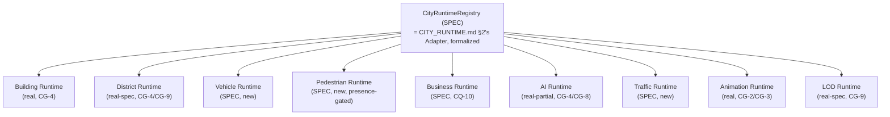

# Enterprise City — Runtime Architecture

**Sprint:** CQ-11 — Architecture Research + UX Research + Game Design Research. Documentation only,
`src` not modified.

**Do not duplicate:** `CITY_RUNTIME.md` (CG-4) already owns the City's overall lifecycle (mount→active→
idle→background→sleep) and three-loop update model (Simulation/Effect/Render tick) — this document
does not re-specify that, it **decomposes** it into the brief's nine named runtimes, each scoped to one
concern, each either citing a real mechanism already built (Animation, Building, LOD) or specifying a
genuinely new one (Vehicle, Pedestrian, Traffic). `CITY_WORLD.md` (CG-9) already owns LOD tiers in
depth — cited, not repeated.

## 0. One registry, nine runtimes — the structural pattern this document reuses

The TS ADOS kernel's real `Lifecycle.ts` (`ARCHITECTURE_MAP.md` §9) already proves a clean pattern for
exactly this problem — multiple independent subsystems, one shared lifecycle state machine
(`Created→Initialized→Started→Paused→Stopped→Disposed`). This document proposes the **same shape**,
not a new one, for how the nine named runtimes below compose: each is an independent module with that
same five-state lifecycle, all owned by one `CityRuntimeRegistry` (SPEC), which is itself just the
already-real `CITY_RUNTIME.md` §2 City Runtime Adapter wearing a more formal name for this document's
purposes — not a new top-level system.



## 1. The nine runtimes

### 1.1 Building Runtime — real

Owns: the three-axis state model (Lifecycle/Health/Interaction, `CITY_BUILDING_STATES.md` §1, CG-4)
and per-building transient effects (`useCityGraphicsRuntime`, real, CG-3). Tick source: the real
Simulation tick (`CITY_RUNTIME.md` §4). Nothing new specified here — this document names it "Building
Runtime" only so the brief's nine-runtime list has a one-to-one real answer for this entry.

### 1.2 District Runtime — real-spec

Owns: `DistrictRuntimeSummary` aggregation (`CITY_SIMULATION.md` §1.2, CG-4, SPEC but fully designed)
and per-district traffic-level/night-mode behavior (`CITY_DISTRICTS.md`, CG-9). Tick source: derives
from Building Runtime's aggregate state, never a separate poll.

### 1.3 Vehicle Runtime — SPEC, new

The formal home for every "traveling object" this engagement has so far specified only as individual
effect skins: agent-movement markers (`CITY_SIMULATION.md` §2.2, CG-4), drones/delivery-robot skins
(`CITY_VISUAL_STATES.md` §3–4, CG-9), and the expanded transport taxonomy `CITY_OBJECT_MODEL.md` §2
adds this sprint. **This document's one new architectural contribution for Vehicle Runtime**: a single
`VehicleInstance` pool (SPEC), not one ad hoc marker per feature —

```ts
type VehicleKind = "drone" | "delivery_van" | "car" | "construction_equipment" | "emergency" | "ship"; // CITY_OBJECT_MODEL.md §2
interface VehicleInstance {
  id: string;
  kind: VehicleKind;
  fromBuildingId: string;
  toBuildingId: string;
  progress: number;             // 0-1 along the real streetGraph() path
  representsEventId: string;    // SPEC — every vehicle traces to one real CityEvent (§CITY_EVENTS.md), never spawned decoratively
}
```

Every prior "traveling marker" spec (agent movement, drones, robots) becomes a `VehicleInstance` with
a different `kind` — **one runtime, one pool, styled per-kind**, rather than each feature owning its
own separate animated-marker implementation. This directly satisfies `ENTERPRISE_CITY_ANIMATIONS.md`'s
one-sanctioned-traveling-object rule (restated, not loosened) by making "one object per real event, at
a time" a structural property of the pool, not a convention each feature must remember independently.

### 1.4 Pedestrian Runtime — SPEC, new, presence-gated only

**Restates, does not loosen, `CITY_VISUAL_STATES.md` §2's (CG-9) explicit finding**: a literal
pedestrian has no real signal to represent unless it *is* a real user's real presence
(`CITY_COLLABORATION.md`, CG-5, still entirely SPEC itself). Pedestrian Runtime is therefore proposed
as a thin wrapper that renders **zero** pedestrians until real presence exists, then renders exactly
one marker per real online user's `focusBuildingId` — never ambient/decorative foot traffic. This
document does not weaken that constraint under the more formal "Runtime" framing.

### 1.5 Business Runtime — SPEC, extends CQ-10's real design

Owns: `BusinessTier` computation and headquarters size/lighting driving (`CITY_LIVING_ECONOMY.md` §1.3,
CQ-10), watching `Company`/`Partnership`/`VerifiedDocument` state (`ENTERPRISE_BUSINESS_NETWORK.md`,
`EBN_PARTNERSHIP_SYSTEM.md`, `EBN_VERIFIED_DOCUMENTS.md`, all CQ-10). This is the one runtime in this
list whose entire data source (the EBN entity model) is itself still SPEC — restated, not newly
designed here.

### 1.6 AI Runtime — real, but honestly fragmented

Owns: `aiAgentRuntime` (real, frontend-simulated, CG-4) and the City-visible face of the three (or
more) disconnected backend agent stacks `AI_AGENT_LIFECYCLE.md` §0 (CG-8) already catalogued. This
document adds one new City-specific visual concept the brief names: **Analytics Centers, Decision
Centers, and an AI Operations Center** — proposed as real-building bindings, not new buildings:
Analytics Center → the real `analytics` building (District D11, `CITY_DISTRICTS.md`); Decision Center →
proposed as a new *view* of the `ai_team`/`concierge` buildings (D3), not a new building; AI Operations
Center → the real `mission_control` building (D4), which already carries real live-ops framing
(`CITY_DISTRICTS.md` D4). No new City geometry — three brief-requested concepts, three existing real
buildings, reframed.

### 1.7 Traffic Runtime — SPEC, new, orchestrates Vehicle Runtime + roads

The coordination layer between Vehicle Runtime (§1.3) and the real road-flow rendering
(`.ec-link-line.is-flowing`, CG-3): decides which real `streetGraph()` edges should show flow at any
moment, based on how many `VehicleInstance`s currently traverse them. This is a thin scheduling layer,
not a new rendering system — it answers "which roads are busy right now," derived entirely from §1.3's
real vehicle pool, never an independent traffic simulation.

### 1.8 Animation Runtime — real

This is, precisely, `animationController.ts` (CG-2) + `useCityGraphicsRuntime` (CG-3) — already fully
real, already fully specified (`CITY_ANIMATION_SYSTEM.md`). Nothing new. Named here only to complete
the brief's nine-item list with an honest "already done" answer.

### 1.9 LOD Runtime — real-spec

`CITY_WORLD.md` §5 (CG-9) already fully specifies zoom-tiered detail rendering. Nothing new. Same
posture as Animation Runtime.

## 2. Rendering layers (brief §10 deliverable)

Extends the real `layerSystem.ts` (CG-2, 8 real layers: Background/Roads/Buildings/Effects/Agents/
Selection/UI Overlay/Debug) with exactly the additions the new runtimes above require — additive
layer entries, not a new layer system:

| New layer | Owner runtime | Order (relative to real 8) |
|---|---|---|
| Vehicles | Vehicle Runtime (§1.3) | Between real `Agents` and `Selection` — vehicles are more concrete than agent-pulse effects, less interactive than selection state |
| Pedestrians | Pedestrian Runtime (§1.4) | Same position as Vehicles — both are "moving foreground objects," share a paint order |
| Traffic overlay | Traffic Runtime (§1.7) | Between real `Roads` and `Buildings` — traffic flow renders on top of static roads, under building tiles |

## 3. Data sources (brief §10 deliverable, consolidated)

| Runtime | Real data source | SPEC data source |
|---|---|---|
| Building | `CityLiveStatus` (real) | — |
| District | `statusById` aggregation (real) | — |
| Vehicle | — | `CityEvents` (workflow handoffs, partnership formation, deliveries) |
| Pedestrian | — | `CITY_COLLABORATION.md` presence (SPEC) |
| Business | — | `Company`/`Partnership`/`VerifiedDocument` (SPEC, CQ-10) |
| AI | `aiAgentRuntime` (real, simulated) | Real backend agent stacks, once consolidated (`AI_AGENT_LIFECYCLE.md` §0, CG-8) |
| Traffic | Vehicle Runtime's pool (derived) | — |
| Animation | `animationController.ts` (real) | — |
| LOD | `viewport.zoom` (real) | — |

## 4. Non-goals

- No new top-level runtime system — `CityRuntimeRegistry` (§0) is the real Adapter, renamed for this
  document's organizing purpose.
- No decorative vehicle or pedestrian spawning — §1.3/§1.4 both require `representsEventId`/real
  presence, no exceptions.
- No new rendering technology — §2's new layers are additive entries in the real layer system.

## Related documents

`CITY_RUNTIME.md`/`CITY_BUILDING_STATES.md`/`CITY_SIMULATION.md` (CG-4), `CITY_CAMERA.md`/
`CITY_ANIMATION_SYSTEM.md`/`CITY_GRAPHICS_ENGINE.md`/`CITY_RENDER_PIPELINE.md` (CG-2/CG-3),
`CITY_VISUAL_STATES.md`/`CITY_WORLD.md`/`CITY_DISTRICTS.md` (CG-9), `CITY_LIVING_ECONOMY.md`/
`ENTERPRISE_BUSINESS_NETWORK.md` (CQ-10), `AI_AGENT_LIFECYCLE.md` (CG-8), `CITY_OBJECT_MODEL.md`
(CQ-11 sibling), `ARCHITECTURE_MAP.md` §9 (the real kernel `Lifecycle.ts` pattern §0 reuses).
