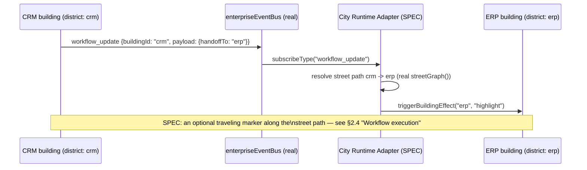
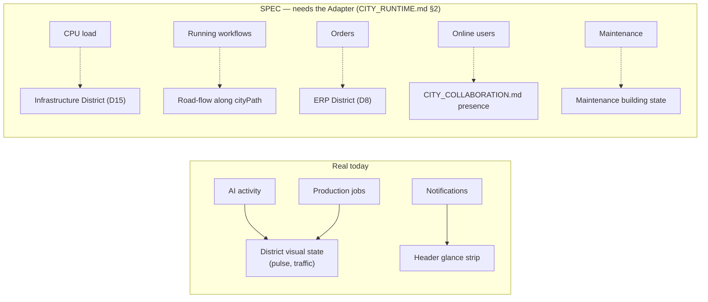

# City Simulation Specification

**Sprint:** CG-4 — Research & Specification only. No source code was modified for this document.
Covers District Runtime, AI Visualization, and Performance Budget — the three brief sections that are
about *what the City shows while nothing is animating a camera*, as opposed to `CITY_RUNTIME.md`
(the loop mechanics) and `CITY_CAMERA.md` (the viewport).

**Companions:** [`CITY_RUNTIME.md`](./CITY_RUNTIME.md) (the Adapter and tick model this section's
behaviors run inside), [`CITY_EVENTS.md`](./CITY_EVENTS.md) (what triggers district/agent reactions),
[`CITY_BUILDING_STATES.md`](./CITY_BUILDING_STATES.md) (the states districts and agents drive).

## 1. District Runtime (SPEC, grounded in real district data)

### 1.1 What exists today (verified)

12 real districts (`CITY_DISTRICTS`, `cityDistricts.ts`): `enterprise, crm, erp, ai, production,
marketplace, analytics, knowledge, finance, developer, security, settings`. The brief's requested list
(Business, Production, Knowledge, Marketplace, Finance, Automation, Developer, Security, CRM, ERP, AI)
maps onto these real 12 almost 1:1 — "Business District" is the real `enterprise` district (home to
`hub`, `dashboard`, `hr`, `admin`), and "Automation" has no dedicated real district today (automation-
flavored buildings currently live inside `production`/`developer`). This document does not propose
adding a 13th district for Automation — see `ENTERPRISE_CITY_BIBLE.md`'s existing reconciliation
table for why the district count is deliberately held at 12 until real product surfaces justify a new
one; Automation is noted here as a labeling gap, not a structural one.

Districts already have real streets (`streetGraph()`, `cityDistricts.ts`) connecting buildings, and a
real centroid (`CityDistrictMeta.x/y`) CG-2's `focusDistrict` already uses.

### 1.2 District-level state (SPEC — new, aggregated from real building state)

A district has no state of its own today — it's purely a label + centroid. This document proposes
district state as a **pure aggregation** of its member buildings' states (`CITY_BUILDING_STATES.md`),
never an independently-tracked value (avoids a second source of truth):

```ts
// SPEC — computed, not stored
type DistrictRuntimeSummary = {
  districtId: CityDistrictId;
  buildingCount: number;
  byHealth: Record<HealthLevel, number>;      // real HealthLevel union
  byLifecycle: Record<LifecycleState, number>; // CITY_BUILDING_STATES.md §3.1
  dominantState: "critical" | "warning" | "busy" | "healthy"; // worst-of, for the district label's own visual
  aiActiveCount: number;
};
```

This is exactly the same "worst-of aggregation" pattern `cityGlance()` (real, `cityVisualLanguage.ts`)
already uses citywide — this document proposes the same function shape, scoped per-district instead of
global. **No new computation model**, just a narrower `filter()` over the existing `statusById` map.

### 1.3 How districts communicate (SPEC)

Districts do not talk to each other directly — they communicate exactly the way `CITY_EVENTS.md`
already specifies for buildings, scoped by `districtId` in the event payload convention
(`CITY_EVENTS.md` §3). A workflow that spans two districts (e.g. a CRM lead flowing into an ERP
order) is visualized as an event traveling along the real `streetGraph()` path between the two
buildings involved, not as a district-to-district channel:



This reuses the real road-rendering CG-3 already ships (`.ec-link-line`, flow-gated to the focused
building today) — this document's only proposal is widening the flow trigger from "touches the focused
building" to "touches either endpoint of an in-flight cross-district handoff," still confined to the
specific link, never the whole map.

## 2. AI Visualization (SPEC, grounded in the real `aiAgentRuntime`)

### 2.1 What exists today (verified)

`aiAgentRuntime` (`enterprise-runtime/aiAgentRuntime.ts`) already models: `id, name, status (idle |
busy | waiting | error | offline), task, queueDepth, memoryMb, workflow, health`, with its own
`tick()` and `activeCount()`. CG-3 already flashes a building when `CityLiveStatus.aiActive` flips —
but nothing today visualizes an *agent* as its own entity distinct from the building it's working in.
The requested items (Agent movement, Thinking, Communication, Job execution, Queue visualization,
Knowledge flow, Workflow execution, Background processing) are all genuinely new visualization work,
specified below against the real `aiAgentRuntime` fields.

### 2.2 Agent movement (SPEC)

An agent icon (new scene-graph node kind, additive to CG-2's `SceneNodeKind`) traveling between two
buildings when `AiAgentRuntime.workflow` implies a handoff (same mechanism as §1.3's district
handoff, at building grain instead of district grain). Movement uses `cameraEngine`'s target-resolution
pattern (`CITY_CAMERA.md` §6.1's `followTarget`, optionally) but the agent marker itself is a new,
separate animated DOM node — not a camera behavior. Speed: constant, linear, matching
`ENTERPRISE_CITY_ANIMATIONS.md` §3's existing rule for "Agent transit marker movement": *"steady linear
movement... never accelerating/decelerating for dramatic effect... the one sanctioned 'traveling
object' in the entire City."* This document does not propose a second traveling-object exception.

### 2.3 Thinking / Communication (SPEC)

- **Thinking** — `AiAgentRuntime.status === "busy"` with no district/building handoff in flight →
  resolves to CG-2's `pulse` effect (`edm-ai-live`, the platform's one sanctioned continuous loop),
  confined to the one building hosting that agent. This is not a new effect — it's `pulse`
  (`CITY_ANIMATION_SYSTEM.md` §3), already shipped, applied to a new trigger condition.
- **Communication** — two agents' buildings both `aiActive` with a shared `workflow` value → the
  road-flow treatment (§1.3) between their buildings, confined to that one link.

### 2.4 Job execution / Queue visualization (SPEC)

`jobManager.listByQueue(kind)` (real) already partitions jobs by `ProductionQueueKind`. Proposed:
a building's `Executing` state (`CITY_BUILDING_STATES.md` §3.1) shows a small queue-depth badge sourced
directly from `AiAgentRuntime.queueDepth` or `jobManager.counts()` — a **read of existing real data**,
not a new counter. "Workflow execution" (brief) is the building-grain version of §2.2's agent movement
— an in-flight job with a defined next-building hop animates the same traveling marker.

### 2.5 Knowledge flow (SPEC)

The one item in this list with no direct real backing today — no real "knowledge graph traversal"
event exists yet in `enterpriseEventBus`. Proposed: defer to whichever future sprint gives the
Knowledge district (`documents`, `knowledge` buildings) a real cross-reference/citation event, then
visualize it with the exact same road-flow + traveling-marker primitives already specified above —
explicitly **not** a new visualization primitive, just a future new *trigger* for the existing ones.

### 2.6 Background processing (SPEC)

Maps directly onto `CITY_RUNTIME.md` §3's Background lifecycle mode, *inverted*: work that continues
while the City itself is backgrounded (tab hidden) should **not** queue up a burst of visual effects to
replay on return (already specified in `CITY_RUNTIME.md` §3 — the Adapter detaches visual reactions in
Background mode). "Background processing" as a *visible* concept only matters while the City is
Active/Idle and refers to agents whose `status` is `busy`/`waiting` but whose building isn't currently
focused/on-screen — proposed treatment: a citywide aggregate badge (using `aiAgentRuntime.activeCount()`,
real, already exists) in the header glance strip, not a per-building effect for off-screen work.

## 3. Performance Budget (SPEC, informed by real catalog size + CG-2/CG-3 measured behavior)

Real scale today: **12 districts, 34 buildings** (`cityCatalog.ts`), confirmed cheap to build/walk in
CG-2's own test suite (effectively instantaneous, no memoization needed — `SPRINT_CG_2_RESULT.md` §4).
The budgets below are sized against that real scale plus reasonable multi-tenant/multi-year growth
headroom, not arbitrary round numbers.

| Resource | Proposed limit | Rationale |
|---|---|---|
| Maximum buildings rendered | 34 today, budget to **120** | ~3.5x current catalog — enough headroom for every `ENTERPRISE_CITY_BIBLE.md` §10 "Departments" building-per-floor idea without a redesign, while staying an order of magnitude below where DOM-per-building would need virtualization |
| Maximum districts | 12 today, budget to **24** | Matches the existing reconciliation ceiling (`ENTERPRISE_CITY_BIBLE.md`) — City is not expected to need more district *labels* even as building count grows within them |
| Maximum concurrent live events processed per second | **20** | Above this, the Adapter (`CITY_RUNTIME.md` §2) should coalesce same-building events within a 250ms window (one effect trigger, not N) rather than drop events — data is never lost, only the *animation* is deduped |
| Maximum concurrent animations (camera + building + district + road) | **8** | One camera tween (there is only ever one — `activeHandleRef` is a single slot, CG-3) + up to 6 simultaneous transient building/district/road effects + 1 reserved for a portal-in-flight. Beyond 8, new effect requests queue (§`CITY_RUNTIME.md` §4 Effect Tick) rather than stack |
| Maximum visualized agents | **16** concurrently, matching `aiAgentRuntime`'s realistic concurrent-agent ceiling per the platform's own AI OS design (`ENTERPRISE_AI_OS.md`) — beyond 16, aggregate into the Background-processing badge (§2.6) instead of one marker each |
| Maximum notifications reflected in City badges | **99** displayed as "99+", matching the existing `Badge` component convention used elsewhere in the platform (not City-specific) |
| Expected FPS | **60** on High/Ultra quality, **45** Medium, **30** Low — exactly `graphicsConfig.ts`'s real `TIER_DEFAULTS.fpsLimit` values (CG-2), restated here as the performance contract those numbers exist to serve, not a new number |
| Memory budget | No hard ceiling proposed — the CG-3 dev overlay's `Memory` readout (`performance.memory.usedJSHeapSize`, Chrome-only) is the intended *observability* tool for this; recommend a soft internal alert threshold (proposed: 250MB attributable to the City surface) revisited once real measurements exist, rather than a speculative number now |
| Virtualization strategy | **None required at current or 120-building scale** — plain DOM absolute-positioned tiles (today's real approach) stay cheap well past the proposed ceiling above. If a future department/floor drill-down (`CITY_BUILDING_STATES.md`, Floor/Room scene-graph levels, already typed as extension points in CG-2's `sceneGraph.ts`) pushes total node count past ~500, revisit with windowing (render only nodes within the current viewport's `viewportRect`, which CG-2's camera engine already computes) rather than switching rendering technology |

### 3.1 Why no virtualization yet (explicit reasoning)

CG-2's `sceneGraphStats()` already gives an exact node count per frame — the mechanism to *decide*
when virtualization is needed already ships today, even though virtualization itself is not proposed.
This document recommends treating the 500-node figure above as a trigger to revisit, not a deadline to
pre-build against: building virtualization before it's needed would be exactly the kind of premature
abstraction this repo's engineering philosophy warns against.

## 4. Non-goals

- No new district data model — district state is always a computed aggregate, never stored.
- No new agent registry — every agent visualization reads `aiAgentRuntime` directly.
- No virtualization/windowing implementation in this sprint — specified as a future trigger only (§3.1).
- No knowledge-graph event source is proposed — §2.5 explicitly defers until one exists elsewhere.

---

## Sprint CG-9 addition — World Simulation Drivers

**Mode:** Architecture Research + Game Design Research. Documentation only, no source modified.
Extends §1–§3 above; does not replace them. Covers the brief's "how the city changes depending on..."
list — ten real/potential drivers, each mapped to whichever real data source already exists (per
`CITY_RUNTIME.md`/`CITY_EVENTS.md`, CG-4) or marked SPEC where none does.

### 5. Per-driver mapping

| Driver | Real data source | City reaction (real mechanism it reuses) |
|---|---|---|
| CPU load | `enterprise-runtime/runtimeEngine`'s real (simulated) telemetry stream | **SPEC** — no building/district currently reads CPU load; would map to `Infrastructure District` (D15, `CITY_DISTRICTS.md`) once/if built, or the header `EnterpriseRuntimeMonitorCompact` (real, already shows this citywide) |
| AI activity | `aiAgentRuntime.activeCount()` (real) | Real, already wired: `pulse` effect on `aiActive` buildings, AI District's (D3) traffic-level proposal |
| Running workflows | `platform_workflow`'s real `TaskCreatedEvent`→`WorkflowCompletedEvent` chain (`AUTOMATION_ENGINE.md`, CG-7), once bridged via the City Runtime Adapter (`CITY_RUNTIME.md` §2, SPEC) | Road-flow between the workflow's real `cityPath` buildings (`enterprise-workflow/workflowTemplates.ts`'s real per-template `cityPath` field — already exists, currently only feeds the *simulated* `deriveWorkflowAutomation()`, not a real running workflow) |
| Notifications | `useNotificationStore` (real) | Real, already wired: header unread badge, per-building `notifications` count |
| CRM activity | `events/crm_publisher.py`'s real durable outbox (`TRIGGER_SYSTEM.md` §4, CG-7) | **Partially real** — the durable event source exists; not yet bound to CRM District (D7) buildings |
| Orders | ERP's real generic hub, no live order data (`CITY_ERP.md` §1) | **SPEC** — blocked entirely on ERP's own "Live... binding" gap, same posture as `CITY_ERP.md` |
| Production jobs | `productionRuntime.monitor()` (real, already joined — `CITY_SIMULATION.md` §2.4 above) | Real, already the richest-wired driver in this whole table |
| Online users | Not confirmed as a real per-session presence signal anywhere in this survey | **SPEC** — `CITY_COLLABORATION.md` (CG-5) already specifies presence in full; this row is a pointer, not a re-specification |
| Errors | `healthService.getLevel()` (real) + `JobLifecycle: "failed"` (real, `WORKFLOW_RUNTIME.md`) | Real sources exist; City-side join confirmed only for a handful of buildings (`useCityLiveStatus.ts`'s `health.find(...)` calls) — most districts are not yet joined |
| Maintenance | `CITY_BUILDING_STATES.md` §3.2's `Maintenance` state (SPEC, CG-4) — deliberately *not* `healthService`-sourced, an explicit operator override | SPEC, already fully specified there — restated as a pointer |

### 6. Reading the table honestly

**Two drivers are fully real and wired today** (AI activity, Production jobs) — these are the two
districts (AI, Production) where "the city changes because something is happening" is not a promise
but an observable fact right now. **Three are partially real** (Notifications — fully wired but
citywide, not district-specific; CRM activity and Errors — real sources exist, City-side joins are
incomplete). **Five are fully SPEC** (CPU load, Running workflows, Orders, Online users, Maintenance)
— each blocked on a real gap already documented elsewhere in this engagement (Infrastructure District
not existing, the City Runtime Adapter not existing, ERP's live-binding gap, presence having no real
backing, and Maintenance being an intentional non-`healthService` override). This ten-row table is the
single clearest "how alive is the City really" scorecard this engagement has produced — worth citing
directly in any future stakeholder conversation about City's current state versus its vision.

### 7. World-state diagram (SPEC — the intended reactive loop)


