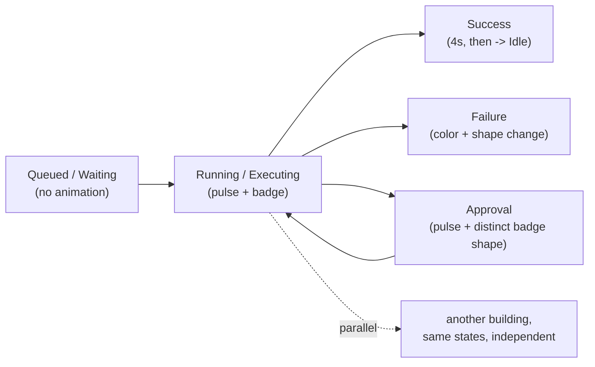

# Enterprise City — User Experience Bible

**Sprint:** CG-5 — Architecture Research + UX Research + Product Research. **Documentation only — no
production code was written or modified.** Runtime, Graphics Engine, and Simulation are already
specified (`CITY_RUNTIME.md`, `CITY_BUILDING_STATES.md`, `CITY_EVENTS.md`, `CITY_CAMERA.md`,
`CITY_SIMULATION.md` — Sprint CG-4). This Bible is the top-level index for **how a human actually
works inside** what those documents specify.

## 0. What this Bible is, and what lives elsewhere

| Topic | Document |
|---|---|
| Per-role journeys inside the City | [`CITY_USER_JOURNEYS.md`](./CITY_USER_JOURNEYS.md) |
| Building/district selection, search, palette, breadcrumbs, deep links, history, favorites | [`CITY_NAVIGATION_GUIDE.md`](./CITY_NAVIGATION_GUIDE.md) |
| Multiple humans in the same City, presence, occupancy | [`CITY_COLLABORATION.md`](./CITY_COLLABORATION.md) |
| Keyboard, screen reader, contrast, motion, color, font scaling | [`CITY_ACCESSIBILITY.md`](./CITY_ACCESSIBILITY.md) |
| Roadmap, risks, validation checklist | [`SPRINT_CG_5_RESULT.md`](./SPRINT_CG_5_RESULT.md) |
| **This document** | Workflow visualization (§1), Mobile experience (§2), User feedback (§3) — the three brief sections with no dedicated filename |

**Do not duplicate:** platform-wide UX findings already live in `UX_REVIEW.md`,
`USER_EXPERIENCE_BACKLOG.md`, `NAVIGATION_IMPROVEMENTS.md`, and `ENTERPRISE_NAVIGATION.md`. This Bible
references those by ID/section rather than restating them, and only documents what is **specific to
the City surface**.

## 1. Workflow visualization

Grounded in the real state/event model `CITY_RUNTIME.md`/`CITY_BUILDING_STATES.md`/`CITY_EVENTS.md`
already specify — this section is the **user-facing reading** of that machinery: what a person
actually sees, not the mechanism producing it.

| Workflow condition | What the user sees | Backing spec |
|---|---|---|
| Running | Building shows `Executing` lifecycle state (pulse/glow per `CITY_BUILDING_STATES.md` §3.1); if a specific job is known, a queue-depth badge | `CITY_EVENTS.md` §4.1 |
| Queued | Building shows `Waiting` lifecycle state, no animation (a queued item is explicitly not "active" — matches the platform's calm-motion rule: nothing animates for a state that hasn't started) | `CITY_BUILDING_STATES.md` §3.1 |
| AI processing | `pulse` effect (`edm-ai-live`, the one sanctioned continuous loop) confined to the AI-hosting building; if a specific agent is visualizable, an agent marker (`CITY_SIMULATION.md` §2.2–2.3) | `CITY_SIMULATION.md` §2 |
| Approval | Building shows a `pulse` + a distinct badge shape (not just color — see `CITY_ACCESSIBILITY.md` §4 color-blindness note) so "needs a human decision" reads as categorically different from "AI is working," never the same visual with a different tint | `CITY_EVENTS.md` §2 "Approval requested" |
| Waiting | Same as Queued — this document treats "Queued" and "Waiting" as one user-facing state (`Waiting` lifecycle axis) since the brief's two terms map onto the identical real signal (`JobLifecycle: "waiting"`); no visual distinction is proposed between them |
| Failure | Building transitions to `Error`/`Critical` (health axis) — a color + shape change (not color alone), auto-surfaces in the header glance strip's "Крит." counter (real, `cityGlance()`) | `CITY_BUILDING_STATES.md` §3.2 |
| Success | Building shows `Success` lifecycle state for a fixed 4s window then returns to `Idle` (`CITY_BUILDING_STATES.md` §3.1) — deliberately time-boxed so a City left open overnight doesn't accumulate a permanent wall of "done" badges | `CITY_BUILDING_STATES.md` §3.1 |
| Parallel execution | Multiple buildings independently show `Executing` simultaneously — no citywide "N things running" aggregate animation is proposed; the existing header glance strip's "В роботі" counter (real, `cityGlance()`) is the aggregate signal, read as a number, not a new visual effect | `CITY_SIMULATION.md` §3 (animation budget — parallel executing buildings each count toward the 8-concurrent-animation ceiling) |
| Background execution | Not shown per-building at all while the City is Active/Idle unless the user focuses that building — represented citywide via the AI-agent aggregate badge (`CITY_SIMULATION.md` §2.6), consistent with "meaningful only" motion (`ENTERPRISE_CITY_ANIMATIONS.md` §1) | `CITY_SIMULATION.md` §2.6, `CITY_RUNTIME.md` §3 (Background lifecycle mode) |

### 1.1 One diagram, the whole table

## 2. Mobile experience (SPEC — no real touch/responsive handling exists in City today)

### 2.1 What exists today (verified)

Zero touch/gesture handling in `enterprise-city/` — confirmed by direct search (no `touch`, `swipe`,
`gesture` matches anywhere in the module). The real design-system breakpoints exist
(`tokens.ts`: `mobile: 0, tablet: 768, laptop: 1024, desktop: 1280`) but City's own CSS
(`.ec-map-shell`, `.ec-building`, etc.) uses percentage-relative units with no responsive breakpoint
overrides for the map itself. Drag-to-pan is mouse-event-only (`onMouseDown`/`mousemove`/`mouseup`
in `EnterpriseCityPage.tsx`) — **does not work on touch devices at all today**, since touch input
fires `pointerdown`/`touchstart`, not `mousedown`. This is the single most important finding in this
section: **City is not usable on a touchscreen today**, not "usable but suboptimal."

### 2.2 Proposed behavior (SPEC)

| Surface | Behavior |
|---|---|
| Desktop (≥1280px, real breakpoint) | Unchanged — current experience |
| Tablet (768–1279px) | Sidebar (`.ec-side`: minimap, recent, favorites, history, inspector, advisor) collapses to a bottom sheet or a toggleable drawer, matching the pattern the real Dock system (`ENTERPRISE_NAVIGATION.md`'s dockable-panel chrome) already uses for collapse/auto-hide — reuse that mechanism rather than inventing a City-specific drawer |
| Mobile (<768px) | Map becomes the only element on screen; toolbar collapses to an icon-only strip; district quick-jump becomes a horizontally-scrollable chip row (already close to its current layout — `.ec-quick-jump` is already a flex row, least-effort adaptation in this whole table) |
| Touch gestures | One-finger drag → pan (replace/extend the existing `onMouseDown` handler with Pointer Events — `onPointerDown`/`pointermove`/`pointerup`, which unifies mouse **and** touch in one handler, rather than adding a parallel touch-only code path); pinch → zoom (two-finger, new — no real analog today, computed from the distance between two active pointers, feeding the same `graphics.animateViewportTo` CG-3 already exposes); tap → open building (already works, `onClick` fires for touch taps); long-press → building context/inspector preview without navigating (new) |
| Reduced animation | On Mobile specifically (not just the existing `prefers-reduced-motion`/`GraphicsSettings.reducedMotion`), recommend defaulting `GraphicsSettings.quality` to **Medium** rather than the desktop default of High — mobile GPUs and battery budgets are a real constraint CG-2's quality-tier system already has the exact mechanism for; this is a default-value proposal, not new code |
| Offline mode | Reuse the real `OfflineBanner` (`src/launch/OfflineBanner.tsx`, `navigator.onLine` events, already app-wide) — **no City-specific offline mechanism is proposed.** City's own behavior while offline: camera/UI stays fully interactive (it's client-side state), but `useCityLiveStatus`'s live data sources (`useLiveEnterprise`, `productionRuntime.monitor()`) stop refreshing; recommend a small "last updated Xs ago" indicator on the header glance strip when offline, sourced from the existing `OfflineBanner` online/offline signal, not a new polling/detection mechanism |

### 2.3 Migration note (Pointer Events, real risk)

Switching `onMouseDown`/`mousemove`/`mouseup` to Pointer Events is the one item above that touches
existing, shipped drag logic (`EnterpriseCityPage.tsx`, CG-3's `onMapPointerDown`) rather than being
purely additive — flagged explicitly here so a future implementation sprint treats it as a careful
refactor (verify desktop drag behavior is bit-for-bit unchanged) rather than a routine touch add-on.

## 3. User feedback

### 3.1 Loading / Empty / Error / Recovery

| State | Real mechanism to reuse | City-specific application (SPEC) |
|---|---|---|
| Loading | No City-specific loading state exists today — the map renders immediately from static catalogs (`CITY_BUILDINGS`/`CITY_DISTRICTS`), only `statusById` is asynchronous (`useCityLiveStatus`) | Buildings render at their real position immediately (never a spinner over the whole map — the spatial layout is not the async part); a building whose live status hasn't resolved yet on first paint shows the `Idle` lifecycle state as its default (already true today, `CITY_STATUS_SEED` — no change needed, just documented as intentional) |
| Empty | No real empty state exists — City always has 34 real buildings | Only a **filtered-empty** state is realistic: a search/overlay filter that matches zero buildings. **SPEC**: show a small inline message in the search panel ("No buildings match — try a district name") rather than an empty map, since the map itself should never appear broken |
| Error | No City-specific error boundary exists — errors would bubble to whatever app-wide boundary exists | **SPEC**: a City-scoped error boundary around the map stage only (`.ec-stage`), not the whole page, so a rendering fault in one building tile doesn't take down the header/sidebar/navigation chrome around it |
| Recovery | `CITY_EVENTS.md` §2 "Recovery" already specifies the building-level visual (fade back to Healthy + one confined district flash) | No additional City-specific recovery UI proposed beyond what `CITY_EVENTS.md` already specifies |

### 3.2 Hints / Onboarding / Tutorial / AI recommendations

| Mechanism | Real today? | SPEC |
|---|---|---|
| Hints | No City-specific hint system | The existing per-building `title` tooltip (real, already shows label/state/purpose/AI assistant on hover) is the current hint mechanism — sufficient for now; no new hint system proposed |
| Onboarding | No City-specific onboarding exists anywhere in the codebase (confirmed: no "onboarding" match in `enterprise-city/`) | **SPEC** (Priority 3, not near-term): a one-time, dismissible, City-scoped overlay on first visit pointing at Plaza → district → building drill-down, gated by a `localStorage` flag following the real `ews_city_*_v1` naming convention CG-2/CG-3 already established |
| Tutorial | Same as Onboarding — none exists | Not recommended as a near-term build; the existing legend (`.ec-legend`, real, already explains the state-color language) already covers the highest-value "what does this mean" question without a modal tutorial flow |
| AI recommendations | **Real today** — `cityAdvice` (`suggestionsForPath("/enterprise-city", ...)`, real, already rendered in the "Advisor · City" sidebar card) and per-building `advisorHintForBuilding` (real, `cityVisualLanguage.ts`) | No gap — already shipped. This document's only note: `CITY_USER_JOURNEYS.md`'s "AI interaction" row for every persona should point at this real mechanism, not describe a hypothetical one |

## 4. Non-goals

- No new loading/spinner primitive — City has no meaningfully async initial render to justify one.
- No City-specific onboarding/tutorial build is prioritized near-term (§3.2) — flagged as Priority 3 in
  `SPRINT_CG_5_RESULT.md`, not silently promoted.
- No second offline-detection mechanism — `OfflineBanner` is reused, not duplicated.
