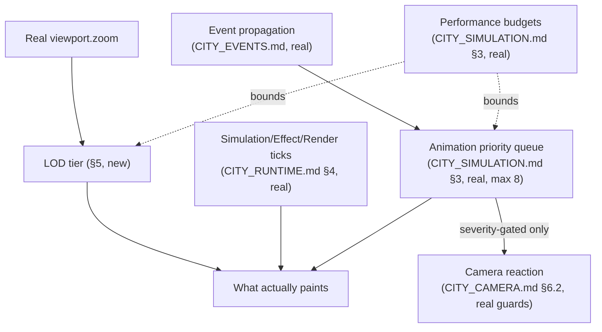

# Enterprise City — The Live World

**Sprint:** CG-9 — Architecture Research + Game Design Research. Documentation only, no source
modified. Covers the brief's "LIVE CITY" section: real-time updates, event propagation, animation
priorities, camera reactions, LOD strategy, visibility rules, performance budgets.

**Do not duplicate:** Six of this section's seven asks are already fully specified elsewhere in this
engagement — this document is the **synthesis layer**, showing how they compose into one coherent
"live world" experience, and contributes genuinely new material only where a real gap exists (§4, LOD
strategy — not previously specified at this depth).

## 1. Real-time updates — already specified, cited

`CITY_RUNTIME.md` §4 (CG-4) owns this: the three-loop model (Simulation tick / Effect tick / Render
tick), the real 12-second `useCityLiveStatus` poll, and the explicit design property that data
freshness is never coupled to render activity. Not repeated here.

## 2. Event propagation — already specified, cited

`CITY_EVENTS.md` (CG-4) owns the full event catalog and propagation sequences;
`TRIGGER_SYSTEM.md` §4 (CG-7) extends it with the backend-side event-source map (AI/CRM/ERP/Desktop/
City/Production/Notifications/Runtime/Security/Audit). Not repeated here.

## 3. Animation priorities — already specified, cited

`CITY_SIMULATION.md` §3 (CG-4)'s performance budget table already sets the concrete ceiling: **8
maximum concurrent animations** (1 camera tween + 6 transient effects + 1 portal-in-flight), with
excess requests queued via the Effect Tick (`CITY_RUNTIME.md` §4) rather than dropped or stacked. This
is already a priority scheme in practice — camera always wins the one reserved slot, portal transitions
always get their reserved slot, and building/district/road effects compete for the remaining six on a
queue basis. Not re-designed here; restated only to confirm the brief's "animation priorities" ask is
already answered.

## 4. Camera reactions — already specified, cited, with one synthesis note

`CITY_CAMERA.md` §6.1–6.2 (CG-4) owns Follow and Focus Event. The synthesis point worth adding here:
Focus Event's three guards (severity-only, input-recency suppression, global cooldown — `CITY_CAMERA.md`
§6.2) are the *single point* every other "should the camera react to X" question in this whole engagement
should route through, rather than each future driver (`CITY_SIMULATION.md` §5's ten world-simulation
drivers) inventing its own camera-reaction judgment call. Concretely: of the ten drivers in
`CITY_SIMULATION.md` §5, only **Errors** (health-critical) should ever be camera-reaction-eligible per
Focus Event's real severity gate — CPU load, notifications, orders, etc. should never move the camera
unprompted, full stop.

## 5. LOD (Level of Detail) strategy — new to this sprint

No LOD tiering was specified in any prior CG document — `CITY_SIMULATION.md` §3.1 (CG-4) covers *node-
count* virtualization (windowing by viewport once >500 nodes), a different concern from *detail
richness per zoom level* at the current, much smaller 34-building scale. This document specifies the
latter.

### 5.1 Real zoom mechanics this LOD strategy rides on

`cityEngine.ts`'s real `CityViewport.zoom` (range 0.65–1.75, real `ZOOM_MIN`/`ZOOM_MAX`) is the only
input this LOD strategy needs — no new camera state.

### 5.2 Proposed tiers (SPEC)

| Zoom range | Detail tier | What renders |
|---|---|---|
| 0.65–0.9 (zoomed out) | **Overview** | District labels + centroid activity glow only; individual building tiles render but suppress secondary badges (notification count, AI dot) — real `CityBuilding` positions unchanged, only which child elements paint |
| 0.9–1.3 (default/mid) | **Standard** | Current real behavior — full building tile (label, state color, notification badge, AI dot, task count) |
| 1.3–1.75 (zoomed in) | **Detail** | Adds the game-design elements this sprint specifies once built (building-lighting density, `CITY_VISUAL_STATES.md` §5) — only worth the extra DOM/paint cost when a building is large enough on screen to actually show it |

This is a pure **CSS/conditional-render tiering keyed off the existing real `viewport.zoom` value** —
no new data, no new camera behavior, and it directly serves `CITY_SIMULATION.md` §3's performance
budget: Overview tier is strictly cheaper to paint than Standard, so panning out to see the whole city
(the most common "just glancing" interaction) is also the cheapest render state, not the most expensive.

### 5.3 Non-goal

No mesh/geometry LOD (this is a DOM/CSS city, not 3D — `CITY_CAMERA.md` §6.4's non-goal restated) —
"LOD" here means conditional detail rendering, not 3D level-of-detail meshes.

## 6. Visibility rules — extends real, already-specified mechanisms

`CITY_BUILDING_STATES.md` §3.3/§4 (CG-4) already specify the Dimmed/Disabled visibility axis and the
"dim, never remove" spatial-constancy principle. This document's one addition: **combine visibility
rules with §5's LOD tiers** — a `Dimmed` building at the Overview tier should not even render its
(already-suppressed) secondary badges, compounding both cost-savings rules rather than treating them as
independent systems that happen to both reduce what paints.

## 7. Performance budgets — already specified, cited

`CITY_SIMULATION.md` §3 (CG-4) owns the concrete numbers (max buildings/districts/events/animations/
agents/notifications, expected FPS per quality tier, virtualization trigger). This document's LOD
tiers (§5) are designed to operate *within* those existing budgets, not add a new one.

## 8. The live-world diagram (synthesis)

## 9. Non-goals

- No re-specification of real-time updates, event propagation, animation-priority mechanics, or
  performance budgets — all cited, none duplicated.
- No 3D LOD — §5.3.
- No new camera-reaction trigger beyond what `CITY_CAMERA.md` §6.2's guards already allow (§4's
  synthesis note restates this as a constraint on future drivers, not a new mechanism).

## Related documents

`CITY_RUNTIME.md`, `CITY_EVENTS.md`, `CITY_CAMERA.md`, `CITY_SIMULATION.md` (all CG-4 — the six
already-specified concerns this document synthesizes), `CITY_BUILDING_STATES.md` (visibility axis),
`CITY_VISUAL_STATES.md` (CG-9 sibling, the game-design elements §5's Detail tier would show).
