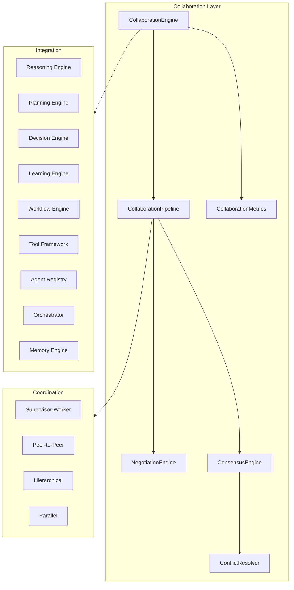

# Platform Multi-Agent Collaboration Engine

> Sprint 4.5 — structured multi-agent coordination, negotiation, and consensus

## Overview

The Platform Multi-Agent Collaboration Engine enables **multiple AI agents to collaborate on shared goals** through structured communication, task negotiation, and coordinated execution.

**No LLM dependency. No modifications to Sprint 1–4.4 architecture.**

---

## Architecture



---

## Core Components

| Component | Role |
|-----------|------|
| `CollaborationEngine` | Central collaboration entry point |
| `CollaborationSession` | Active multi-agent session |
| `SharedContext` | Shared execution state & results |
| `AgentMessage` | Structured inter-agent message |
| `CollaborationRole` | supervisor · worker · coordinator · peer · specialist · observer |
| `CoordinationStrategy` | Role-based · capability match · parallel · sequential · supervisor delegate · peer consensus |
| `NegotiationEngine` | Task ownership, priority, resource, tool negotiation |
| `ConsensusEngine` | Voting and consensus models |
| `ConflictResolver` | Conflict detection and resolution |
| `CollaborationResult` | Session outcome with metrics |

---

## Collaboration Modes

| Mode | Description |
|------|-------------|
| One-to-one | Two agents, sequential coordination |
| One-to-many | Supervisor delegates to multiple workers |
| Many-to-many | Peer consensus across all agents |
| Hierarchical | Coordinator + workers role hierarchy |
| Peer-to-peer | Equal peers with consensus |
| Supervisor-worker | Classic supervisor delegation (default) |

---

## Communication Protocol

| Message Type | Purpose |
|--------------|---------|
| `capability_announcement` | Agent declares capabilities |
| `task_delegation` | Assign task to agent |
| `intermediate_result` | Share partial results |
| `progress_update` | Report execution progress |
| `completion` | Task finished notification |
| `negotiation` | Negotiation / resolution messages |
| `consensus_vote` | Consensus voting |
| `conflict` | Conflict notification |

---

## Negotiation Flow

1. Identify capable agents for task capability
2. Score ownership claims (confidence + capability match)
3. Detect ownership disputes
4. Negotiate priority and tool selection
5. Assign task owner
6. Delegate via structured message

---

## Consensus Models

| Model | Description |
|-------|-------------|
| Voting | Simple vote count |
| Weighted voting | Agent weight influences outcome |
| Confidence-based | Higher-confidence agents carry more weight |
| Majority | Requires >50% agreement |
| Supervisor override | Supervisor decision is final |

---

## Coordination Features

- Role assignment per collaboration mode
- Capability matching for task assignment
- Dynamic agent selection via negotiation
- Parallel execution for independent tasks
- Dependency synchronization for sequential tasks
- Timeout configuration via engine config
- Recovery after agent failure via conflict resolver

---

## Usage

### Start collaboration

```python
from platform_collaboration import (
    CollaborationMode,
    CollaborationTask,
    collaboration_engine,
)

tasks = [
    CollaborationTask(name="Search", capability="buy_car", priority=80.0),
    CollaborationTask(name="Finance", capability="auto_financing", priority=70.0),
]

result = await collaboration_engine.collaborate(
    "Buy a Toyota SUV",
    ["auto_agent", "finance_agent"],
    mode=CollaborationMode.SUPERVISOR_WORKER,
    supervisor_id="auto_agent",
    tasks=tasks,
)

print(result.completed_tasks)
print(result.session.shared_context.intermediate_results)
```

### Send messages & share results

```python
sid = result.session.session_id
await collaboration_engine.broadcast_progress(sid, "auto_agent", 0.75, "Inspection in progress")
await collaboration_engine.share_result(sid, "auto_agent", {"vehicles_found": 5})
```

### Reach consensus manually

```python
from platform_collaboration import ConsensusEngine, ConsensusModel, CollaborationSession

session = CollaborationSession(supervisor_id="auto_agent")
# ... populate participants ...
consensus = ConsensusEngine().reach_consensus(
    session,
    proposal="proceed_with_purchase",
    votes={"auto_agent": "proceed_with_purchase", "finance_agent": "proceed_with_purchase"},
    model=ConsensusModel.WEIGHTED_VOTING,
)
```

---

## Integration Bridges

| Layer | Bridge |
|-------|--------|
| Reasoning | `enrich_with_reasoning()` |
| Planning | `enrich_with_planning()` → tasks from plan steps |
| Decision | `apply_decision_policy()` |
| Learning | `record_learning()` after completion |
| Workflow | `execute_workflow()` for completed tasks |
| Tools | `available_tools()` for tool negotiation |
| Agents | `participants_from_registry()` |
| Memory | `enrich_with_memory()` |
| Orchestrator | `orchestrator_routing()` |

---

## Events

| Event | When |
|-------|------|
| `CollaborationStartedEvent` | Session begins |
| `AgentJoinedEvent` | Agent joins session |
| `TaskDelegatedEvent` | Task assigned to agent |
| `ConsensusReachedEvent` | Consensus achieved |
| `ConflictDetectedEvent` | Conflict identified |
| `ConflictResolvedEvent` | Conflict resolved |
| `CollaborationCompletedEvent` | Session finished |

---

## Metrics

`collaboration_engine.metrics_summary()` returns:

| Metric | Description |
|--------|-------------|
| `avg_collaboration_latency_ms` | Average session duration |
| `avg_consensus_time_ms` | Average consensus time |
| `total_delegations` | Tasks delegated |
| `total_conflicts` | Conflicts detected |
| `agent_participation` | Per-agent session count |
| `success_rate` | Successful collaborations |

---

## Developer Guide

1. Choose collaboration mode based on agent topology
2. Provide tasks explicitly or let planning engine generate them
3. Set `supervisor_id` for hierarchical/supervisor-worker modes
4. Monitor `CollaborationSession.messages` for communication audit trail
5. Use `SharedContext` for intermediate result exchange
6. Handle conflicts via built-in resolver or custom recovery logic
7. Review metrics and learning feedback after each session

Package location: `platform_collaboration/`

Tests: `tests/test_collaboration_engine.py`
