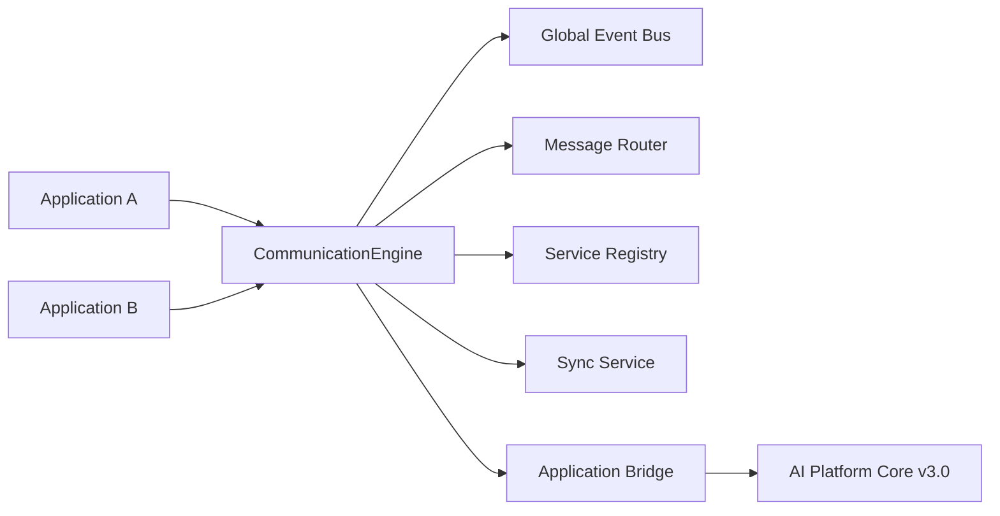

# Cross-Application Communication & Event Bus (Sprint 7.2)

> Unified messaging layer so every application on **AI Platform Core v3.0** can securely exchange events, commands, data, and AI context.

## Release Summary

| Field | Value |
|-------|-------|
| Ecosystem Version | **1.5.0-alpha** |
| Communication Layer | **1.0** |
| Event Bus | **1.0** |
| Platform Dependency | **AI Platform Core v3.0** |
| Sprint | **7.2** |

---

## Architecture



Package layout under `ecosystem/communication/`:

| Module | Role |
|--------|------|
| `event_bus/` | Global bus — domain, application, system, AI, workflow events |
| `message_router/` | Request/response, pub/sub, broadcast, command/query, DLQ, retries |
| `application_bridge/` | Connect apps, share context, agent collaboration |
| `service_registry/` | Registration, capability discovery, health, dependency graph |
| `event_store/` | Append-only event log and replay |
| `subscriptions/` | Topic subscriptions |
| `sync/` | Cross-app user/permission/org/notification sync |

---

## Event Bus Guide

```python
from ecosystem import ecosystem
from ecosystem.communication.models import EventCategory

event = await ecosystem.engine.communication.bus.publish(
    "LeadCreated",
    {"lead_id": "l1"},
    category=EventCategory.DOMAIN,
    source_application="auto_marketplace",
)

# Category helpers
await ecosystem.engine.communication.bus.publish_ai("AgentInvoked", {"agent": "sales"}, source="auto_marketplace")
await ecosystem.engine.communication.bus.publish_workflow("DealAdvanced", {"deal_id": "d1"}, source="auto_marketplace")
```

Replay from the event store:

```python
events = ecosystem.engine.communication.store.replay(since=0.0)
```

---

## Messaging Guide

```python
router = ecosystem.engine.communication.router

# Direct / request-response / broadcast
await router.direct("auto_marketplace", "crm_hub", {"action": "ping"})
await router.request("auto_marketplace", "crm_hub", {"q": "status"})
await router.broadcast("auto_marketplace", {"alert": "maintenance"}, topic="system.alerts")

# Command & Query buses
await router.command("auto_marketplace", "crm_hub", "qualify_lead", {"lead_id": "l1"})
await router.query("auto_marketplace", "crm_hub", "pipeline_stats", {})

# Delivery confirmation
router.acknowledge(message_id, "crm_hub")
```

Subscribe to topics:

```python
ecosystem.engine.communication.subscriptions.subscribe("crm_hub", "LeadCreated")
```

---

## Synchronization Guide

```python
sync = ecosystem.engine.communication.sync

await sync.sync_user("auto_marketplace", {"user_id": "u1", "email": "a@b.com"})
await sync.sync_permissions("auto_marketplace", {"user_id": "u1", "roles": ["dealer"]})
await sync.sync_organization("auto_marketplace", {"organization_id": "o1"})
await sync.sync_notifications("auto_marketplace", {"title": "New lead"})
await sync.sync_context("auto_marketplace", {"session": "s1", "intent": "buy"})
```

---

## Service Registry

```python
await ecosystem.engine.communication.bridge.connect_application(
    "auto_marketplace",
    version="2.0.0",
    capabilities=["crm", "catalog", "finance"],
    dependencies=[],
)

apps = ecosystem.engine.communication.registry.discover_capability("crm")
graph = ecosystem.engine.communication.registry.dependency_graph()
health = ecosystem.engine.communication.registry.health_report()
```

---

## AI Integration

```python
bridge = ecosystem.engine.communication.bridge

await bridge.share_context("user-1", "auto_marketplace", {"prefs": {"ev": True}}, shared_with=["crm_hub"])
await bridge.route_ai_event("OfferGenerated", {"offer_id": "o1"}, source_application="auto_marketplace")
await bridge.delegate_task("auto_marketplace", "qualify_lead", {"lead_id": "l1"}, target_agent="sales-agent")
await bridge.collaborate_agents("auto_marketplace", "negotiate", {"deal_id": "d1"}, partner_application="crm_hub")
await bridge.exchange_knowledge("auto_marketplace", "crm_hub", {"article": "EV incentives"})
```

---

## API Reference

| API | Endpoints |
|-----|-----------|
| Communication | `POST /api/ecosystem/v1/communication/messages`, `/request`, `/broadcast`, `/commands`, `/queries`, `/acknowledge`, `/subscribe`, `/context`, `/agents/delegate` |
| Events | `POST/GET /api/ecosystem/v1/events`, `GET /events/replay` |
| Registry | `POST/GET /api/ecosystem/v1/registry`, `/health`, `/dependencies`, `/capabilities/{capability}` |
| Sync | `POST /api/ecosystem/v1/sync`, `GET /sync/history` |

---

## Events

| Event | When |
|-------|------|
| `ApplicationRegistered` | App registered in service registry |
| `ApplicationConnected` | App marked connected / healthy |
| `EventPublished` | Bus event published |
| `EventConsumed` | Subscriber matched |
| `SynchronizationCompleted` | Sync finished |
| `MessageDelivered` | Message routed to target |
| `ContextShared` | AI/shared context published |
| `AgentDelegated` | Task delegated to agent |

---

## Developer Guide

```python
from ecosystem import ecosystem

comm = ecosystem.engine.communication
await comm.bridge.connect_application("my_app", capabilities=["search"])
await comm.bus.publish_application("Ready", {}, source="my_app")
await comm.router.broadcast("my_app", {"hello": True})
```

Access facade: `ecosystem.engine.communication.{bus,router,registry,store,subscriptions,sync,bridge}`

**AI Platform Core is not modified** — integration uses `ecosystem/integrations/platform_bridge.py`.

---

## Tests

```bash
pytest tests/test_communication.py -q
```

---

## Expected Result

- Sprint 7.2 completed
- Cross-Application Communication ready
- Global Event Bus ready
- Application Bridge ready
- Unified Messaging ready
